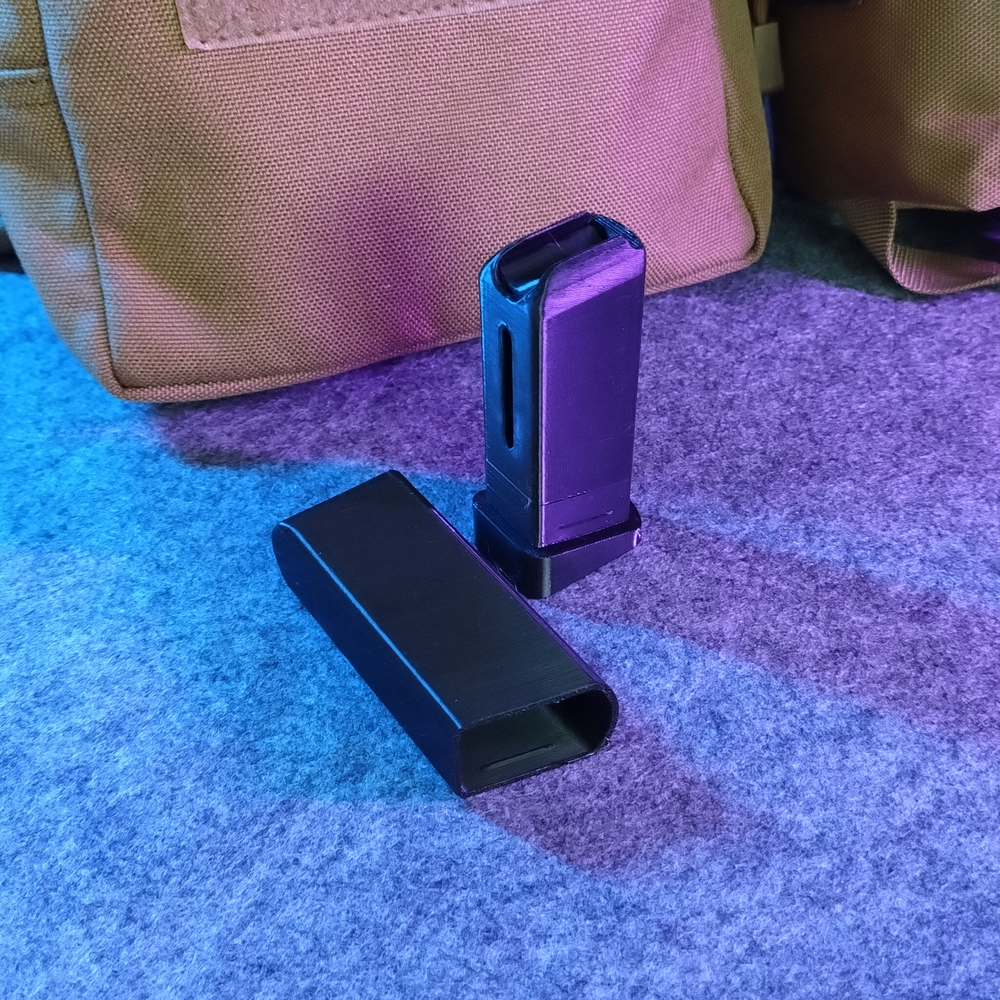
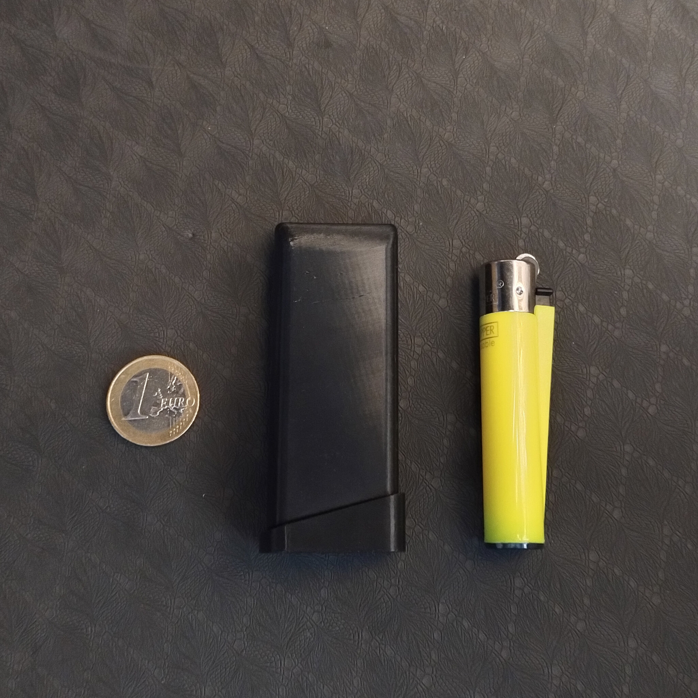
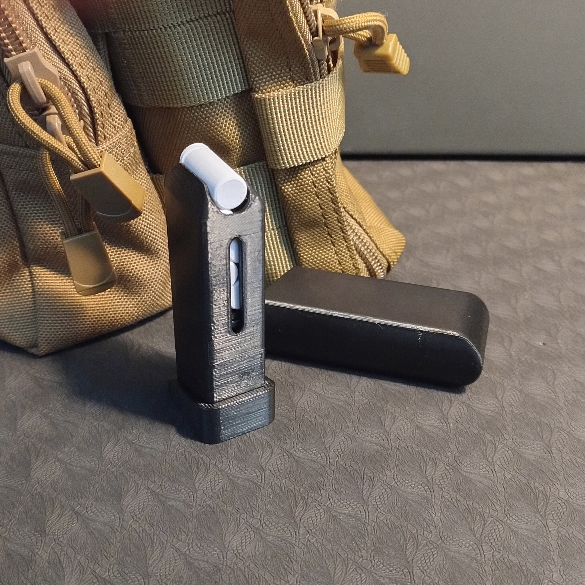
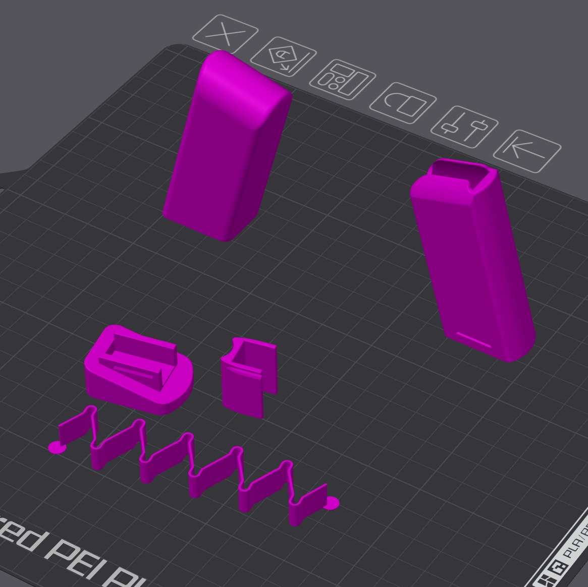

# Airsoft 9mm blanks holder

- **Brief**: 9mm Airsoft Blanks Holder.
- **Tags**: `airsoft`, `grenade`, `blanks`, `molle`, `tactical`.
- **Published**:
  [Cults3D](https://cults3d.com/en/3d-model/game/airsoft-9mm-blanks-holder-zeroex-2).

Holder for 9 mm Airsoft blanks, compatible with the Kimera Kamikaze Grenade. It holds up to six
rounds. The thickened rear wall and transport cap help protect the contents from bumps. Do not carry
blanks loose in a pocket.

Although its size may make it look like a toy, the holder has a working spring and is designed for
Airsoft use. It can also carry reloads for acoustic Airsoft grenades.

<!------------------------------------------------------------------------------------------------->
## Instructions
<!------------------------------------------------------------------------------------------------->

### Bill of materials

- Optional: Cyanocrilate glue (super glue) or similar.

### Printing

- Tested with PETG.
- Use screenshot as reference for orientation.
- Print main body and shell vertically with increased wall thickness, ensure good layer adhesion.
- Print spring on the side.
- Print bottom cap flat.
- Print pusher on the side that is furthest away from the notch.

### Assembly

1. Insert pusher into main body, oriented such that the notch alignes with the groove.
2. Insert spring into main body behind the pusher.
3. Place bottom cap on the main body. If not tight enough, glue it in place and let it dry.
4. Slide shell over body.

<!------------------------------------------------------------------------------------------------->
## Attribution
<!------------------------------------------------------------------------------------------------->

This is an original 3D print model.

Explore my [3D print model collection](https://zeroexgit.github.io/3d-print-models/)
to discover more models and check for updates to this one.

<!------------------------------------------------------------------------------------------------->
## License
<!------------------------------------------------------------------------------------------------->

Single User License - Personal Use Only.
