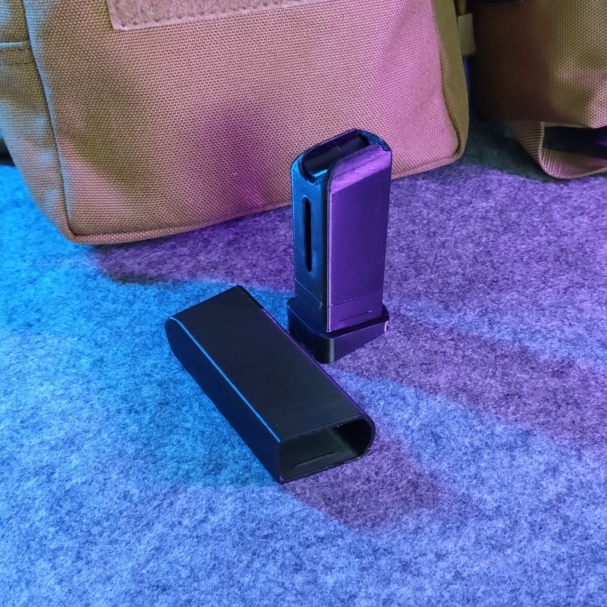
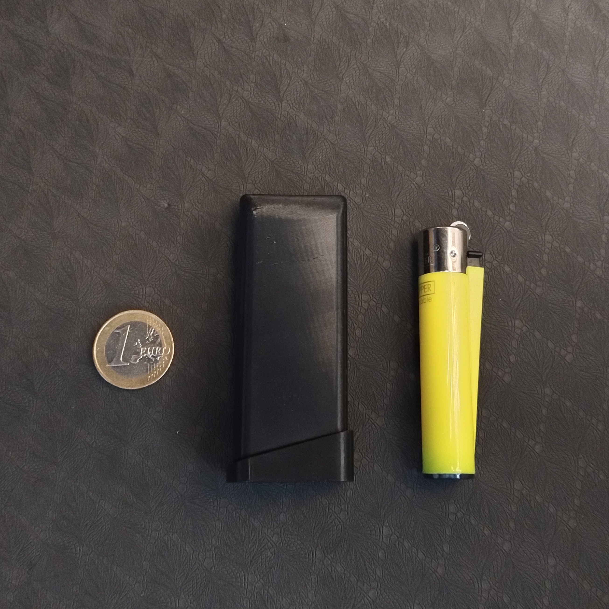
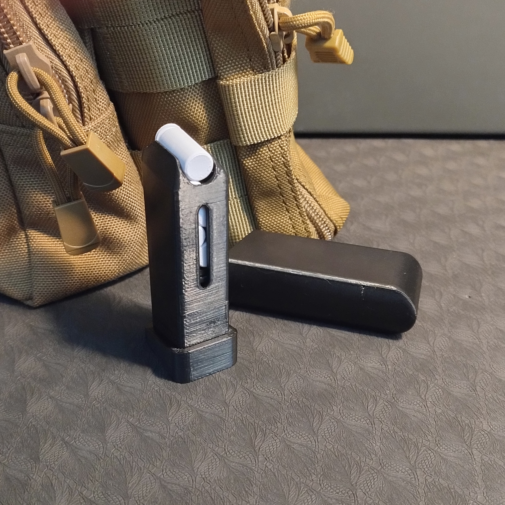

# Airsoft Blanks Holder

- **Brief**: 9mm Airsoft Blanks Holder.
- **Tags**: `airsoft`, `grenade`, `blanks`, `molle`, `tactical`.
<!--
- **Published**:
  [Thingiverse](link-goes-here),
  [Printables](link-goes-here),
  [MakerWorld](link-goes-here),
  [Cults3D](link-goes-here).
  -->

Holder for 9mm Airsoft blanks, compatible with the Kimera Kamikaze Grenade and similar shells. Stores up to 6 rounds. Triple-thickness rear wall and a transport cap to protect against accidental activations; don't carry these loose in your pocket! Looks like a toy given its size, but it's fully functional and purpose-built for Airsoft.

Explore my [3D print model collection](https://zeroexgit.github.io/3d-print-models/) to discover more models and check for updates to this one.

## Attribution

This is an original 3D print model.

## License

Single User License (No Redistribution, No Commercial Use).
