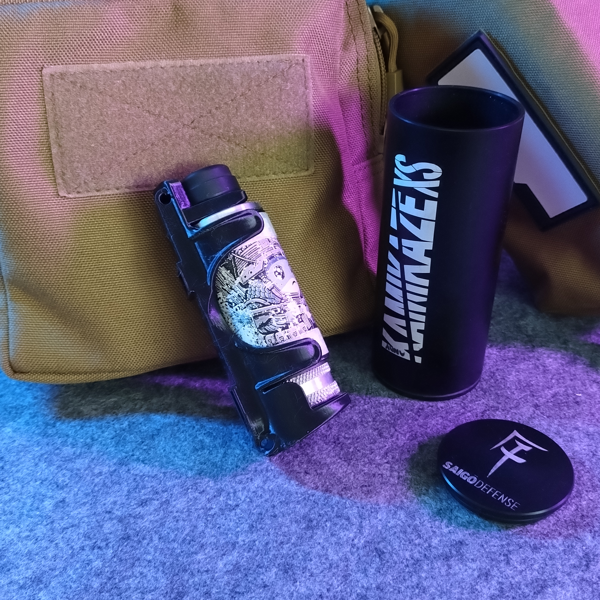
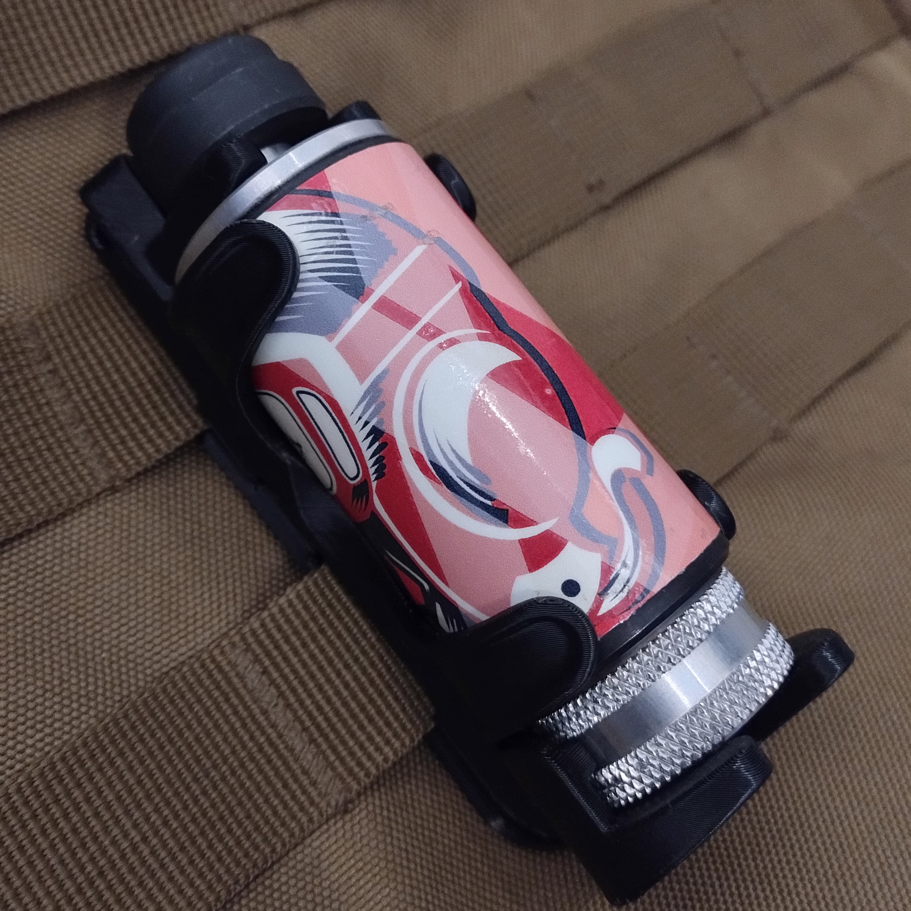
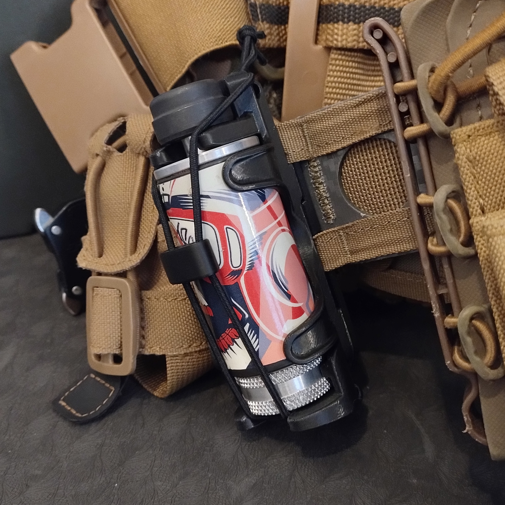
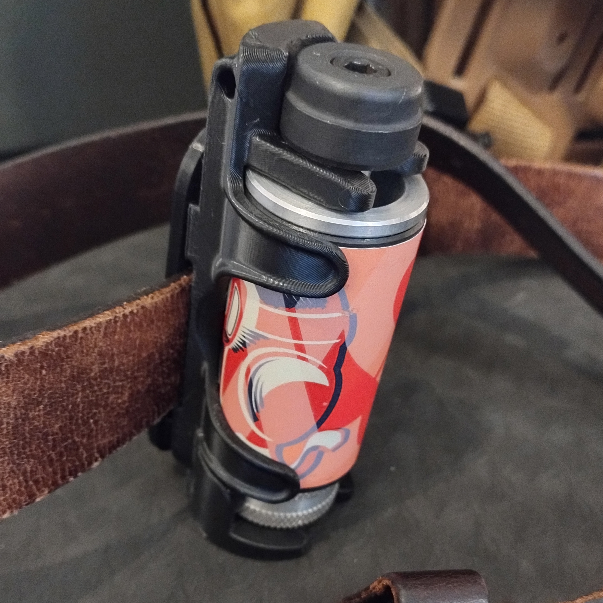
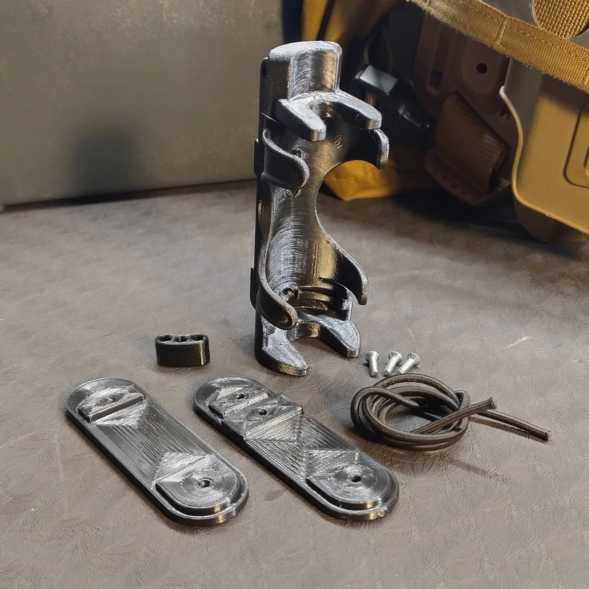

# Airsoft Grenade Holder for Kimera Kamikaze XS

- **Brief**: Kimera Kamikaze XS Airsoft Grenade Holder.
- **Tags**: `airsoft`, `grenade`, `molle`, `tactical`.
<!--
- **Published**:
  [Thingiverse](link-goes-here),
  [Printables](link-goes-here),
  [MakerWorld](link-goes-here),
  [Cults3D](link-goes-here).
-->

MOLLE and belt compatible. One-handed quick draw: the retention is built-in so you can retrieve the grenade without letting go of your replica. Strong retention in any orientation, plus an elastic strap for extra security during transport.

Explore my [3D print model collection](https://zeroexgit.github.io/3d-print-models/) to discover more models and check for updates to this one.

## Attribution

This is an original 3D print model.

## License

Single User License (No Redistribution, No Commercial Use).
