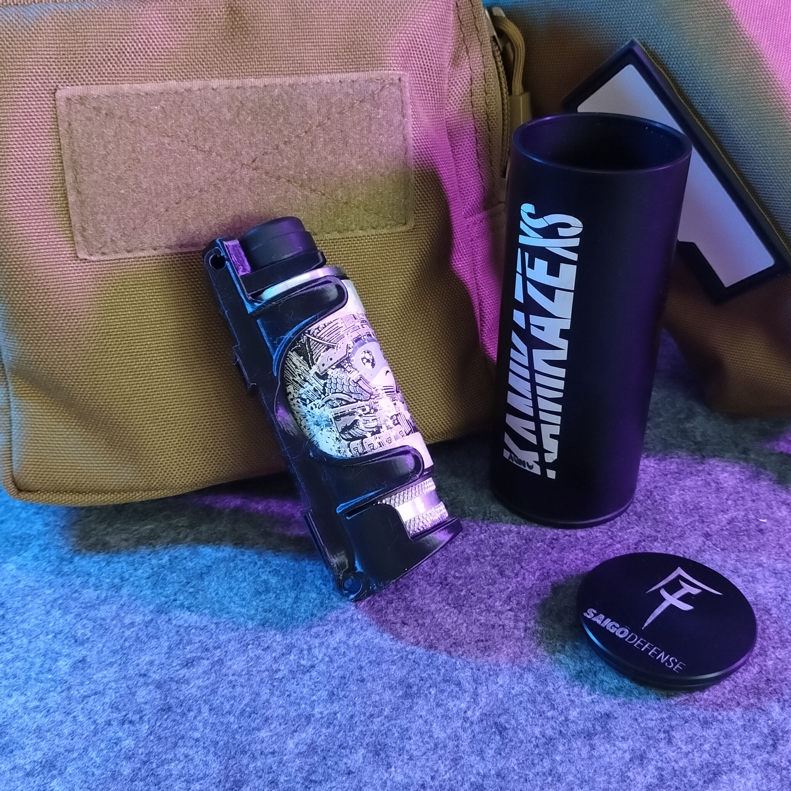
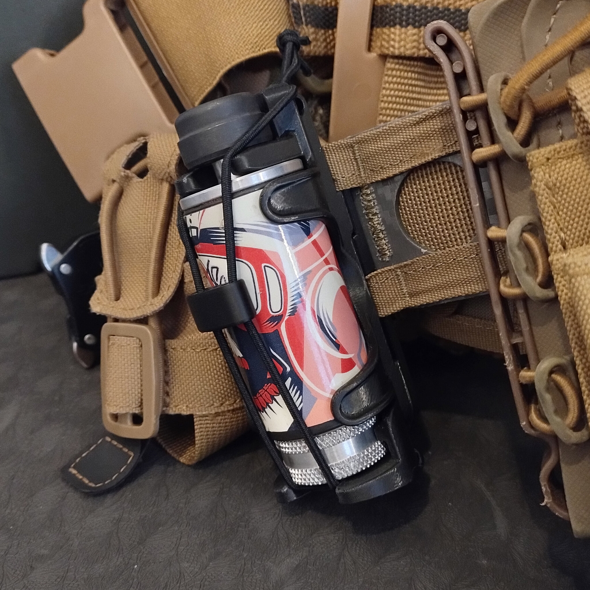
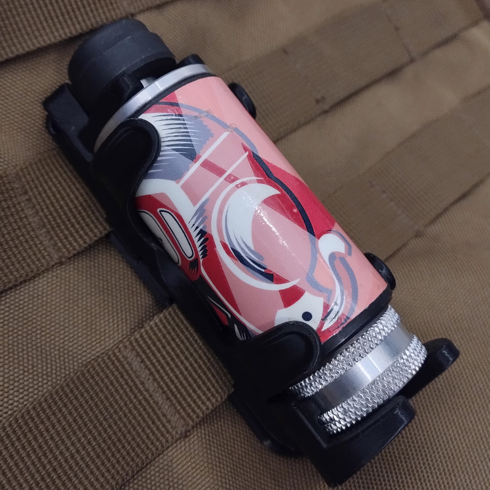
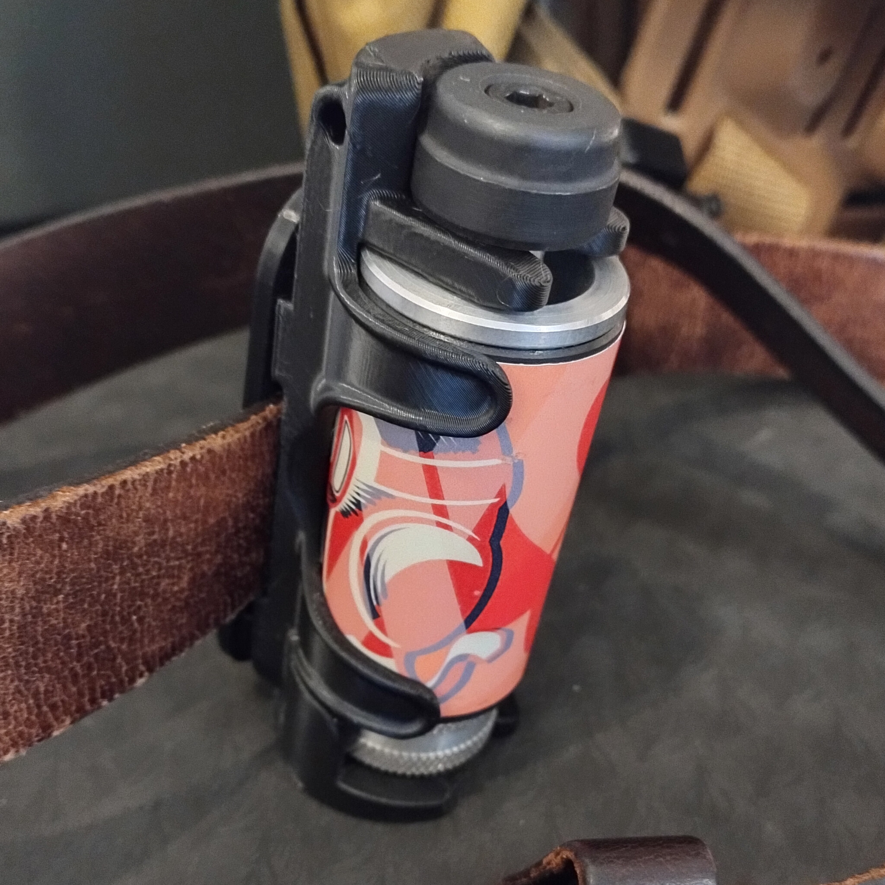
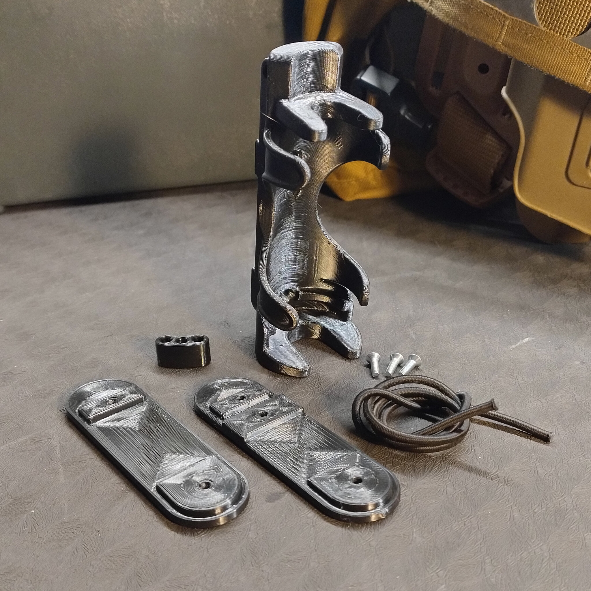

# Airsoft grenade holder for Saigo Kamikaze XS

- **Brief**: Saigo Kamikaze XS airsoft grenade holder.
- **Tags**: `airsoft`, `grenade`, `molle`, `tactical`.
- **Published**:
  [Cults3D](https://cults3d.com/en/3d-model/game/airsoft-grenade-holder-for-saigo-kamikaze-xs).

MOLLE and belt compatible. One-handed quick draw: the retention is built-in so
you can retrieve the grenade without letting go of your replica. Strong
retention in any orientation, plus an elastic strap for extra security during
transport.

<!------------------------------------------------------------------------------------------------->
## Instructions
<!------------------------------------------------------------------------------------------------->

### Bill of materials

- 2x M3x8mm or M3x10mm screws.
- 2x M3 nuts.
- 1x ~30cm 2mm bungee cord (elastic cord) or similar.

### Printing

- Tested with PETG.
- Print the holder at ~30 degrees tipping backwards, laying the model on the flat bottom surface on the bottom-back. Enable supports.
- Print the bungee guide.
- Choose backplate to print: one is for MOLLE attachment, the other is for belt attachment.

### Assembly

1. Place nuts in the backplate all the way in.
2. Place backplate on your belt or MOLLE strap.
3. Screw holder, from the front, onthe the backplate with the screws.
4. Thread the bungee cord through the holes in the holder, then through the bungee guide, then back to the holder, and tie a knot to secure it. There is no right or wrong way to guide the bungee cord; feel free to experiment.

<!------------------------------------------------------------------------------------------------->
## Attribution
<!------------------------------------------------------------------------------------------------->

This is an original 3D print model.

Explore my [3D print model collection](https://zeroexgit.github.io/3d-print-models/)
to discover more models and check for updates to this one.

<!------------------------------------------------------------------------------------------------->
## License
<!------------------------------------------------------------------------------------------------->

Single User License - Personal Use Only.
