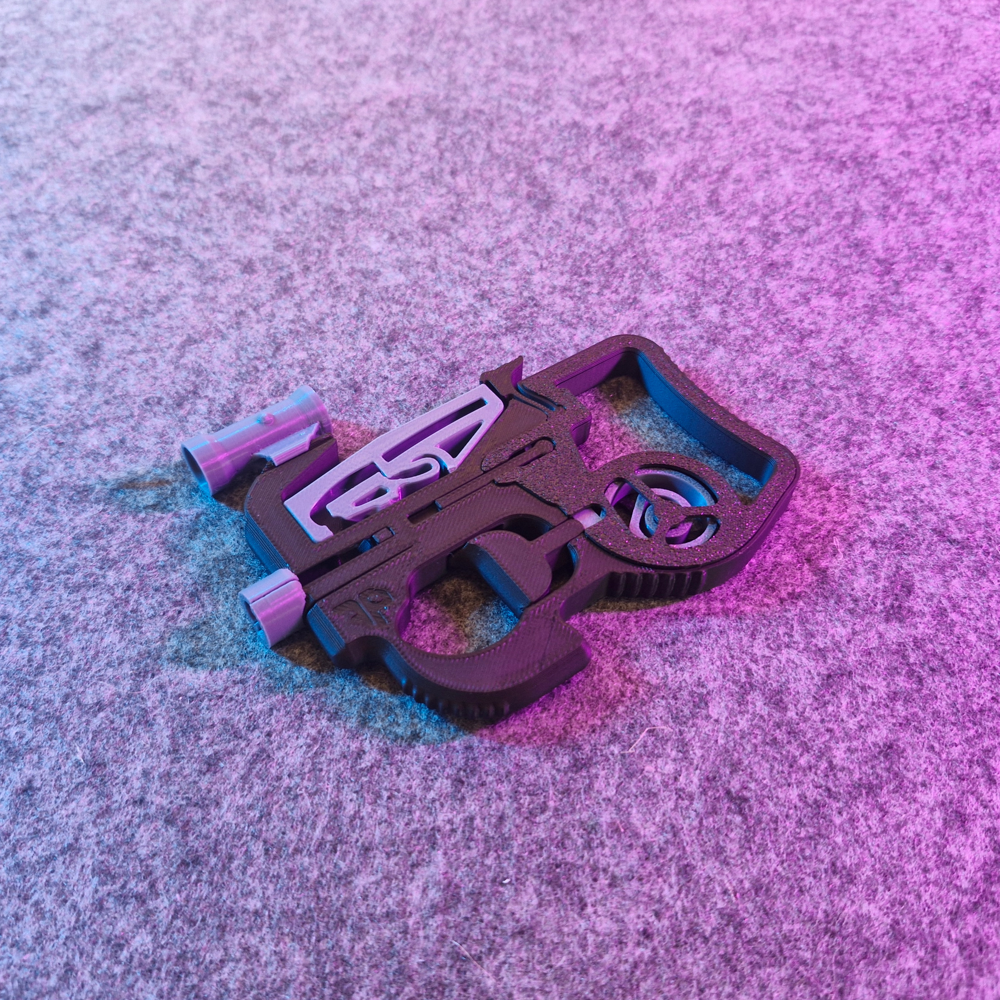

# FN-BB90

- **Brief**: Fully 3D-printed, print-in-place BB launcher inspired by the FN P90, with an interchangeable top magazine and a rail-mounted scope.
- **Tags**: `bb gun`, `airsoft`, `fn p90`, `print-in-place`, `no hardware`, `launcher`, `toy`.

FN-P90-inspired BB launcher with a top-mounted interchangeable magazine and a Picatinny rail for attachments. Fires standard 6mm airsoft BBs. No hardware required — print-in-place mechanism. Requires careful printing at 0.2mm layer height with standard (non-silk, non-matte) PLA, PETG, ABS, or ASA.

<!------------------------------------------------------------------------------------------------->
## Attribution
<!------------------------------------------------------------------------------------------------->

This entry references a 3D print model by **PeliX3D** available at <https://makerworld.com/en/models/1213009-fn-bb90-bb-gun-interchangeable-magazine-scope>.

This is a link-only catalog entry for a model I like. I share my own print photo and a link to the original listing so others can find it.

No model files are included here (no `.stl` / `.3mf` uploads) when the license does not allow redistribution/resharing.

### Original Description

> It is finally time for a new BB-Gun-release: FN-BB90 — featuring an interchangeable magazine sitting on top of the shooter, designed to resemble the infamous FN P90. The cherry on top is the rail on top of the gun, which can be used for all kinds of attachments (a scope is included).
>
> **Printing:**
> Layer height: 0.2mm or finer. Perimeters: 3+. Material: PLA Basic (not matte or silk), PETG, ABS, ASA. Supports: not required. Tolerances of 0.2mm required — parts may fuse together otherwise.
>
> **Usage:**
> When the gun is not in use, always remove the magazine to keep the BB release from wearing out. Use with more caution when no magazine is inserted, as the frame at the ammo inlet is thin and fragile.

<!------------------------------------------------------------------------------------------------->
## License
<!------------------------------------------------------------------------------------------------->

This model is licensed under the **Standard Digital File License** (no redistribution/resharing permitted).
