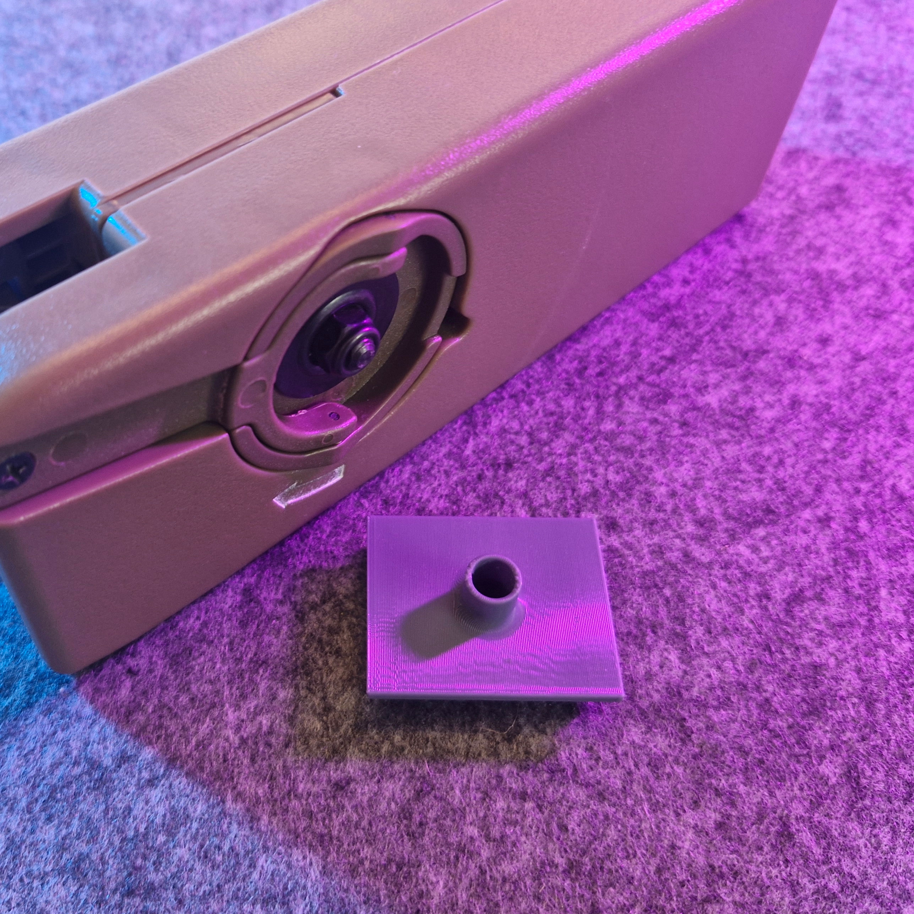
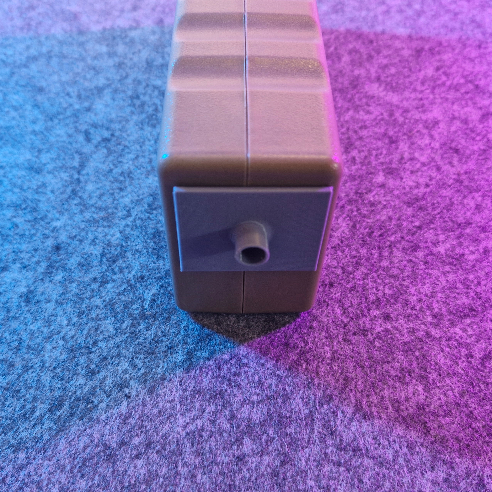

# Midcap Unloader for Odin M12 (reupload)

- **Brief**: Small friction-fit attachment for the Odin M12 speedloader to easily empty midcap magazines.
- **Tags**: `airsoft`, `odin`, `speedloader`, `midcap`, `unloader`, `magazine`.

Easy to carry along. Does not replace the lid.

<!------------------------------------------------------------------------------------------------->
## Attribution
<!------------------------------------------------------------------------------------------------->

This model is a reupload of a 3D print model by **Thinkscraft** obtained from <https://www.thingiverse.com/thing:4784836>.

I've reuploaded this model only to this repository and its website catalog to make the model easier to discover, provide a stable reference for what I print, and keep a backup in case the original listing disappears. I only reupload models whose licenses explicitly allow redistribution/resharing (including non-commercial constraints where applicable).

### Original Description

> This is a small addition to your Odin speedloader to easily empty your midcap magazines after a long day or skirmish.
>
> Installing is very easy: just put the side with the 2 extruding bits in first, then push the other side down to lock it in place.
>
> It's a very tight friction fit and will not fall out easily.

<!------------------------------------------------------------------------------------------------->
## License
<!------------------------------------------------------------------------------------------------->

This model is licensed under [**CC BY 4.0**](https://creativecommons.org/licenses/by/4.0/).
