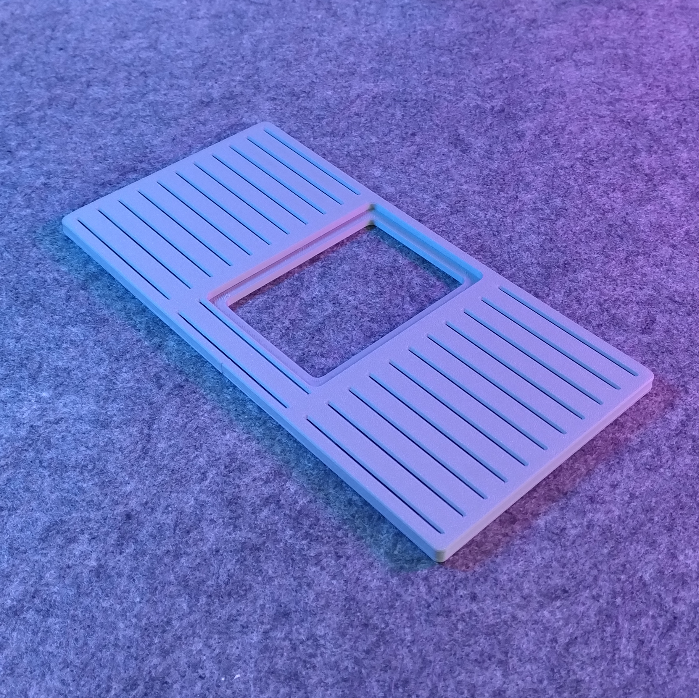
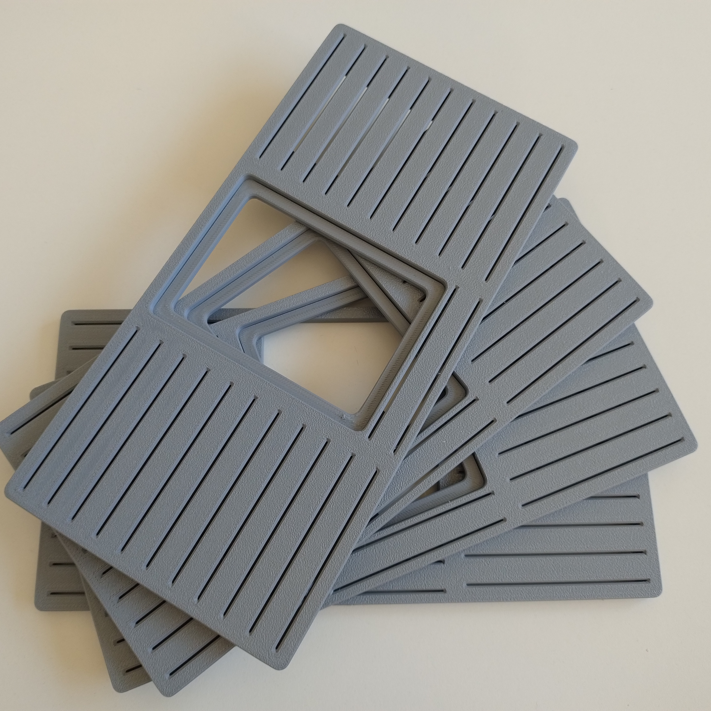
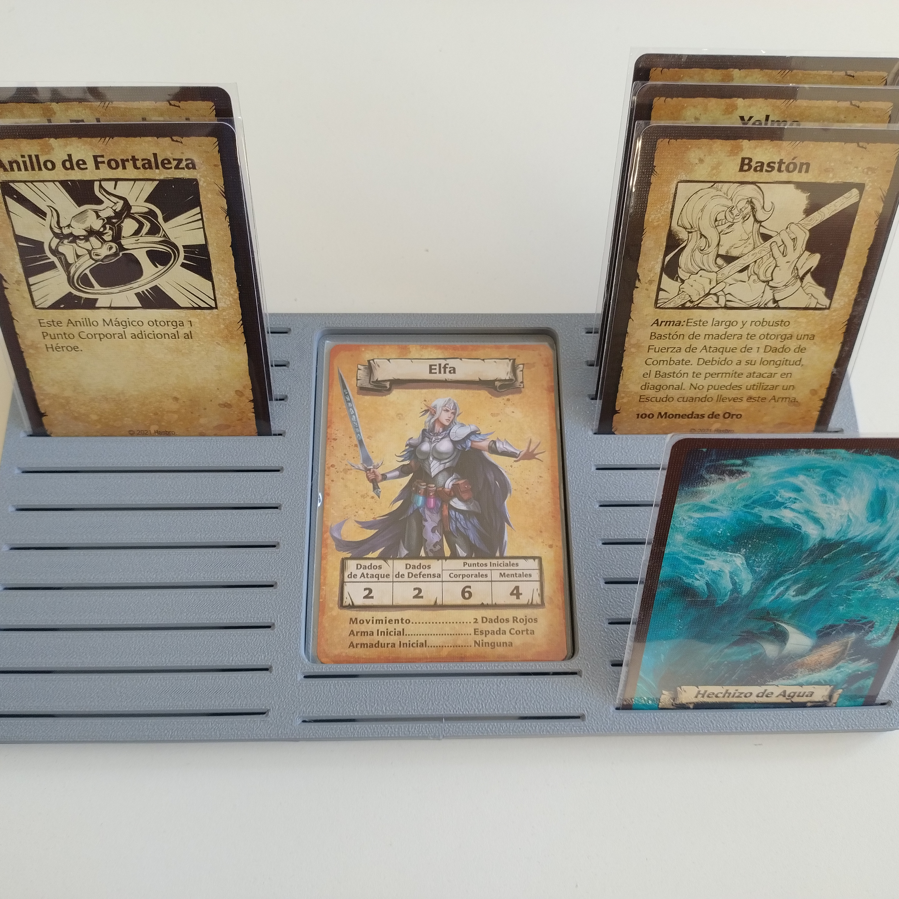
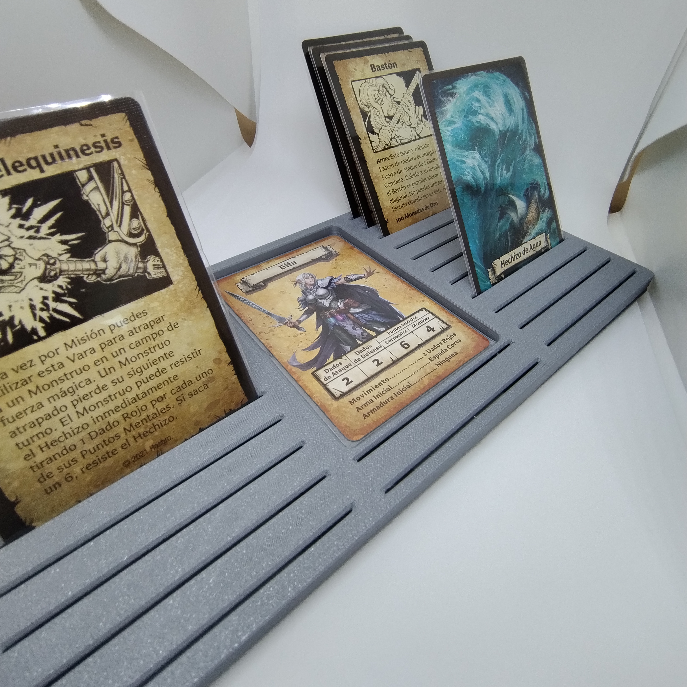

# HeroQuest Sleeved-Card Dashboard (remix)

- **Brief**: Sleeved-card holder for HeroQuest board game and other similar card games.
- **Tags**: `dnd`, `cardholder`, `dashboard`, `heroquest`.
<!--
- **Published**: [Thingiverse](link-goes-here),
  [Printables](link-goes-here),
  [MakerWorld](link-goes-here),
  [Cults3D](link-goes-here).
-->

Explore my [3D print model collection](https://zeroexgit.github.io/3d-print-models/) to discover more models and check for updates to this one.

## Attribution

This model is a remix of a 3D print model by **TheMagiciaN** obtained from <https://www.printables.com/model/662883-heroquest-card-dashboard>.

### Differences of the remix compared to the original

- Upscaled to hold sleeved cards.

### Original Description

> The model is split into two parts, so it can be printed without support or overhangs. I would recommend printing it with the grooves facing upward (orientation like in the stl itself) and use some plastic glue to connect the bottom part.
>
> The Bottom part allows you to safely lift this dashboard from the table without any cards falling out (don't move the dashboard too fast though, the “grip” on the cards is not that firm), while the internal grooves make it easy to flip through the cards.

## License

This model is licensed under [**CC BY-SA 4.0**](https://creativecommons.org/licenses/by-sa/4.0/).
