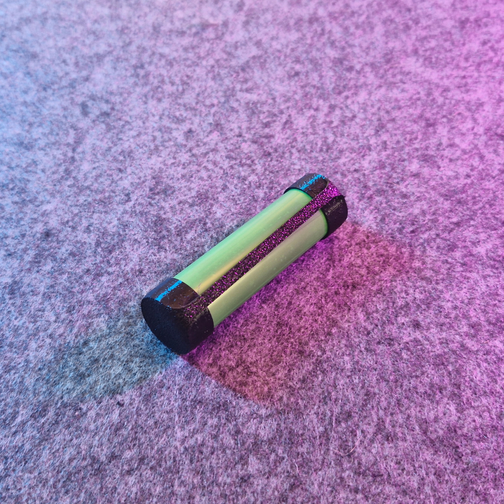
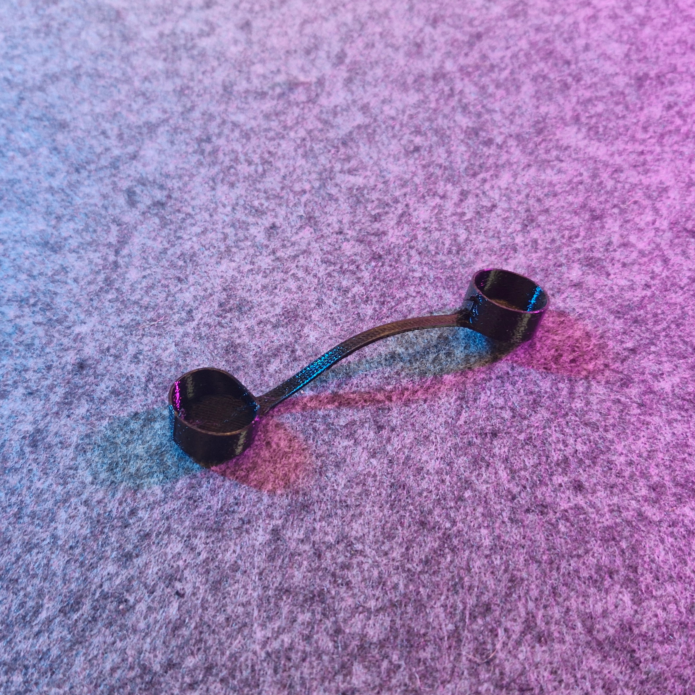

# 18650 battery TPU cap (reupload)

- **Brief**: TPU protective cap for 18650 lithium cells.
- **Tags**: `18650`, `battery`, `tpu`, `cap`, `electronics`.

<!------------------------------------------------------------------------------------------------->
## Attribution
<!------------------------------------------------------------------------------------------------->

This model is a reupload of a 3D print model by **Asalas88** obtained from <https://www.printables.com/model/254365-18650-battery-cap-tpu>.

I've reuploaded this model only to this repository and its website catalog to make the model easier to discover, provide a stable reference for what I print, and keep a backup in case the original listing disappears. I only reupload models whose licenses explicitly allow redistribution/resharing (including non-commercial constraints where applicable).

### Original Description

> Print in TPU. Simple solution to cover both ends of an 18650, when carrying it loose in a backpack/toolkit to prevent from shorting on metal objects.
>
> Very lightweight, uses only about 2g of TPU per print. You can carry multiple caps with you in different colors, and mark batteries which need charging after you use them.

<!------------------------------------------------------------------------------------------------->
## License
<!------------------------------------------------------------------------------------------------->

This model is licensed under [**CC0 1.0 Public Domain**](https://creativecommons.org/publicdomain/zero/1.0/).
