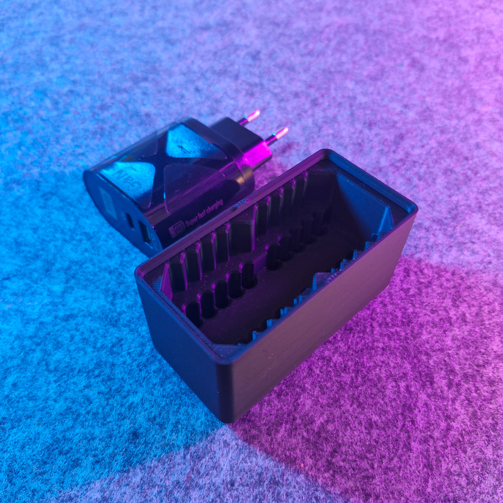
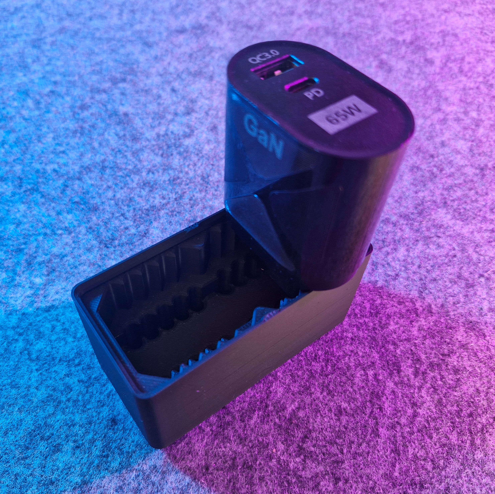

# Bin 1.2.6 - Euro Power Plug Holder (remix)

- **Brief**: Gridfinity remix for euro USB power plugs, resized to 1x2x6 with lip notches and magnet holes.
- **Tags**: `gridfinity`, `power plug`, `euro plug`, `usb charger`, `magnet`.

Gridfinity bin remix for euro USB power plugs.

<!------------------------------------------------------------------------------------------------->
## Attribution
<!------------------------------------------------------------------------------------------------->

This model is a remix of a 3D print model by **3dreamer** obtained from <https://www.printables.com/model/1375287-gridfinity-power-plug-holder-eu>.

Explore my [3D print model collection](https://zeroexgit.github.io/3d-print-models/) to discover
more models and check for updates to this one.

### Differences of the remix compared to the original

- Increase size to 1x2x6.
- Added lip notches and magnet holes.

### Original Description

> gridfinity bin (size 1x2x5, 1x4x5 and 1x6x5) that can hold (hopefully all of) your euro usb
> power plugs. There is surprisingly a bit of a variation in diameter and distance of the plug
> pins - even though it's supposed to be standardized - but so far all the plugs I found fit
> snuggly into the holder.

<!------------------------------------------------------------------------------------------------->
## License
<!------------------------------------------------------------------------------------------------->

This model is licensed under [**CC BY-NC-SA 4.0**](https://creativecommons.org/licenses/by-nc-sa/4.0/).
