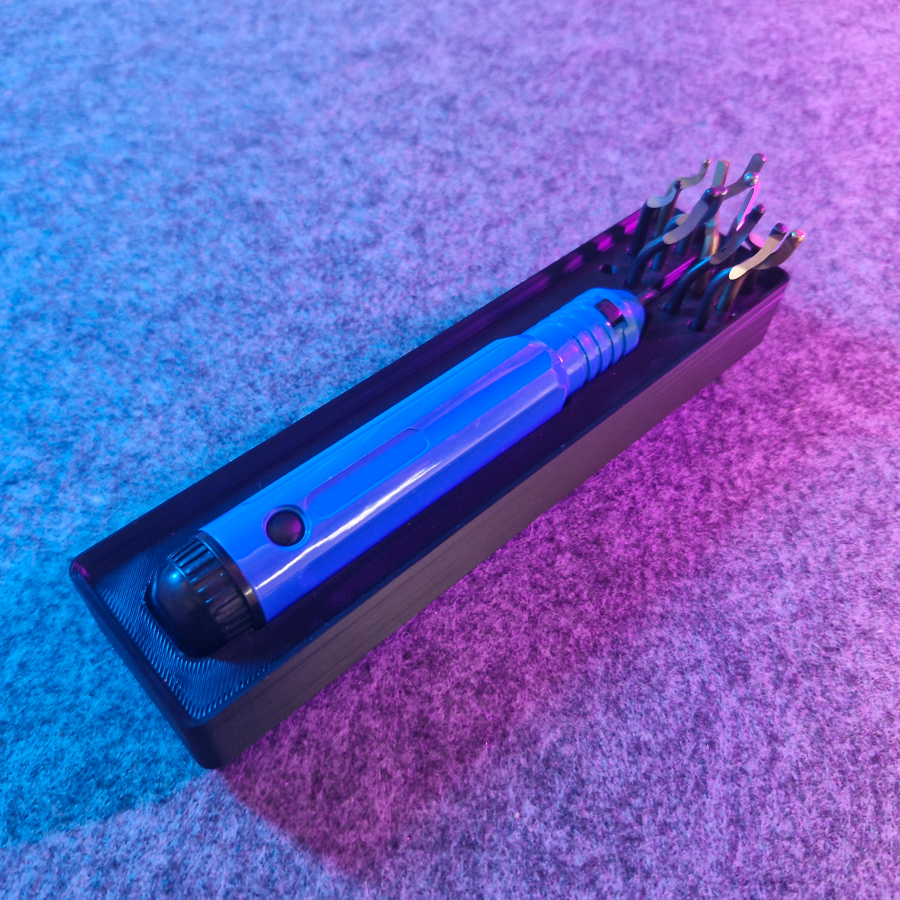

# Bin 1.4.3 - Deburring Tool Holder (reupload)

- **Brief**: Gridfinity holder for a deburring tool.
- **Tags**: `gridfinity`, `deburring tool`, `holder`, `workshop`.

<!------------------------------------------------------------------------------------------------->
## Attribution
<!------------------------------------------------------------------------------------------------->

This model is a reupload of a 3D print model by **Nicklascs** obtained from <https://www.printables.com/model/612387-gridfinity-deburring-tool-holder>.

I've reuploaded this model only to this repository and its website catalog to make the model
easier to discover, provide a stable reference for what I print, and keep a backup in case the
original listing disappears. I only reupload models whose licenses explicitly allow
redistribution/resharing (including non-commercial constraints where applicable).

### Original Description

> Gridfinity deburring tool holder.

<!------------------------------------------------------------------------------------------------->
## License
<!------------------------------------------------------------------------------------------------->

This model is licensed under [**CC BY-SA 4.0**](https://creativecommons.org/licenses/by-sa/4.0/).
