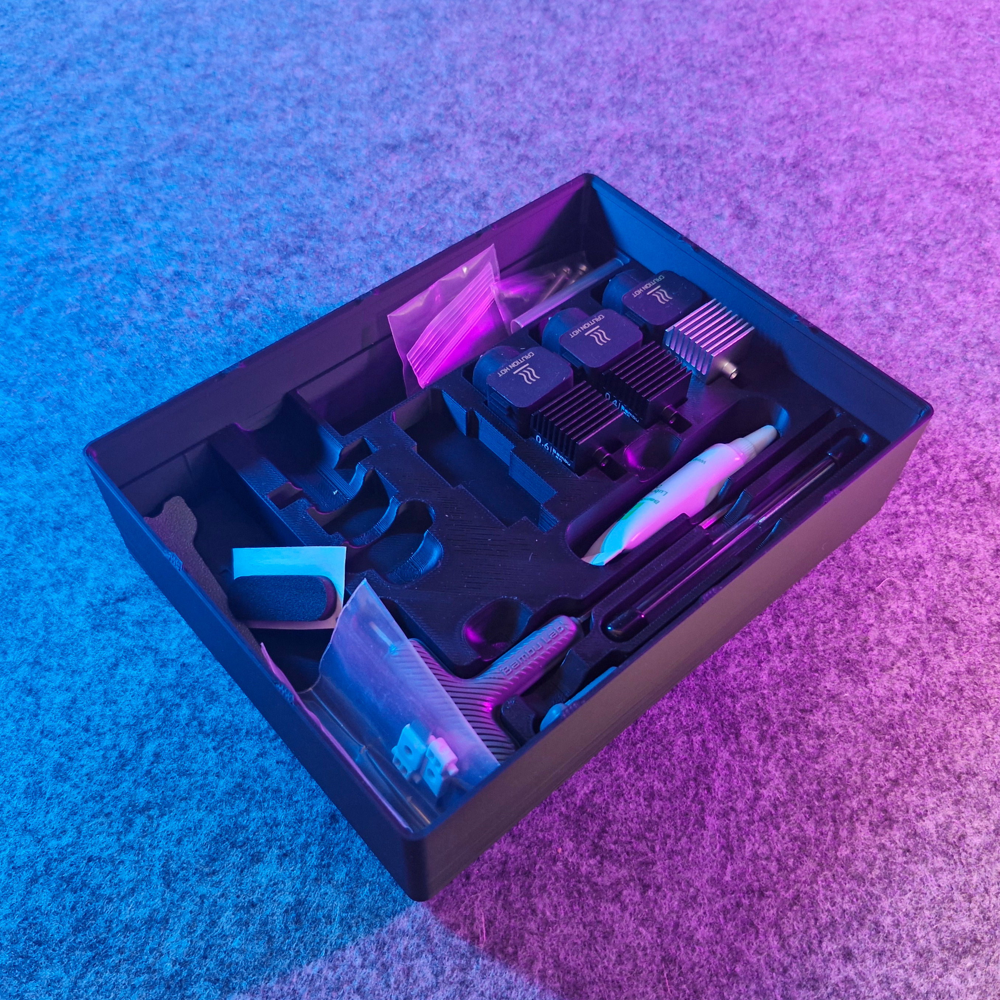

# Bin 2.3.6 - A1 Mini Toolbox (remix)

- **Brief**: Gridfinity 4x3x6U A1/A1 Mini toolbox remix with magnetic base, simplified stacking lip, and bigger label.
- **Tags**: `gridfinity`, `toolbox`, `a1 mini`, `bambu lab`, `magnet`.

Gridfinity bin for 4x3x6U A1/A1 Mini accesories.

<!------------------------------------------------------------------------------------------------->
## Attribution
<!------------------------------------------------------------------------------------------------->

This model is a remix of a 3D print model by **Brice Hoogenboom** obtained from <https://www.printables.com/model/699737-a1a1-mini-toolbox-gridfinity>.

Explore my [3D print model collection](https://zeroexgit.github.io/3d-print-models/) to discover
more models and check for updates to this one.

### Differences of the remix compared to the original

- Simplified base with magnetic inserts.
- Simplified stacking lip and added lip notches.

### Original Description

> Gridfinity 4x3x6U A1/A1 Mini toolbox w/ tray insert. No handle, bigger label. Hinges & other
> needed items please get from original Pred model. No parametric, had to break a few things to
> get handle out, and label correct because I'm a newb.

<!------------------------------------------------------------------------------------------------->
## License
<!------------------------------------------------------------------------------------------------->

This model is licensed under [**CC BY-NC-SA 4.0**](https://creativecommons.org/licenses/by-nc-sa/4.0/).
