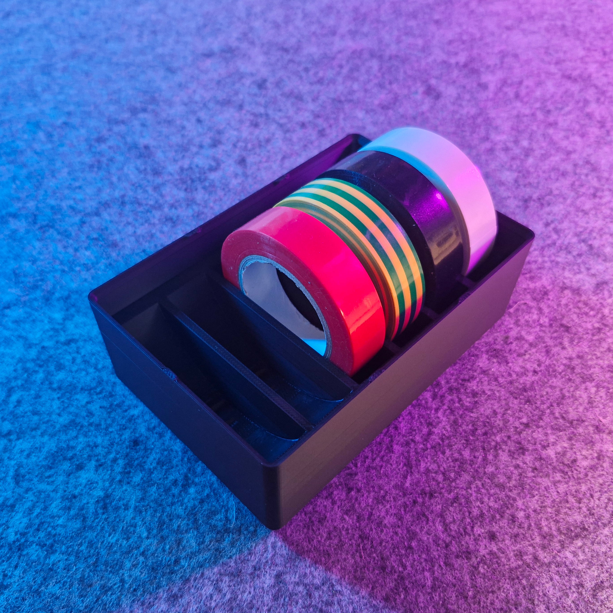

# Bin 2.3.6 - Electrical Tape Holder (remix)

- **Brief**: Gridfinity container for 6 small electrical tape spools, sized exactly to 3x3x6 for stackability.
- **Tags**: `gridfinity`, `electrical tape`, `holder`, `magnet`, `stackable`.
- **Original**: [Printables](https://www.printables.com/model/421237-electrical-tape-holder-gridfinity)

Gridfinity container for electrical tapes with room for 6 small spools.

<!------------------------------------------------------------------------------------------------->
## Attribution
<!------------------------------------------------------------------------------------------------->

This model is a remix of a 3D print model by **LutraVulgaris** obtained from <https://www.printables.com/model/421237-electrical-tape-holder-gridfinity>.

Explore my [3D print model collection](https://zeroexgit.github.io/3d-print-models/) to discover
more models and check for updates to this one.

### Differences of the remix compared to the original

- Simplified magnet holes.
- Added lip notches.
- Ensured size is exactly 3x3x6 for stackability.

### Original Description

> Gridfinity container for electrical tapes (6 small spools).
>
> - 3x3, 6u tall.
> - Stackable.
> - Holes for 6x2 mm press-fit magnets.

<!------------------------------------------------------------------------------------------------->
## License
<!------------------------------------------------------------------------------------------------->

This model is marked as **Public Domain** in the provided metadata. Verify exact upstream license
wording before publishing outside this repo.
