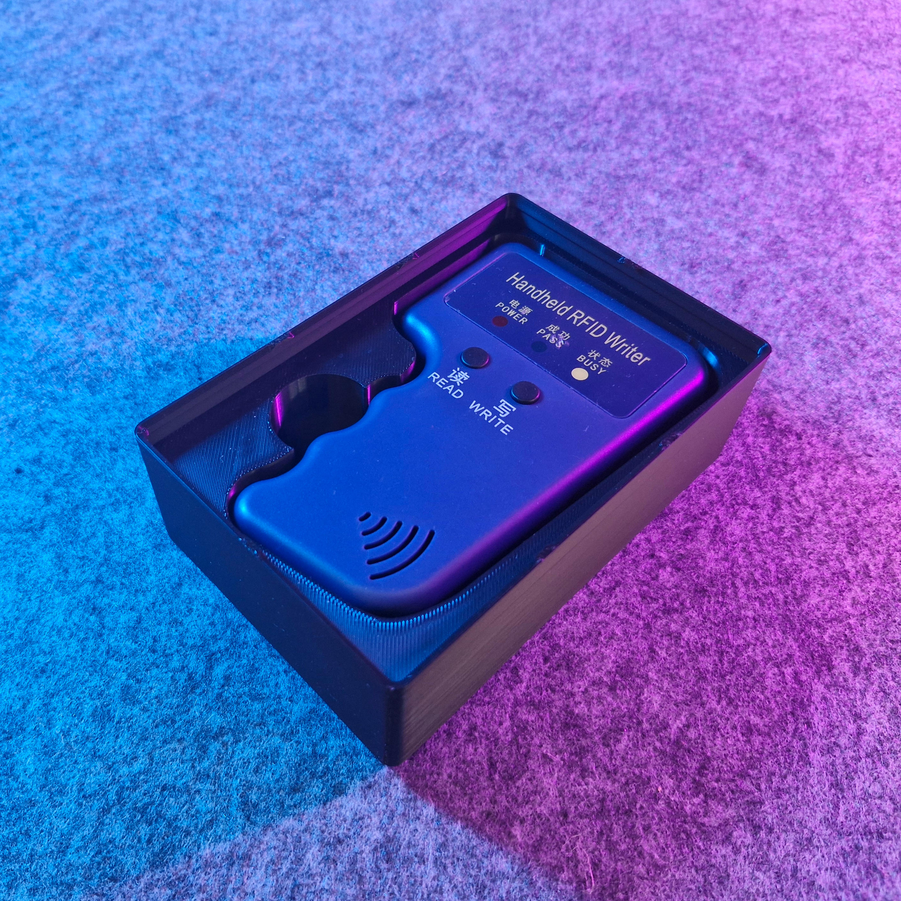

# Bin 2.3.6 - Handheld RFID Writer (remix)

- **Brief**: Gridfinity remix for a handheld RFID writer, packed into a 2x3x6 unit bin with lip notches and magnet holes.
- **Tags**: `gridfinity`, `rfid`, `writer`, `holder`, `magnet`.
- **Original**: [Printables](https://www.printables.com/model/871504-handheld-rfid-writer-gridfinity/files)

<!------------------------------------------------------------------------------------------------->
## Attribution
<!------------------------------------------------------------------------------------------------->

This model is a remix of a 3D print model by **kilinccagatay** obtained from <https://www.printables.com/model/871504-handheld-rfid-writer-gridfinity/files>.

Explore my [3D print model collection](https://zeroexgit.github.io/3d-print-models/) to discover
more models and check for updates to this one.

### Differences of the remix compared to the original

- Packed into a 2x3x6 unit bin size.
- Added lip notches.
- Added magnet holes.

### Original Description

> Handheld RFID Writer gridfinity

<!------------------------------------------------------------------------------------------------->
## License
<!------------------------------------------------------------------------------------------------->

This model is licensed under [**CC BY-NC-SA 4.0**](https://creativecommons.org/licenses/by-nc-sa/4.0/).
