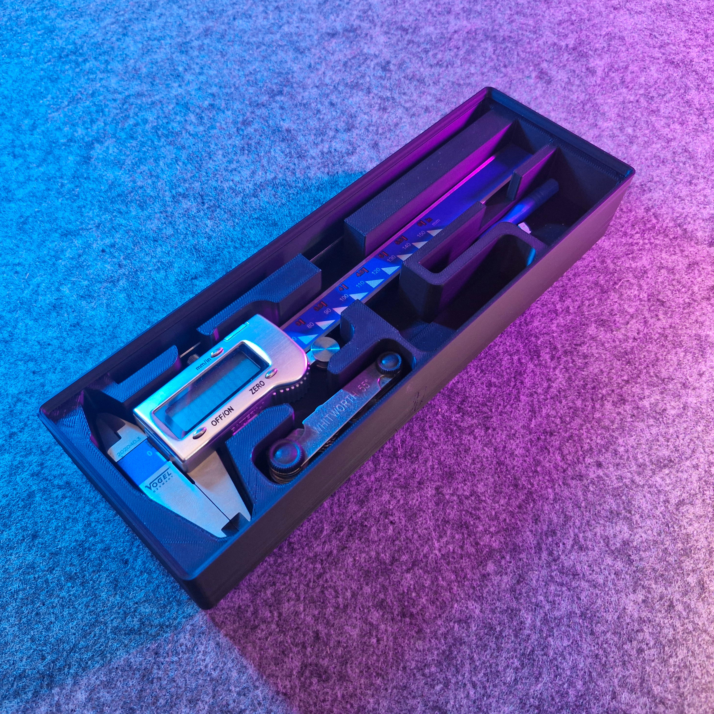

# Bin 2.6.6 - Caliper (remix)

- **Brief**: Gridfinity caliper organizer.
- **Tags**: `gridfinity`, `caliper`, `organizer`, `tool holder`.

Gridfinity caliper holder.

<!------------------------------------------------------------------------------------------------->
## Attribution
<!------------------------------------------------------------------------------------------------->

This model is a remix of a 3D print model by **Jacek** obtained from <https://www.printables.com/model/1086568-gridfinity-caliper>.

Explore my [3D print model collection](https://zeroexgit.github.io/3d-print-models/) to discover
more models and check for updates to this one.

### Differences of the remix compared to the original

- Packed into a 2x6x6 unit bin size.
- Added lip notches.

### Original Description

> Caliper organizer by GRIDFINITY design.
>
> Based on the Gridfinity System from Zack Freedman: https://thangs.com/designer/ZackFreedman
>
> https://www.youtube.com/c/

<!------------------------------------------------------------------------------------------------->
## License
<!------------------------------------------------------------------------------------------------->

This model is licensed under [**CC BY 4.0**](https://creativecommons.org/licenses/by/4.0/).
