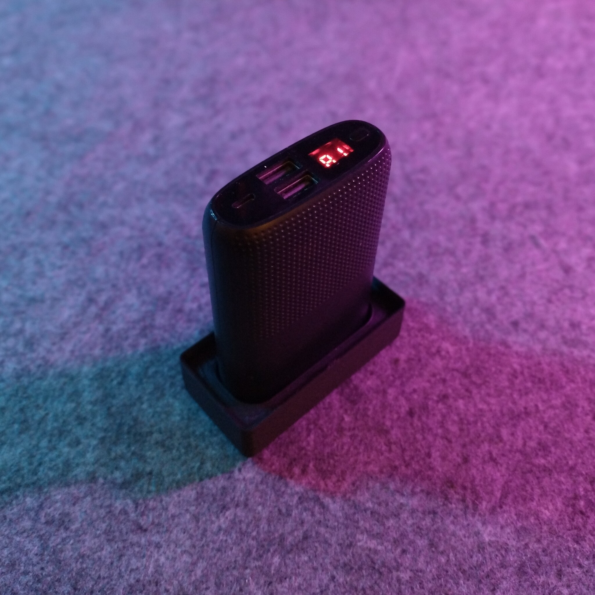
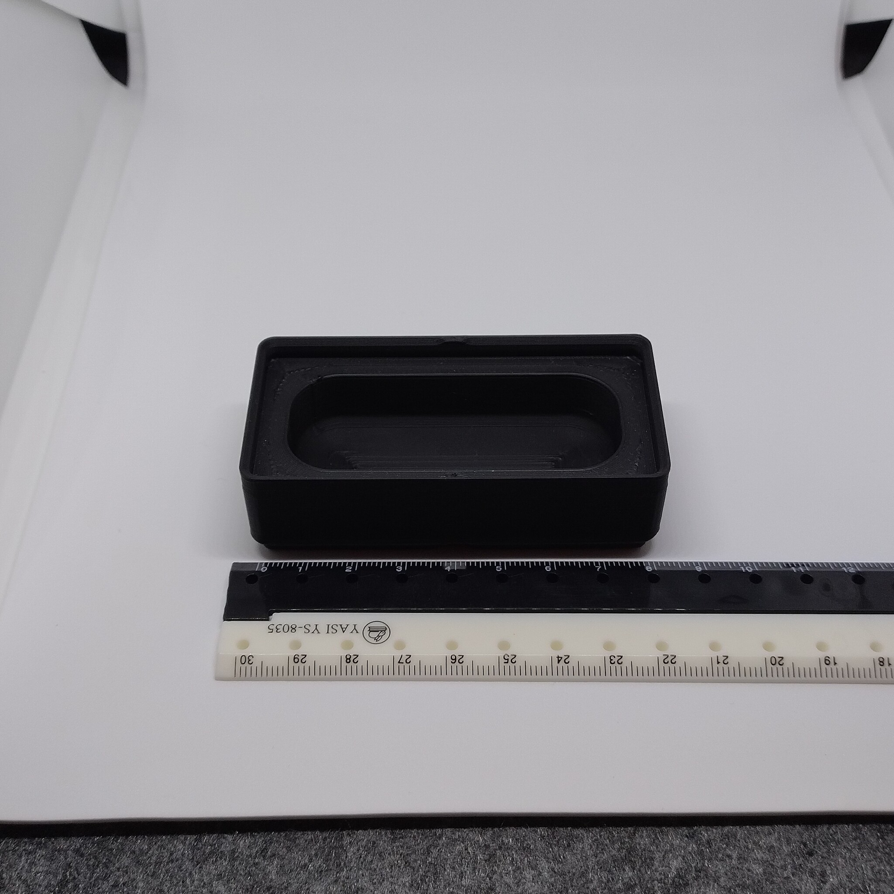
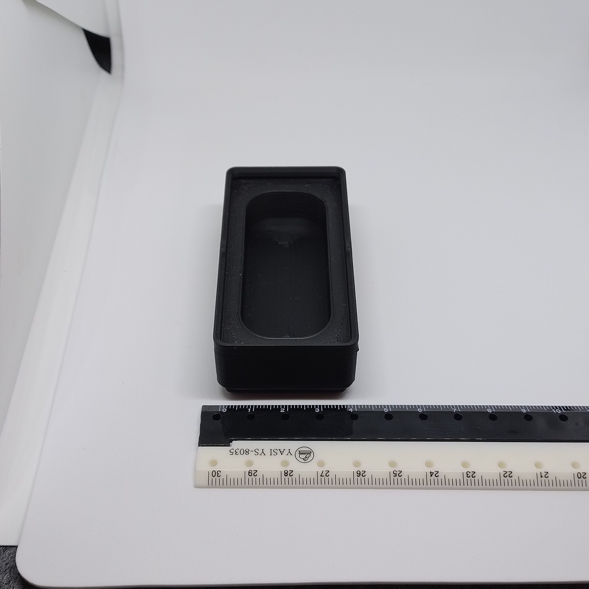

# Gridfinity - Bin 1.2.3 - PURIDEA S16 power bank

- **Brief**: Gridfinity holder for a PURIDEA S16 power bank.
- **Tags**: `gridfinity`, `storage`, `electronics`, `battery bank`.
- **Published**:
  [Thingiverse](https://www.thingiverse.com/thing:7416302),
  [Printables](https://www.printables.com/model/1860437-gridfinity-bin-123-puridea-s16-power-bank),
  [MakerWorld](https://makerworld.com/en/models/3375361-gridfinity-bin-1-2-3-puridea-s16-power-bank),
  [Cults3D](https://cults3d.com/en/3d-model/tool/gridfinity-bin-1-2-3-puridea-s16-power-bank).

Gridfinity bin sized 1x2x3 for holding a PURIDEA S16 power bank.

<!------------------------------------------------------------------------------------------------->
## Attribution
<!------------------------------------------------------------------------------------------------->

This is an original 3D print model.

Explore my [3D print model collection](https://zeroexgit.github.io/3d-print-models/) to discover
more models and check for updates to this one.

<!------------------------------------------------------------------------------------------------->
## License
<!------------------------------------------------------------------------------------------------->

This model is licensed under [**CC BY-NC-SA 4.0**](https://creativecommons.org/licenses/by-nc-sa/4.0/).
