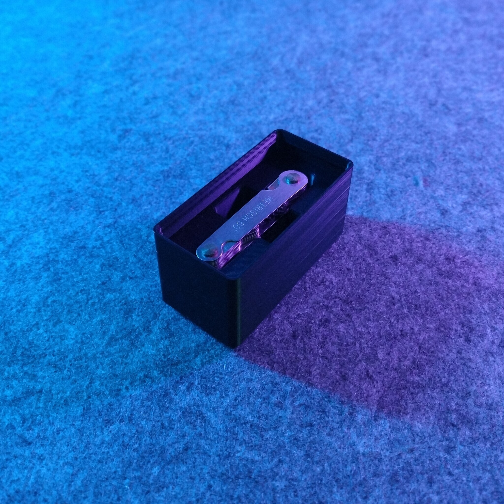
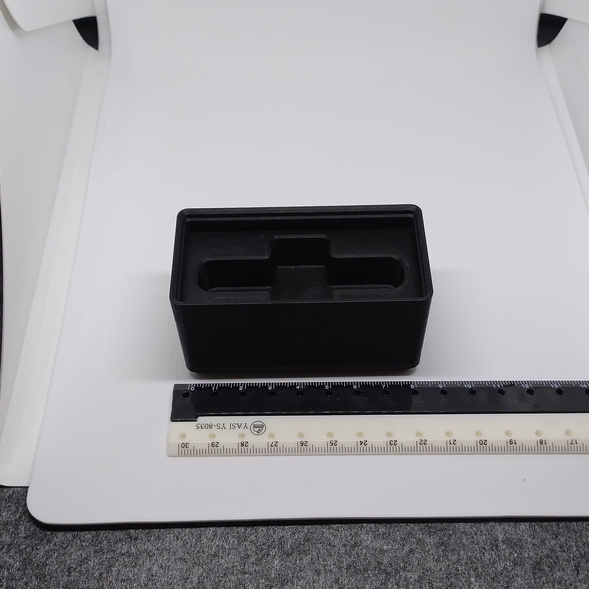
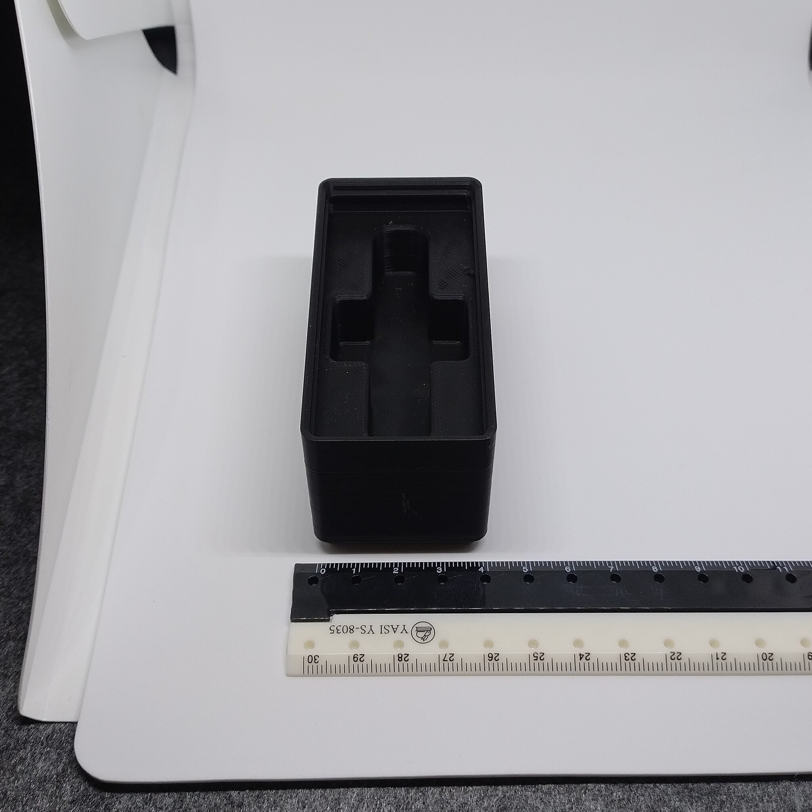

# Gridfinity - Bin 1.2.6 - Thread gauge (remix)

- **Brief**: Gridfinity thread-gauge holder resized to 1x2x6, with stacking lips and press-fit
  holes for 6x2 mm magnets.
- **Tags**: `gridfinity`, `storage`, `thread gauge`, `organizer`, `stackable`.
- **Published**:
  [Thingiverse](https://www.thingiverse.com/thing:7416618),
  [Printables](https://www.printables.com/model/1861090-gridfinity-bin-126-thread-gauge-remix),
  [MakerWorld](https://makerworld.com/en/models/3376719-gridfinity-bin-1-2-6-thread-gauge-remix),
  [Cults3D](https://cults3d.com/en/3d-model/tool/gridfinity-bin-1-2-6-thread-gauge-remix).

A compact Gridfinity bin for storing a thread gauge. The 1x2x6 size, stacking lips, and magnet holes
adapt the holder to this setup while keeping it easy to stack and secure.

<!------------------------------------------------------------------------------------------------->
## Attribution
<!------------------------------------------------------------------------------------------------->

This model is a remix of a 3D print model by **Mikołaj** obtained from <https://www.printables.com/model/1143237-gridfinity-bin-for-thread-gauge>.

Explore my [3D print model collection](https://zeroexgit.github.io/3d-print-models/) to discover more
models and check for updates to this one.

### Differences of the remix compared to the original

- Resized the bin to 1x2x6.
- Added stacking lips.
- Added press-fit holes for 6x2 mm magnets.

### Original Description

> Gridfinity 1x2x4 bin for a thread gauge.

<!------------------------------------------------------------------------------------------------->
## License
<!------------------------------------------------------------------------------------------------->

This model is licensed under [**CC BY-NC-SA 4.0**](https://creativecommons.org/licenses/by-nc-sa/4.0/).
