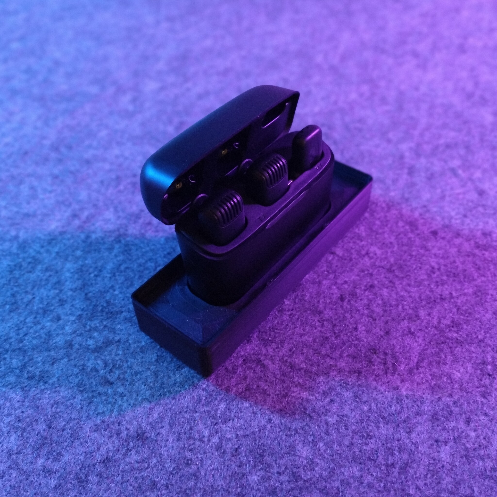
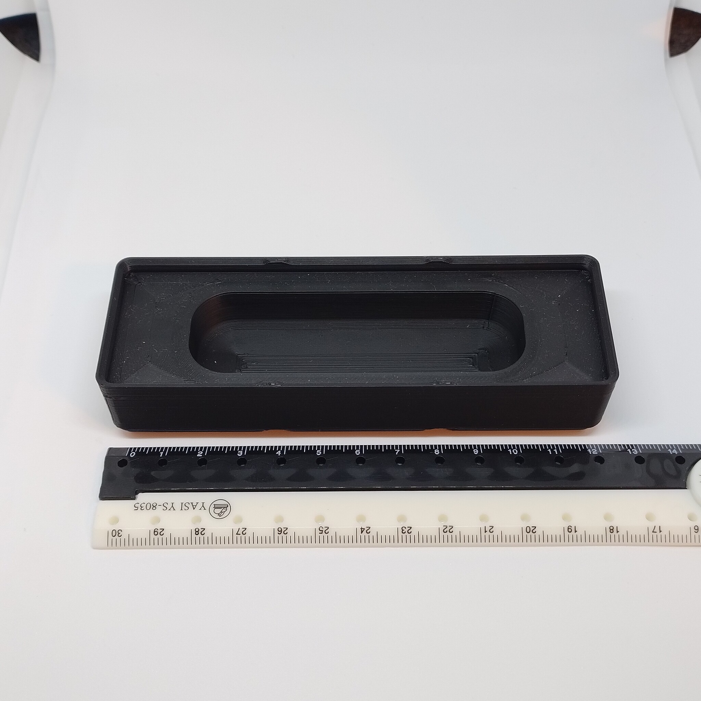
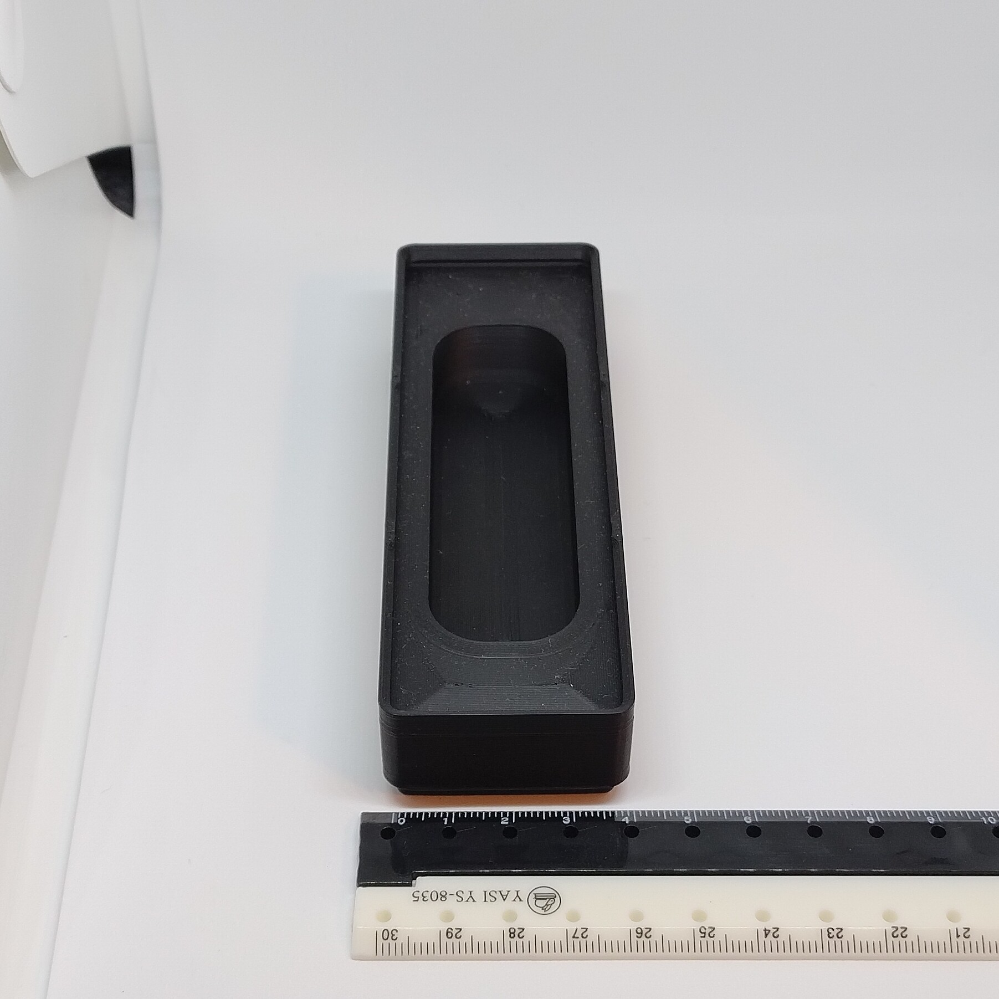

# Gridfinity - Bin 1.3.3 - Wireless lavalier microphone

- **Brief**: Gridfinity bin for a compact wireless lavalier microphone kit.
- **Tags**: `gridfinity`, `storage`, `audio`, `microphone`.
<!--
- **Published**:
  [Thingiverse](link-goes-here),
  [Printables](link-goes-here),
  [MakerWorld](link-goes-here),
  [Cults3D](link-goes-here).
-->

Gridfinity bin sized 1x3x3 for a compact wireless lavalier microphone kit. The seller described the
kit as including a charging case and receiver for use with phones, tablets, gaming, and live
streaming. The microphone has no markings or other identifying information. An K30 USB-C model
is one possible lead, but this identification is unverified; fit may vary between kits.

<!------------------------------------------------------------------------------------------------->
## Attribution
<!------------------------------------------------------------------------------------------------->

This is an original 3D print model.

Explore my [3D print model collection](https://zeroexgit.github.io/3d-print-models/) to discover
more models and check for updates to this one.

<!------------------------------------------------------------------------------------------------->
## License
<!------------------------------------------------------------------------------------------------->

This model is licensed under [**CC BY-NC-SA 4.0**](https://creativecommons.org/licenses/by-nc-sa/4.0/).
