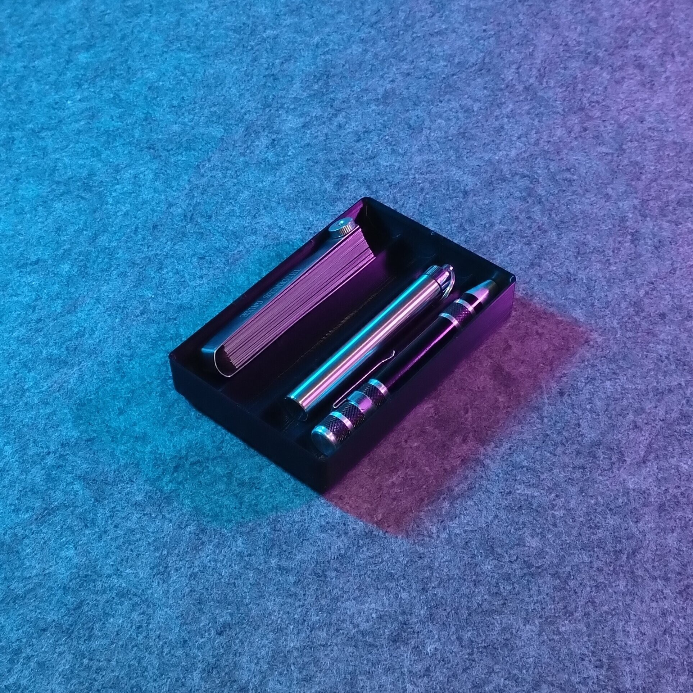
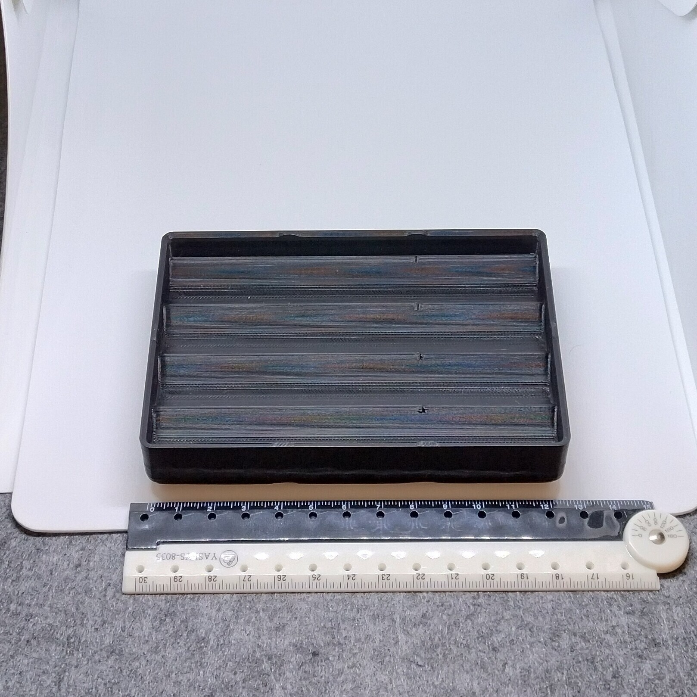
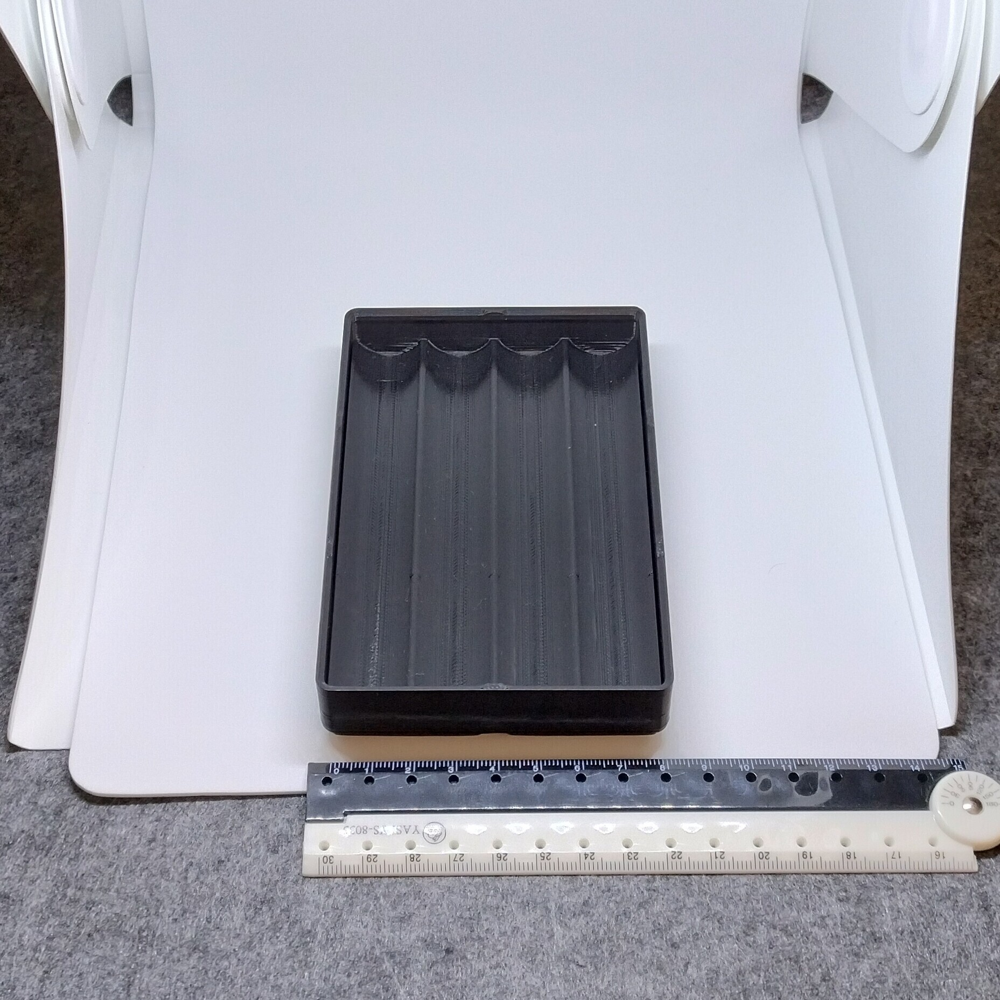

# Gridfinity - Bin 2.3.3 - Pencil bin with 4 trays (remix)

- **Brief**: Gridfinity pen holder with four compartments.
- **Tags**: `gridfinity`, `storage`, `tool holder`, `stackable`
- **Published**:
  [Thingiverse](https://www.thingiverse.com/thing:7417688),
  [Printables](https://www.printables.com/model/1864319-gridfinity-bin-233-pencil-bin-with-4-trays-remix),
  [MakerWorld](https://makerworld.com/en/models/3388727-gridfinity-bin-2-3-3-pencil-tray-4-remix),
  [Cults3D](https://cults3d.com/en/3d-model/tool/gridfinity-bin-2-3-3-pencil-bin-with-4-trays-remix).

This Gridfinity-compatible pen holder has four compartments for pens and other stationery. It is
2x3x3 Gridfinity units and can stack when the stored items do not extend above the rim.

<!------------------------------------------------------------------------------------------------->
## Attribution
<!------------------------------------------------------------------------------------------------->

This model is a remix of a 3D print model by **Dissendat** obtained from <https://www.printables.com/model/455293-gridfinity-pen-holder/files>.

Explore my [3D print model collection](https://zeroexgit.github.io/3d-print-models/) to discover more models and check for updates to this one.

### Differences of the remix compared to the original

- Resize to Gridfinity 2x3x3 bin size.
- Added notches on stacking lips.
- Added press-fit holes for 6x2 mm magnets.

### Original Description

> A Gridfinity-compatible pen holder measuring 2x4 Gridfinity units and 3 units high. It holds up to four pens and can stack when stored items are not too thick.

<!------------------------------------------------------------------------------------------------->
## License
<!------------------------------------------------------------------------------------------------->

This model is licensed under [**CC BY 4.0**](https://creativecommons.org/licenses/by/4.0/).
