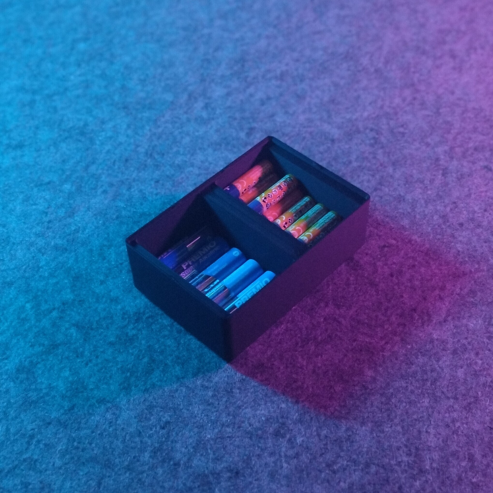
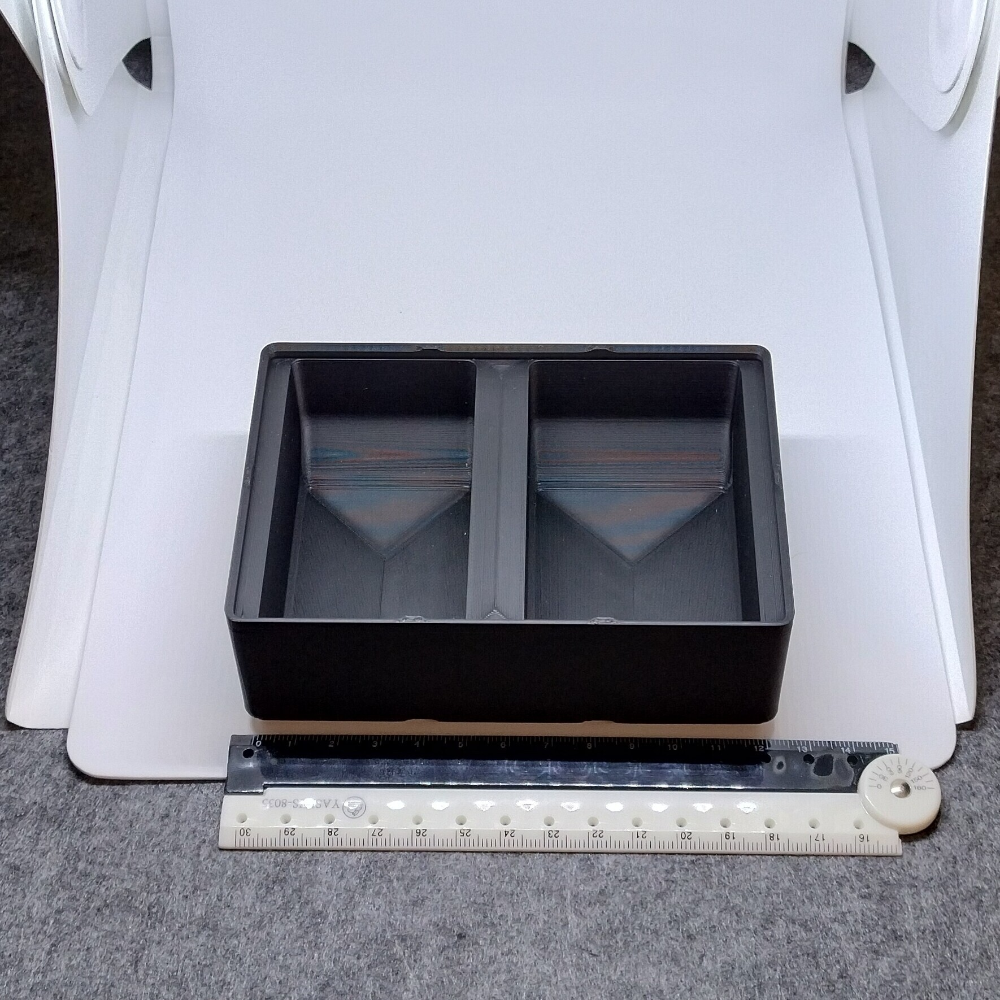
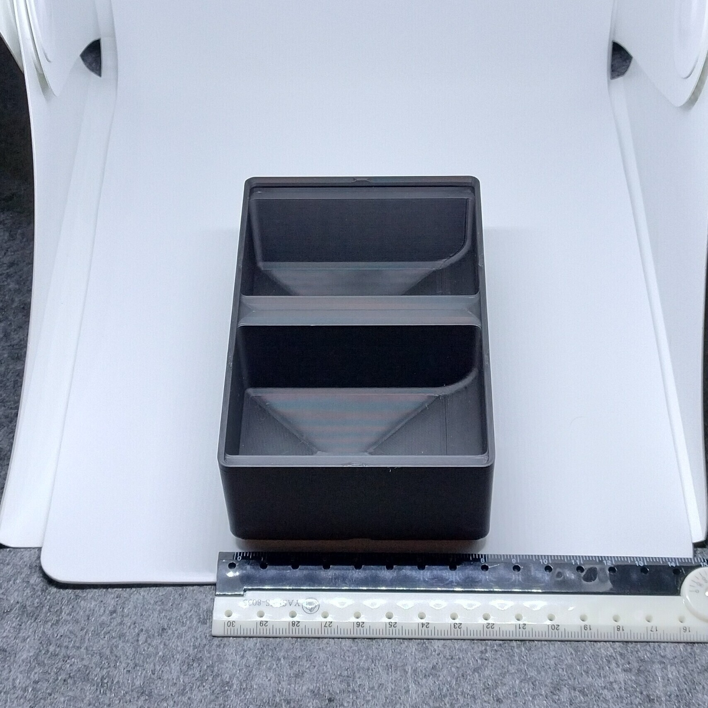

# Gridfinity - Bin 2.3.6 - Battery AA and AAA

  

- **Brief**: Gridfinity organizer for AA and AAA batteries.
- **Tags**: `gridfinity`, `storage`, `tool holder`, `stackable`
- **Published**:
  [Thingiverse](https://www.thingiverse.com/thing:7417689),
  [Printables](https://www.printables.com/model/1864325-gridfinity-bin-236-battery-aa-and-aaa),
  [MakerWorld](https://makerworld.com/en/models/3388735-gridfinity-bin-2-3-6-battery-aa-and-aaa),
  [Cults3D](https://cults3d.com/en/3d-model/tool/gridfinity-bin-2-3-6-battery-aa-and-aaa).

Gridfinity organizer for storing AA and AAA batteries. Stackable and with a scoop to easily remove batteries from the bin.

<!------------------------------------------------------------------------------------------------->

## Attribution

<!------------------------------------------------------------------------------------------------->

This is an original 3D print model.

Explore my [3D print model collection](https://zeroexgit.github.io/3d-print-models/) to discover more models and check for updates to this one.

<!------------------------------------------------------------------------------------------------->

## License

<!------------------------------------------------------------------------------------------------->

This model is licensed under [**CC BY-NC-SA 4.0**](https://creativecommons.org/licenses/by-nc-sa/4.0/).
