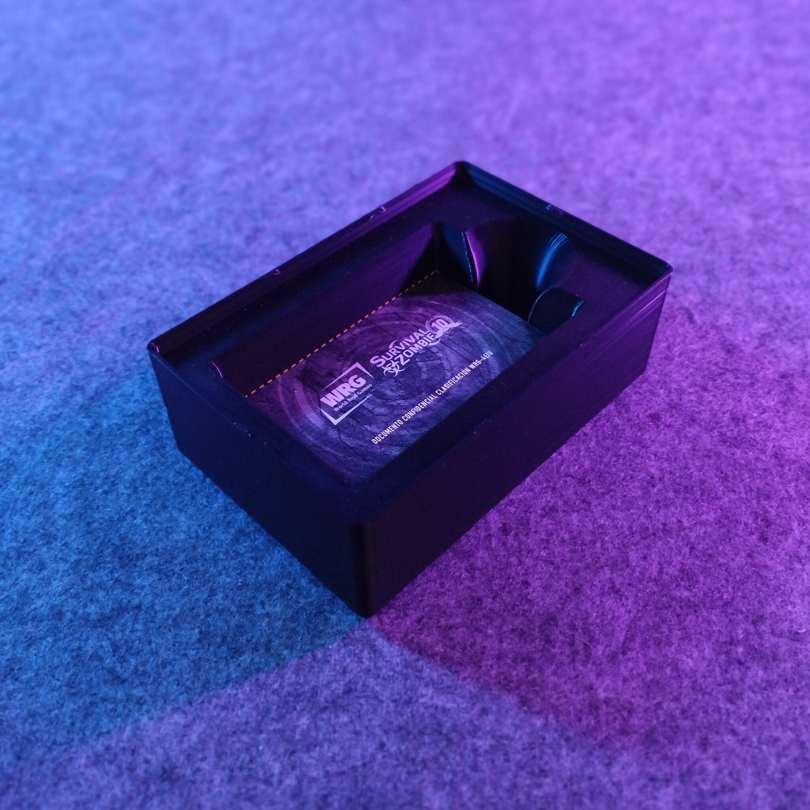
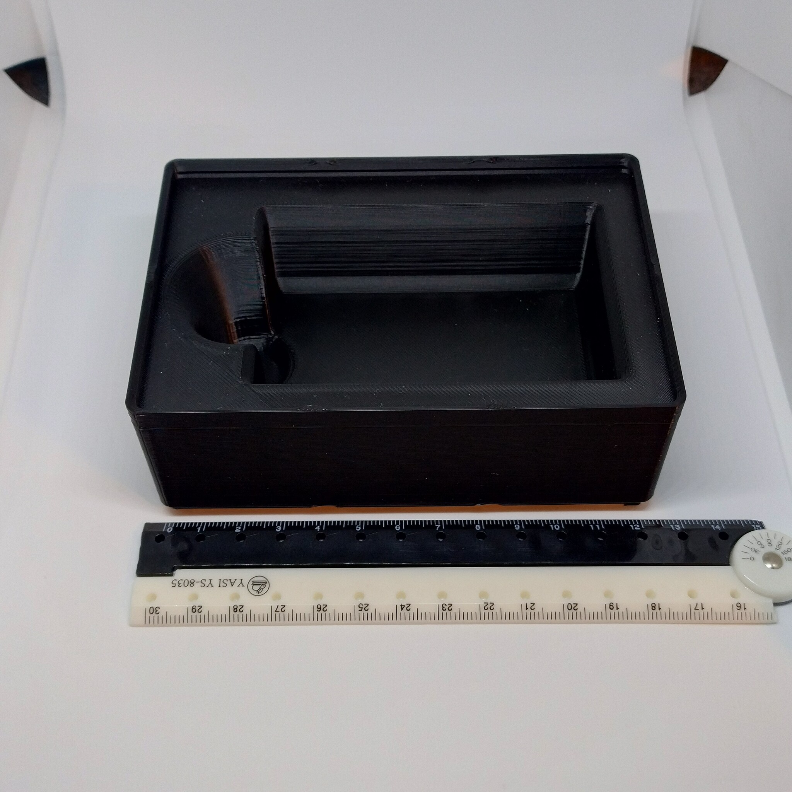
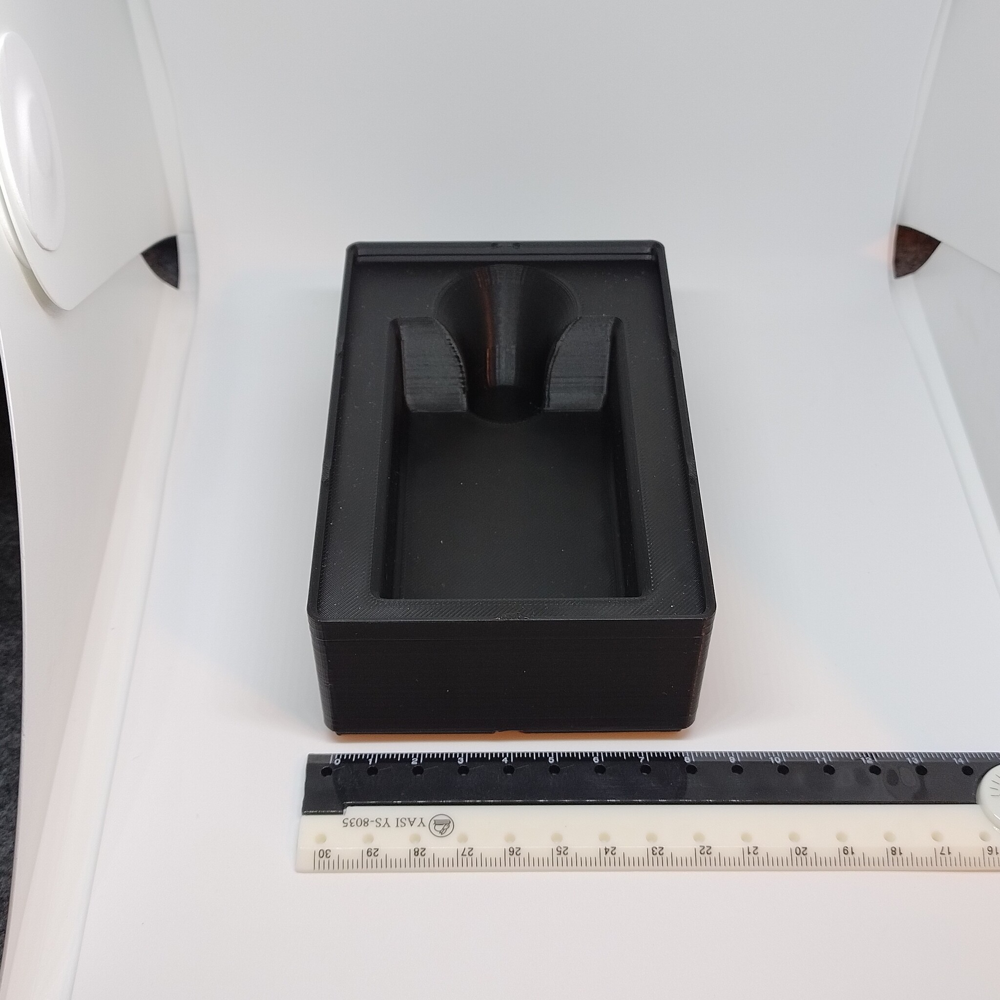

# Gridfinity - Bin 2.3.6 - Credit card tray (remix)

- **Brief**: Stackable Gridfinity tray for storing credit cards.
- **Tags**: `gridfinity`, `storage`, `cards`, `stackable`.
- **Published**:
  [Thingiverse](https://www.thingiverse.com/thing:7416487),
  [Printables](https://www.printables.com/model/1860863-gridfinity-bin-236-credit-card-tray-remix),
  [MakerWorld](https://makerworld.com/en/models/3375850-gridfinity-bin-2-3-6-credit-card-tray-remix),
  [Cults3D](https://cults3d.com/en/3d-model/tool/gridfinity-bin-2-3-6-credit-card-tray-remix).

Stackable Gridfinity tray for credit cards, modified to fit more cards (25+).

<!------------------------------------------------------------------------------------------------->
## Attribution
<!------------------------------------------------------------------------------------------------->

This model is a remix of a 3D print model by **foundUnderground** obtained from <https://www.printables.com/model/1052592-gridfinity-credit-card-tray>.

Explore my [3D print model collection](https://zeroexgit.github.io/3d-print-models/) to discover
more models and check for updates to this one.

### Differences of the remix compared to the original

- Resized to 2x3x6.
- Added stacking lips.
- Added magnet holes.

### Original Description

> Credit card tray for Gridfinity. I couldn't find something that worked quite the way I wanted.
> This model should use less filament than most of what I saw available, and have a few other
> advantages.
>
> - Can be used in a situation where card height must be minimized.
> - Stackable - so in my case it can be placed under another bin keeping the cards out of sight.

<!------------------------------------------------------------------------------------------------->
## License
<!------------------------------------------------------------------------------------------------->

This model is licensed under [**CC BY-NC-SA**](https://creativecommons.org/licenses/by-nc-sa/4.0/).
