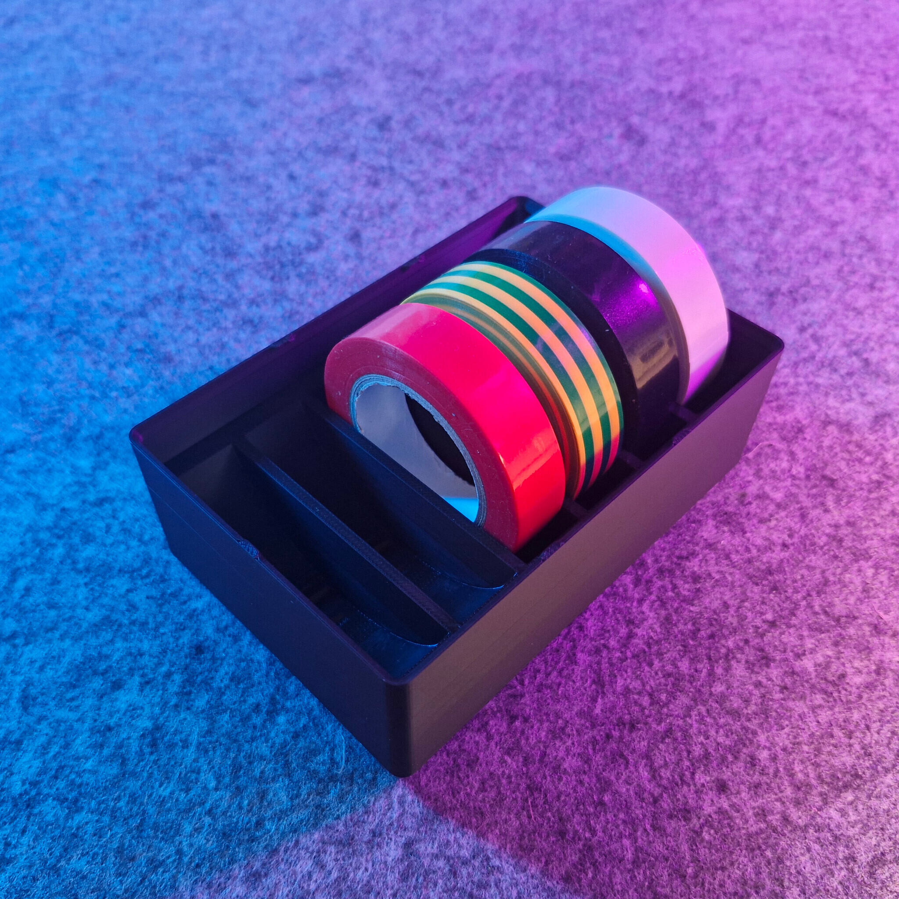
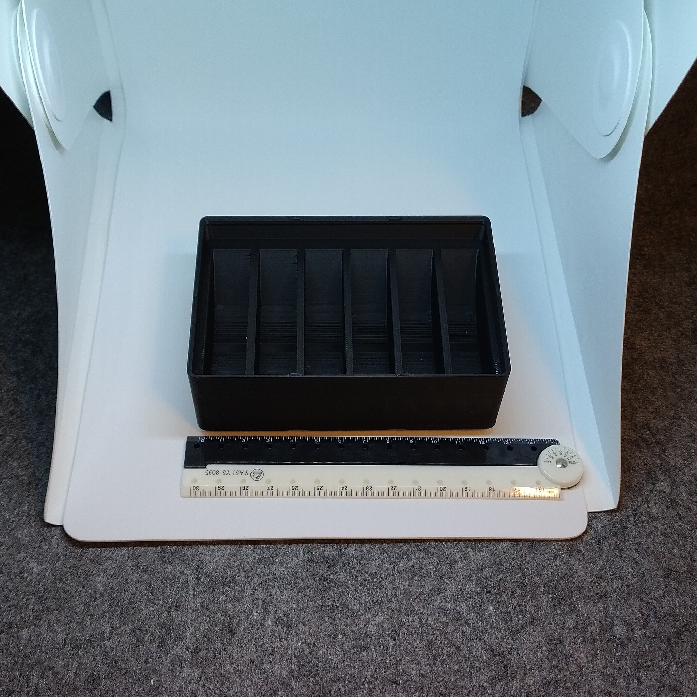
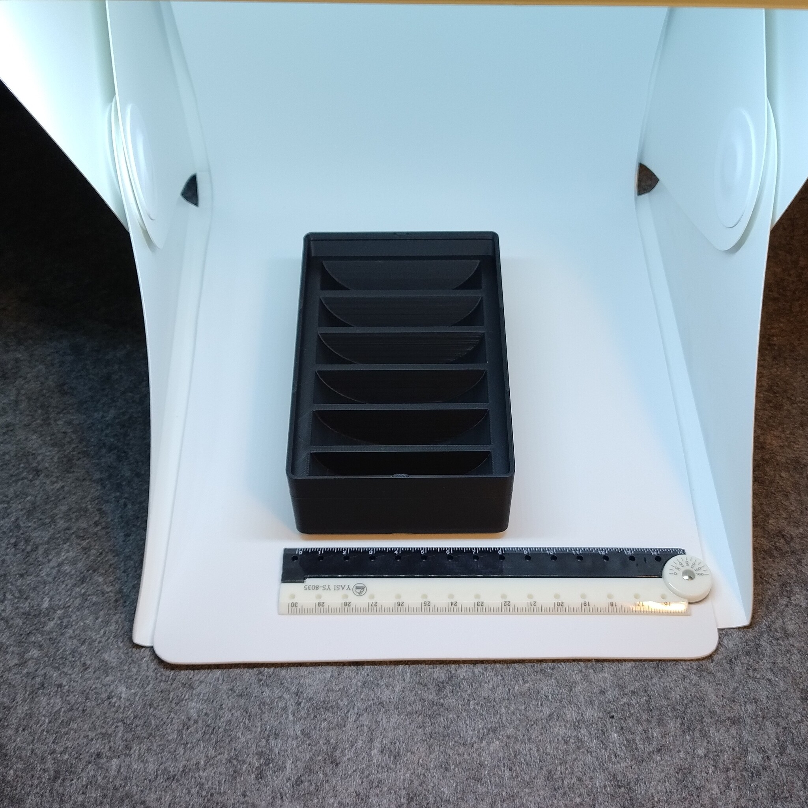

# Gridfinity - Bin 2.3.6 - Electrical Tape (remix)

- **Brief**: Gridfinity container for 6 small electrical tape spools, sized exactly to 3x3x6 for stackability.
- **Tags**: `gridfinity`, `storage`, `tool holder`, `stackable`.
- **Published**:
  [Thingiverse](https://www.thingiverse.com/thing:7416215).
  [Printables](https://www.printables.com/model/1860225-gridfinity-bin-236-electrical-tape-holder-remix),
  [MakerWorld](https://makerworld.com/en/models/3372814-gridfinity-bin-2-3-6-electrical-tape-remix),
  [Cults3D](https://cults3d.com/en/3d-model/tool/gridfinity-bin-2-3-6-electrical-tape-holder-remix).

Gridfinity container for electrical tapes with room for 6 small spools.

<!------------------------------------------------------------------------------------------------->
## Attribution
<!------------------------------------------------------------------------------------------------->

This model is a remix of a 3D print model by **LutraVulgaris** obtained from <https://www.printables.com/model/421237-electrical-tape-holder-gridfinity>.

Explore my [3D print model collection](https://zeroexgit.github.io/3d-print-models/) to discover more models and check for updates to this one.

### Differences of the remix compared to the original

- Simplified the magnet holes for 6x2 mm press-fit magnets.
- Added lip notches.
- Ensured size is exactly 3x3x6 for stackability.

### Original Description

> Gridfinity container for electrical tapes (6 small spools).
>
> - 3x3, 6u tall.
> - Stackable.
> - Holes for 6x2 mm press-fit magnets.

<!------------------------------------------------------------------------------------------------->
## License
<!------------------------------------------------------------------------------------------------->

This model is licensed under [**CC0 1.0**](https://creativecommons.org/publicdomain/zero/1.0/).
