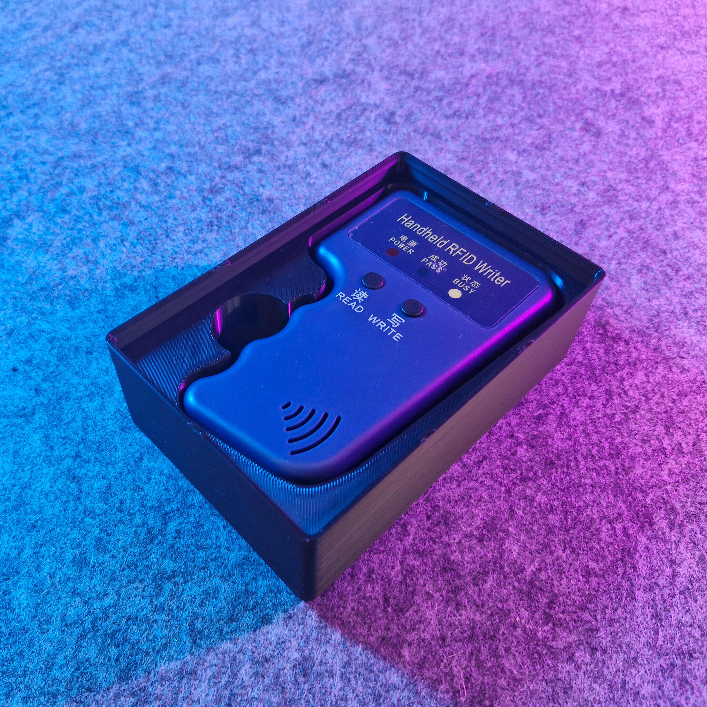
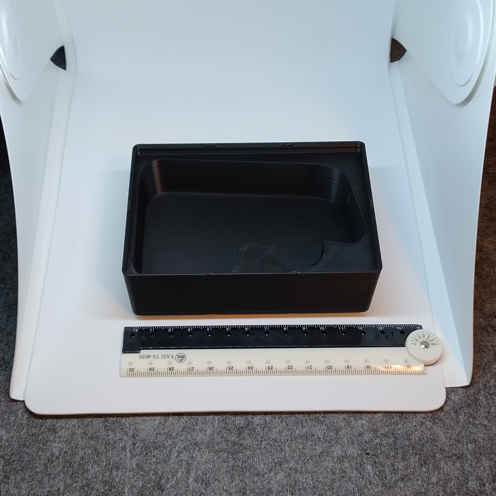
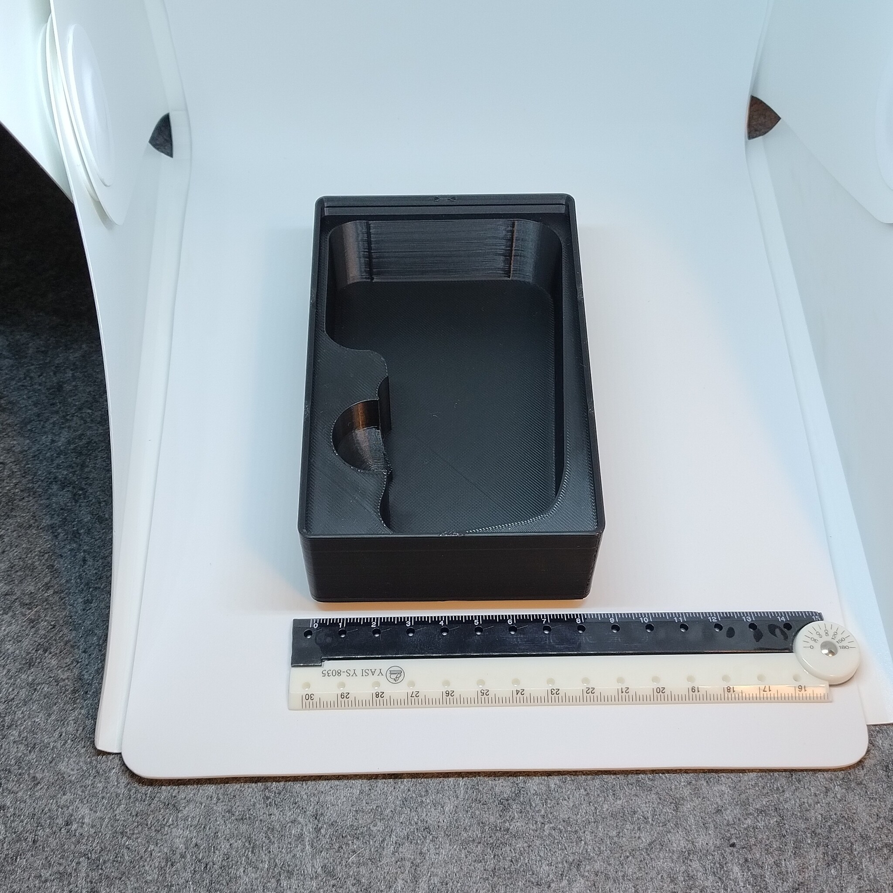

# Gridfinity - Bin 2.3.6 - Handheld RFID writer (remix)

- **Brief**: Gridfinity handheld RFID writer bin, packed into 2x3x6 units with lip notches and
  press-fit holes for 6x2 mm magnets.
- **Tags**: `gridfinity`, `storage`, `tool holder`, `stackable`.
- **Published**:
  [Thingiverse](https://www.thingiverse.com/thing:7416219).
  [Printables](https://www.printables.com/model/1860242-gridfinity-bin-236-handheld-rfid-writer-remix),
  [MakerWorld](https://makerworld.com/en/models/3372936-gridfinity-bin-2-3-6-rfid-writer-remix),
  [Cults3D](https://cults3d.com/en/3d-model/tool/gridfinity-bin-2-3-6-handheld-rfid-writer-remix).

For small RFID writers, found on many online retailers. Stacks particularly well with a
2x3x6 generic bin Gridfinity underneath to store blank RFID tags.

<!------------------------------------------------------------------------------------------------->
## Attribution
<!------------------------------------------------------------------------------------------------->

This model is a remix of a 3D print model by **kilinccagatay** obtained from <https://www.printables.com/model/871504-handheld-rfid-writer-gridfinity/files>.

Explore my [3D print model collection](https://zeroexgit.github.io/3d-print-models/) to discover more models and check for updates to this one.

### Differences of the remix compared to the original

- Packed into a 2x3x6 unit bin size.
- Added lip notches.
- Added press-fit holes for 6x2 mm magnets.

### Original Description

> Handheld RFID Writer gridfinity

<!------------------------------------------------------------------------------------------------->
## License
<!------------------------------------------------------------------------------------------------->

This model is licensed under [**CC BY-NC-SA 4.0**](https://creativecommons.org/licenses/by-nc-sa/4.0/).
