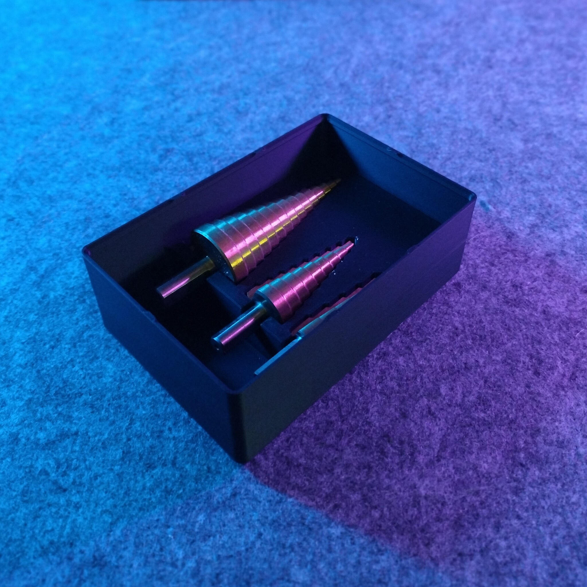
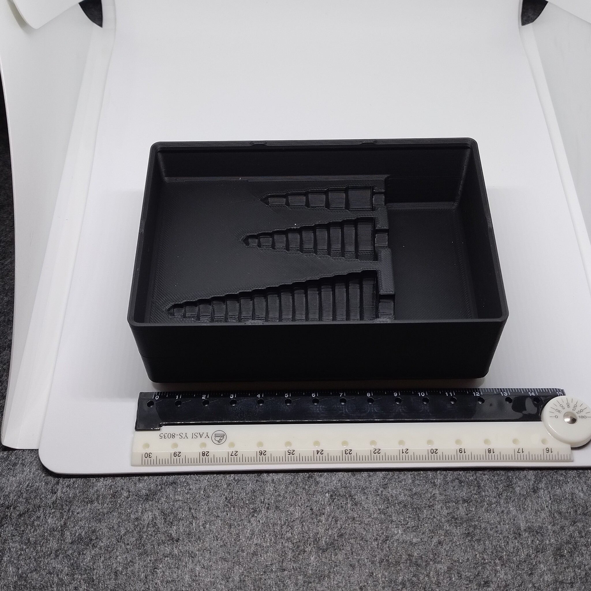
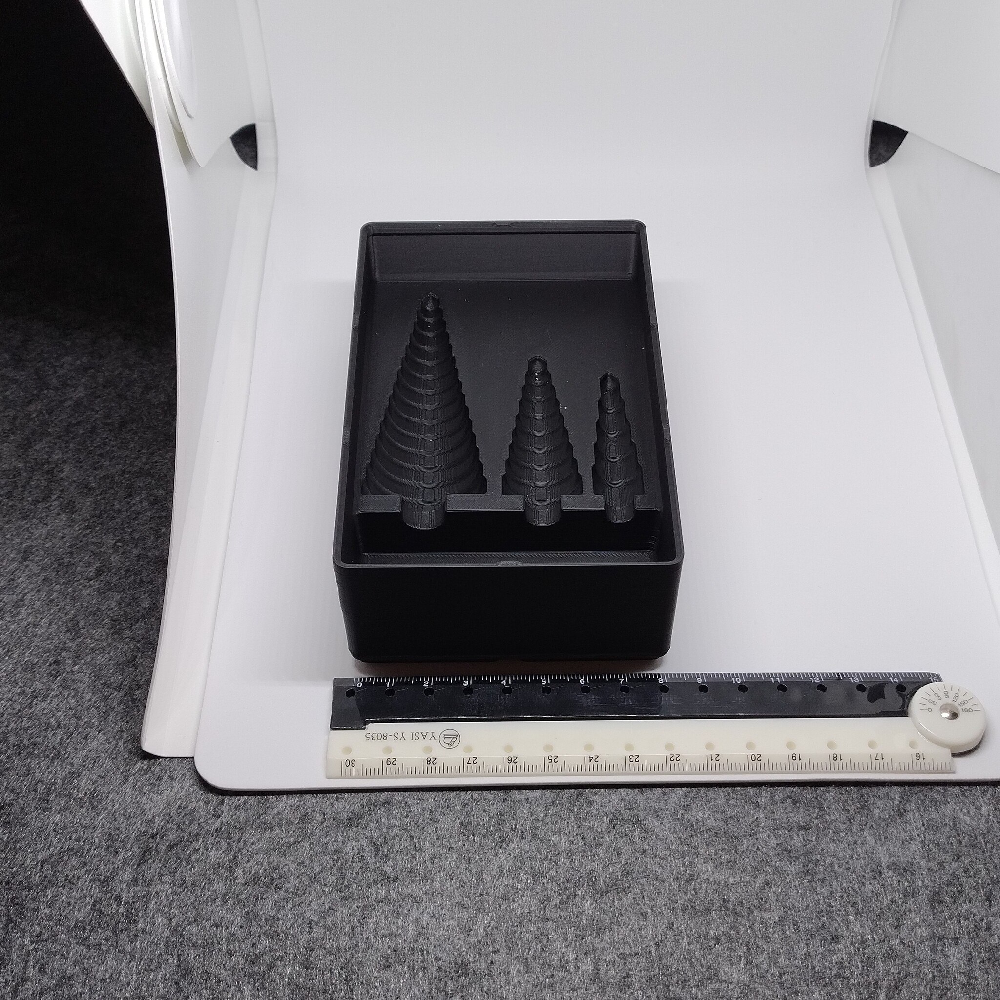

# Gridfinity - Bin 2.3.6 - Step drills (remix)

- **Brief**: Gridfinity step-drill holder with stacking lips and press-fit holes for 6x2 mm magnets.
- **Tags**: `gridfinity`, `storage`, `step drill`, `organizer`, `stackable`.
- **Published**:
  [Thingiverse](https://www.thingiverse.com/thing:7416610),
  [Printables](https://www.printables.com/model/1861086-gridfinity-bin-236-step-drills-remix),
  [MakerWorld](https://makerworld.com/en/models/3376725-gridfinity-bin-2-3-6-step-drills-remix),
  [Cults3D](https://cults3d.com/en/3d-model/tool/gridfinity-bin-2-3-6-step-drills-remix).

Keep step drills together in this Gridfinity holder. The remix adds stacking lips and magnet holes
to make the bin easier to integrate with a stackable, magnetic storage layout.

<!------------------------------------------------------------------------------------------------->
## Attribution
<!------------------------------------------------------------------------------------------------->

This model is a remix of a 3D print model by **layershifter** obtained from <https://www.printables.com/model/1050074-step-drills-grifinity-updated>.

Explore my [3D print model collection](https://zeroexgit.github.io/3d-print-models/) to discover more models and check for updates to this one.

### Differences of the remix compared to the original

- Added notches to stacking lips.
- Added press-fit holes for 6x2 mm magnets.

### Original Description

> A Gridfinity box for 4–32 mm, 4–20 mm, and 4–12 mm step drills, sized 3x2x5. The shortest bit
> did not fit its slot, so the slot was lengthened and magnet holes were added.

<!------------------------------------------------------------------------------------------------->
## License
<!------------------------------------------------------------------------------------------------->

This model is licensed under [**CC BY-NC-SA 4.0**](https://creativecommons.org/licenses/by-nc-sa/4.0/).
