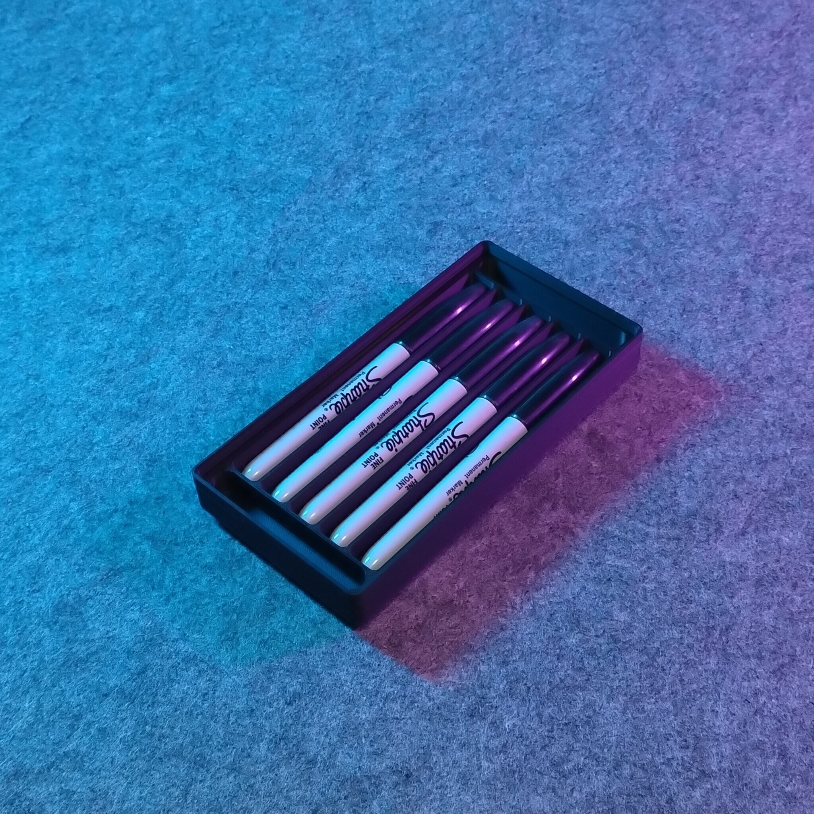
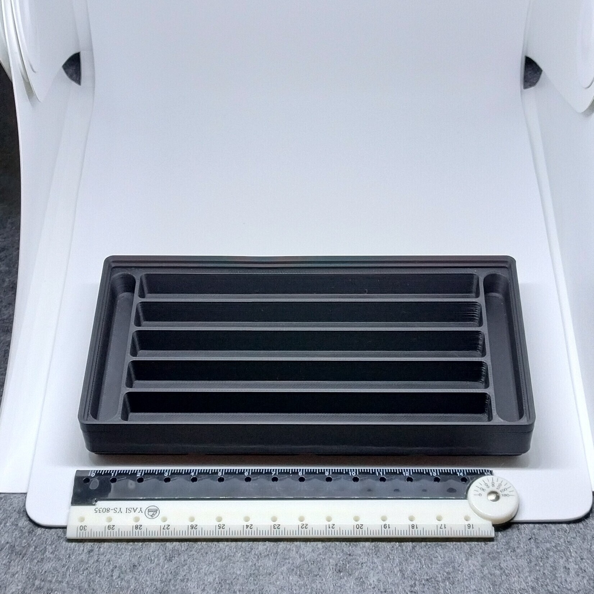
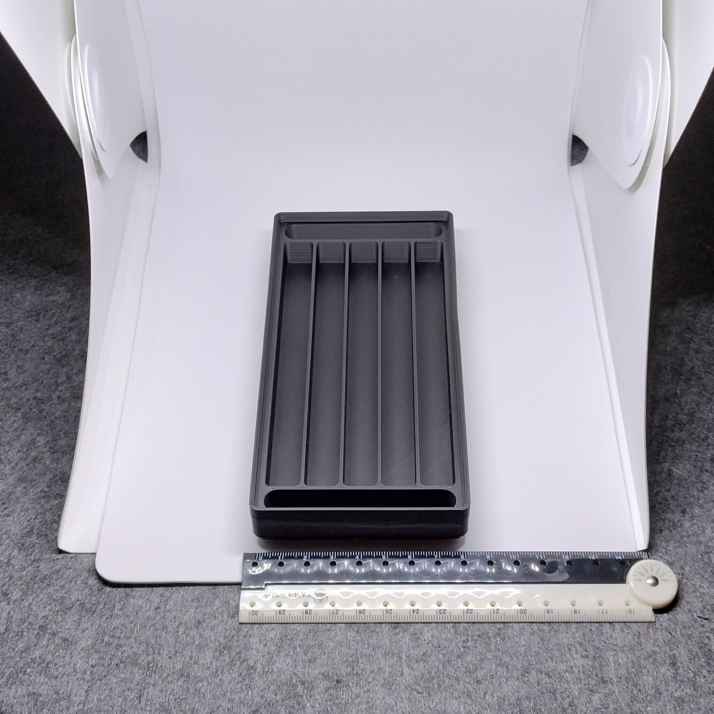

# Gridfinity - Bin 2.4.3 - Sharpie tray with magnet holes (remix)

  

- **Brief**: Shallow Gridfinity tray for storing Sharpie pens.
- **Tags**: `gridfinity`, `storage`, `tool holder`, `stackable`
- **Published**:
  [Thingiverse](https://www.thingiverse.com/thing:7417692),
  [Printables](https://www.printables.com/model/1864330-gridfinity-bin-243-sharpie-tray-with-magnet-holes),
  [MakerWorld](https://makerworld.com/en/models/3388791-gridfinity-bin-2-4-3-sharpie-tray-remix),
  [Cults3D](https://cults3d.com/en/3d-model/tool/gridfinity-bin-2-4-3-sharpie-tray-with-magnet-holes-remix).

A shallow tray for storing Sharpie pens and stackable. Modified for press-fit 6x2 mm magnets.

<!------------------------------------------------------------------------------------------------->

## Attribution

<!------------------------------------------------------------------------------------------------->

This model is a remix of a 3D print model by **Brasso** obtained from <https://www.printables.com/model/722383-gridfinity-4x2-sharpie-tray-5-pens>.

Explore my [3D print model collection](https://zeroexgit.github.io/3d-print-models/) to discover more models and check for updates to this one.

### Differences of the remix compared to the original

- Added press-fit holes for 6x2 mm magnets.

### Original Description

> A shallow tray for Sharpie pens, available in two depths. The deeper version allows stacking, while the shallow version fits an extra layer in a drawer.

<!------------------------------------------------------------------------------------------------->

## License

<!------------------------------------------------------------------------------------------------->

This model is licensed under [**CC BY-NC 4.0**](https://creativecommons.org/licenses/by-nc/4.0/).
