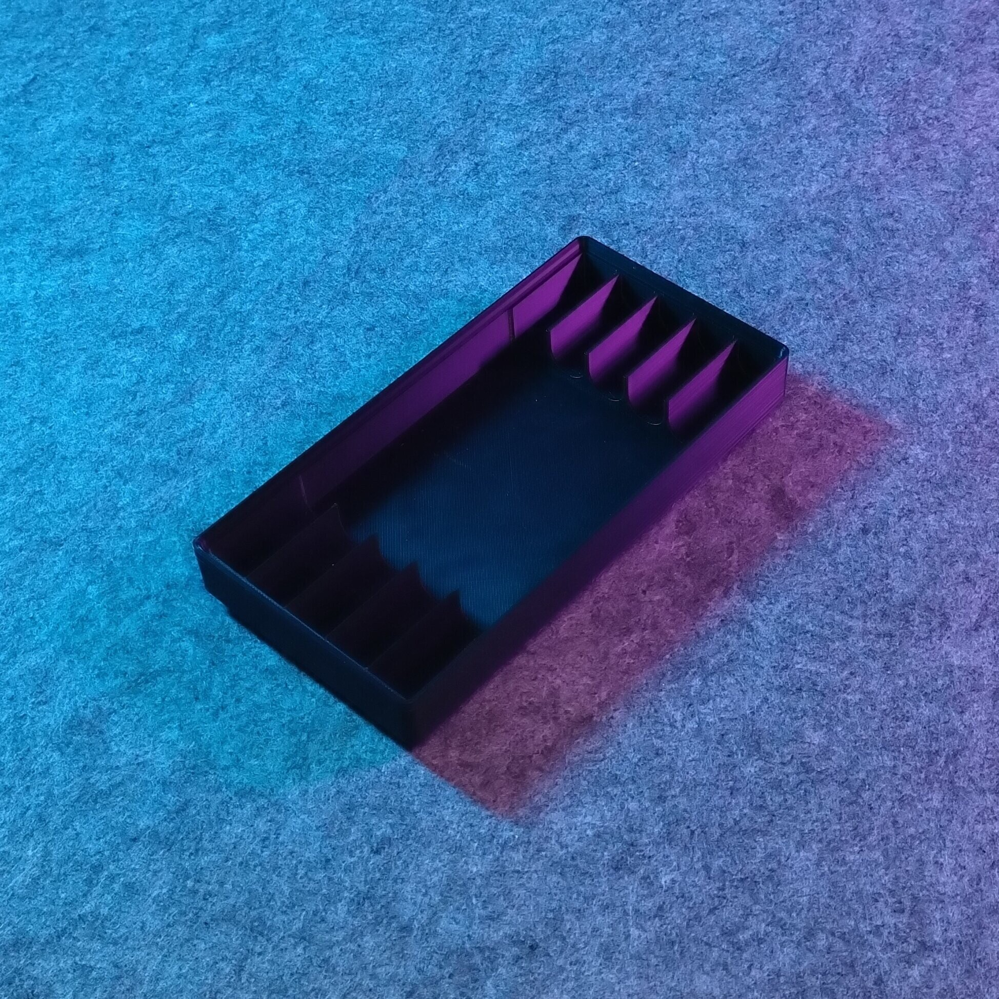
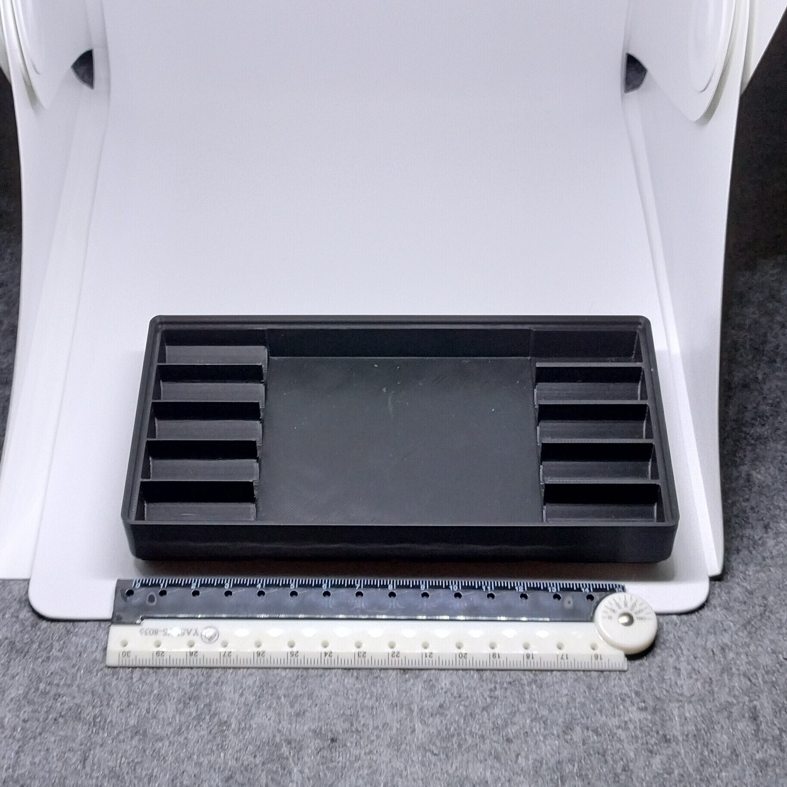
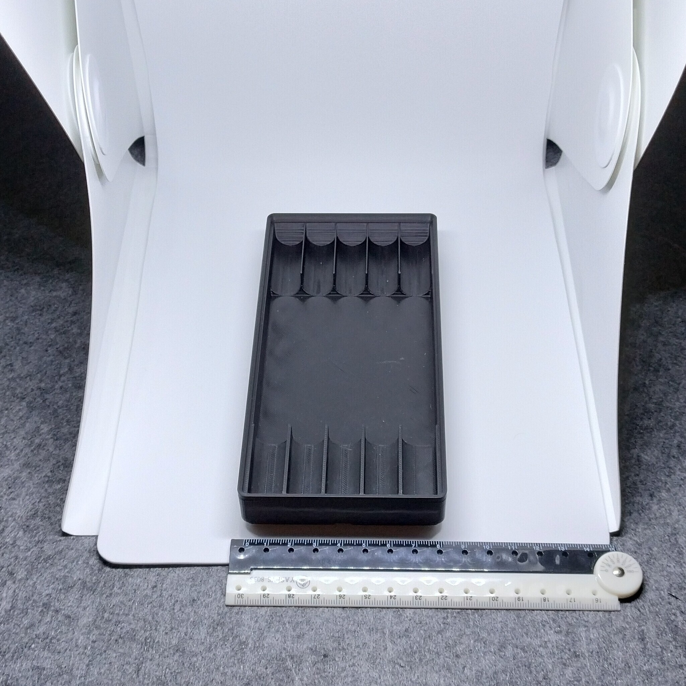

# Gridfinity - Bin 2.4.3 - Stackable 5 pen tray (remix)

  

- **Brief**: Stackable Gridfinity tray for five pens or pencils.
- **Tags**: `gridfinity`, `storage`, `tool holder`, `stackable`
- **Published**:
  [Thingiverse](https://www.thingiverse.com/thing:7417699),
  [Printables](https://www.printables.com/model/1864344-gridfinity-bin-243-stackable-5-pen-tray-remix),
  [MakerWorld](https://makerworld.com/en/models/3388861-gridfinity-bin-2-4-3-stackable-5-pens-remix),
  [Cults3D](https://cults3d.com/en/3d-model/tool/gridfinity-bin-2-4-3-stackable-5-pen-tray-remix).

This 2x4x3 Gridfinity tray holds five pens or pencils and is designed to stack.

<!------------------------------------------------------------------------------------------------->

## Attribution

<!------------------------------------------------------------------------------------------------->

This model is a remix of a 3D print model by **walkitinkid** obtained from <https://www.printables.com/model/1143009-gridfinity-stackable-pen-tray>.

Explore my [3D print model collection](https://zeroexgit.github.io/3d-print-models/) to discover more models and check for updates to this one.

### Differences of the remix compared to the original

- Added notches on stacking lips.
- Added press-fit holes for 6x2 mm magnets.

### Original Description

> A 2x4x3 Gridfinity tray designed to hold five pens or pencils.

<!------------------------------------------------------------------------------------------------->

## License

<!------------------------------------------------------------------------------------------------->

This model is licensed under [**CC BY-NC 4.0**](https://creativecommons.org/licenses/by-nc/4.0/).
