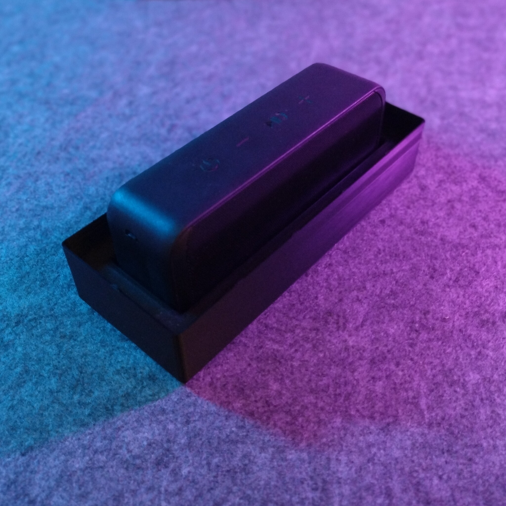
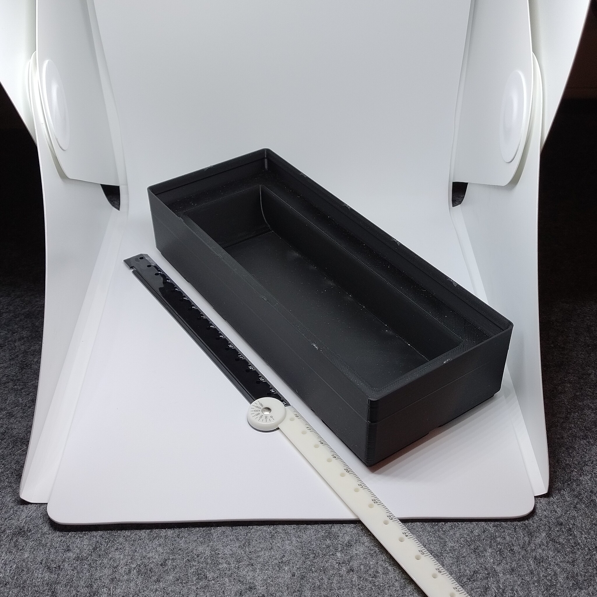
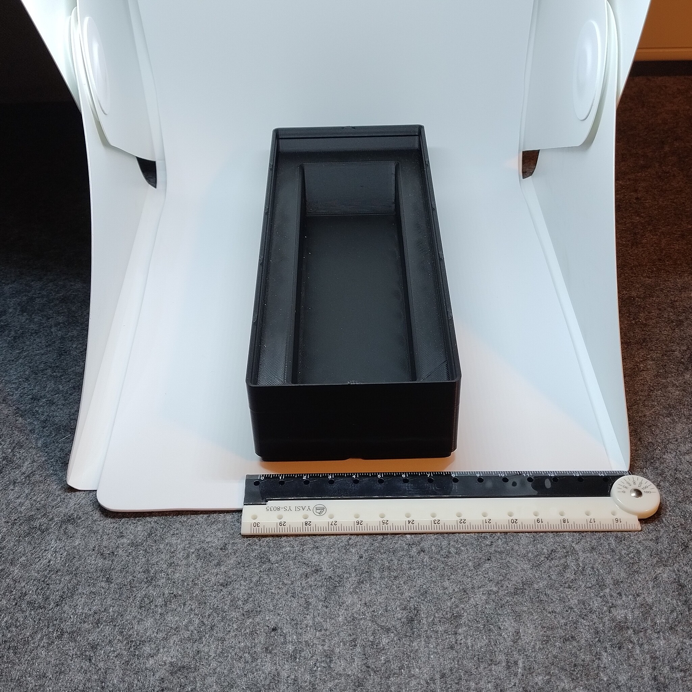

# Gridfinity - Bin 2.5.6 - Aukey SK-A2 bluetooth speaker

- **Brief**: Gridfinity holder for an Aukey SK-A2 Bluetooth speaker.
- **Tags**: `gridfinity`, `storage`, `audio`, `speaker`.
- **Published**:
  [Thingiverse](https://www.thingiverse.com/thing:7416441),
  [Printables](https://www.printables.com/model/1860792-gridfinity-bin-256-aukey-sk-a2-bluetooth-speaker),
  [MakerWorld](https://makerworld.com/en/models/3375387-gridfinity-bin-2-5-6-aukey-sk-a2-speaker),
  [Cults3D](https://cults3d.com/en/3d-model/tool/gridfinity-bin-2-5-6-aukey-sk-a2-bluetooth-speaker).

Gridfinity bin sized 2x5x6 for holding an Aukey SK-A2 Bluetooth speaker.

<!------------------------------------------------------------------------------------------------->
## Attribution
<!------------------------------------------------------------------------------------------------->

This is an original 3D print model.

Explore my [3D print model collection](https://zeroexgit.github.io/3d-print-models/) to discover
more models and check for updates to this one.

<!------------------------------------------------------------------------------------------------->
## License
<!------------------------------------------------------------------------------------------------->

This model is licensed under [**CC BY-NC-SA 4.0**](https://creativecommons.org/licenses/by-nc-sa/4.0/).
