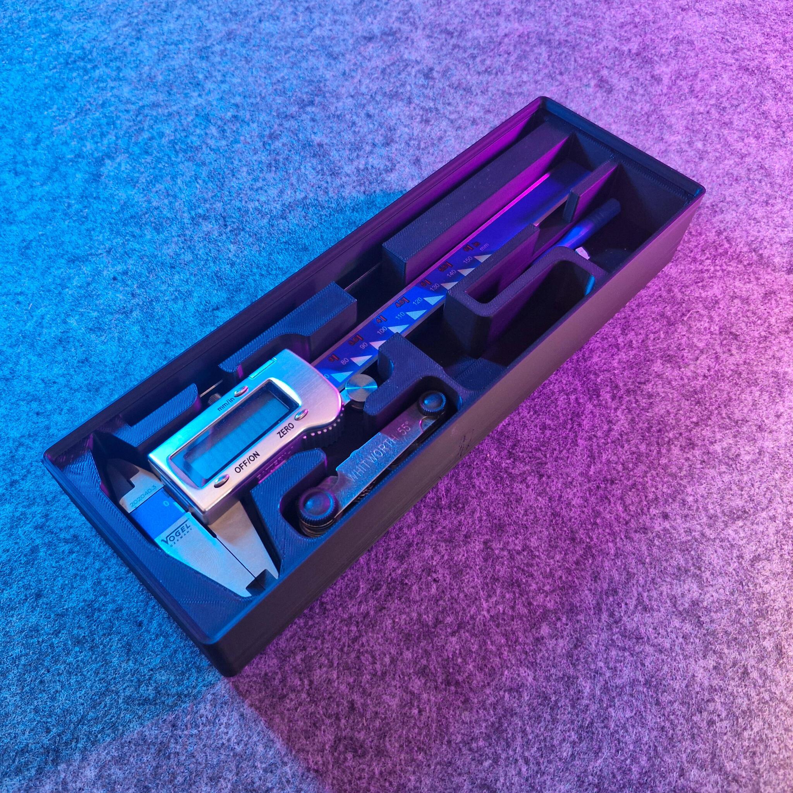
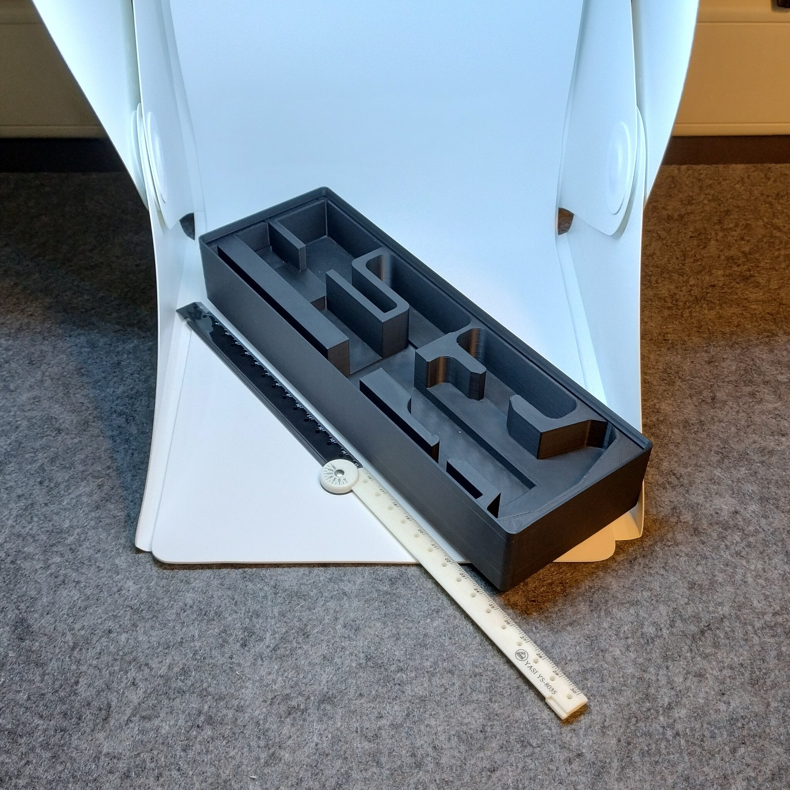
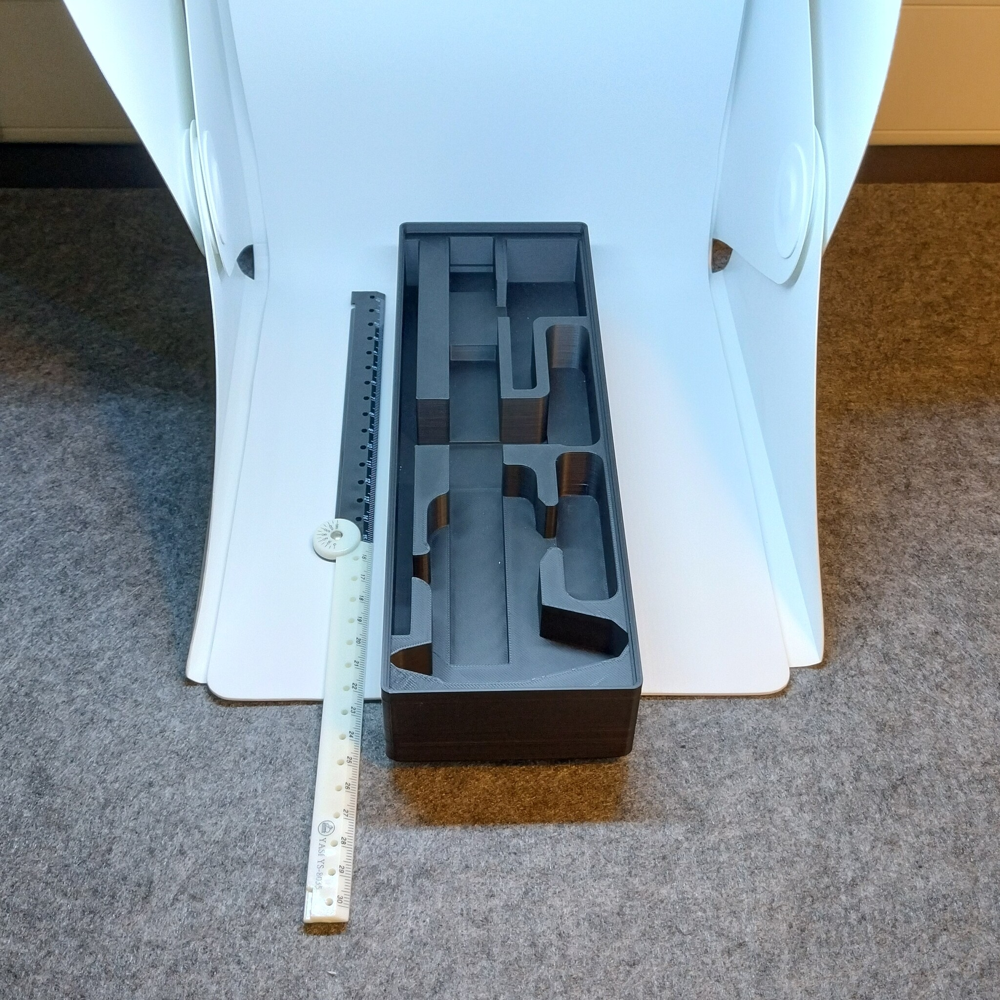

# Gridfinity - Bin 2.6.6 - Caliper (remix)

- **Brief**: Gridfinity caliper organizer.
- **Tags**: `gridfinity`, `storage`, `tool holder`, `stackable`.
- **Published**:
  [Thingiverse](https://www.thingiverse.com/thing:7417680),
  [Printables](https://www.printables.com/model/1864294-gridfinity-bin-266-caliper-remix),
  [MakerWorld](https://makerworld.com/en/models/3388619-gridfinity-bin-2-6-6-caliper-remix),
  [Cults3D](https://cults3d.com/en/3d-model/tool/gridfinity-bin-2-6-6-caliper-remix).

Gridfinity caliper holder.

<!------------------------------------------------------------------------------------------------->
## Attribution
<!------------------------------------------------------------------------------------------------->

This model is a remix of a 3D print model by **Jacek** obtained from <https://www.printables.com/model/1086568-gridfinity-caliper>.

Explore my [3D print model collection](https://zeroexgit.github.io/3d-print-models/) to discover more models and check for updates to this one.

### Differences of the remix compared to the original

- Packed into a 2x6x6 unit bin size.
- Added lip notches.

### Original Description

> Caliper organizer by GRIDFINITY design.
>
> Based on the Gridfinity System from Zack Freedman: https://thangs.com/designer/ZackFreedman

<!------------------------------------------------------------------------------------------------->
## License
<!------------------------------------------------------------------------------------------------->

This model is licensed under [**CC BY 4.0**](https://creativecommons.org/licenses/by/4.0/).
