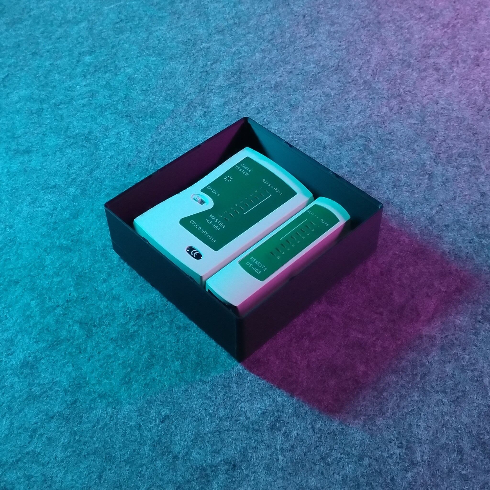
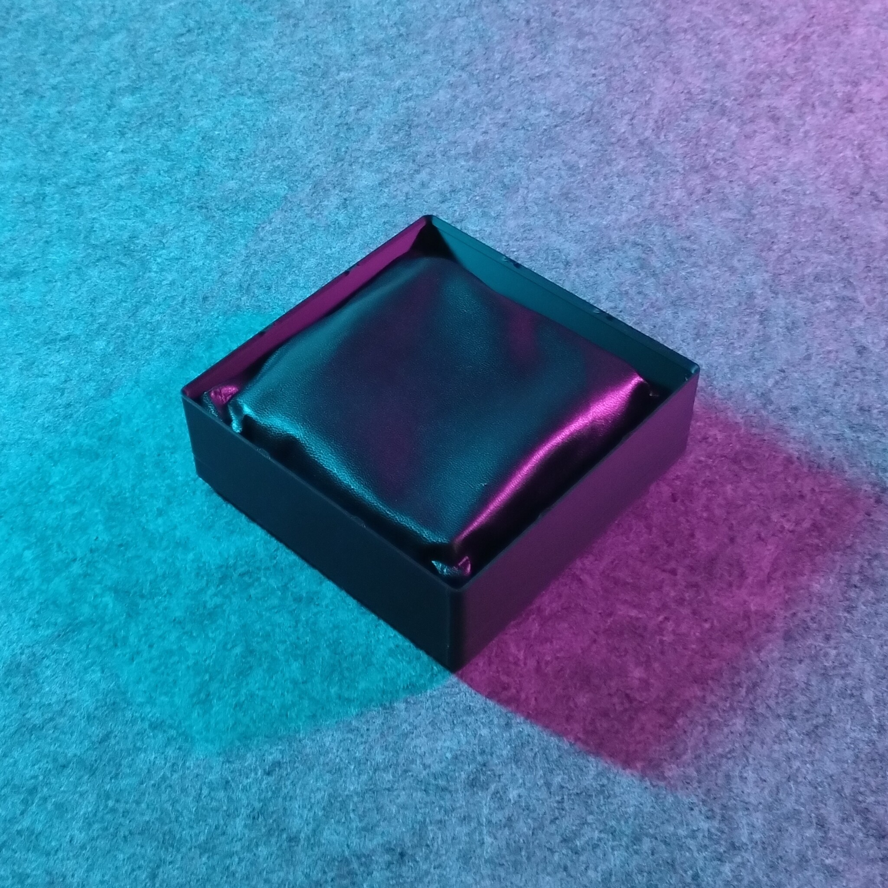
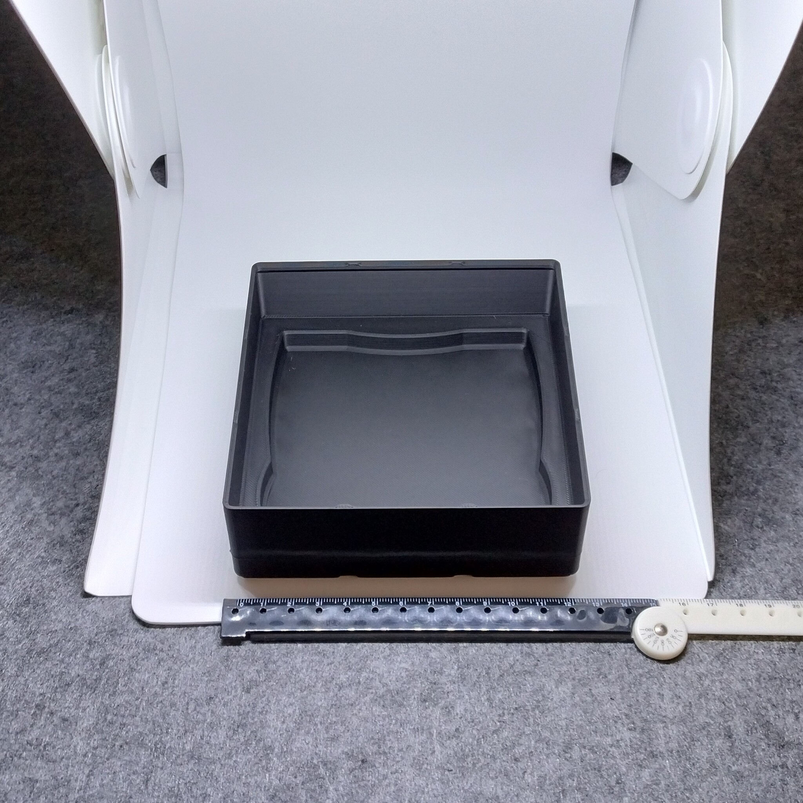
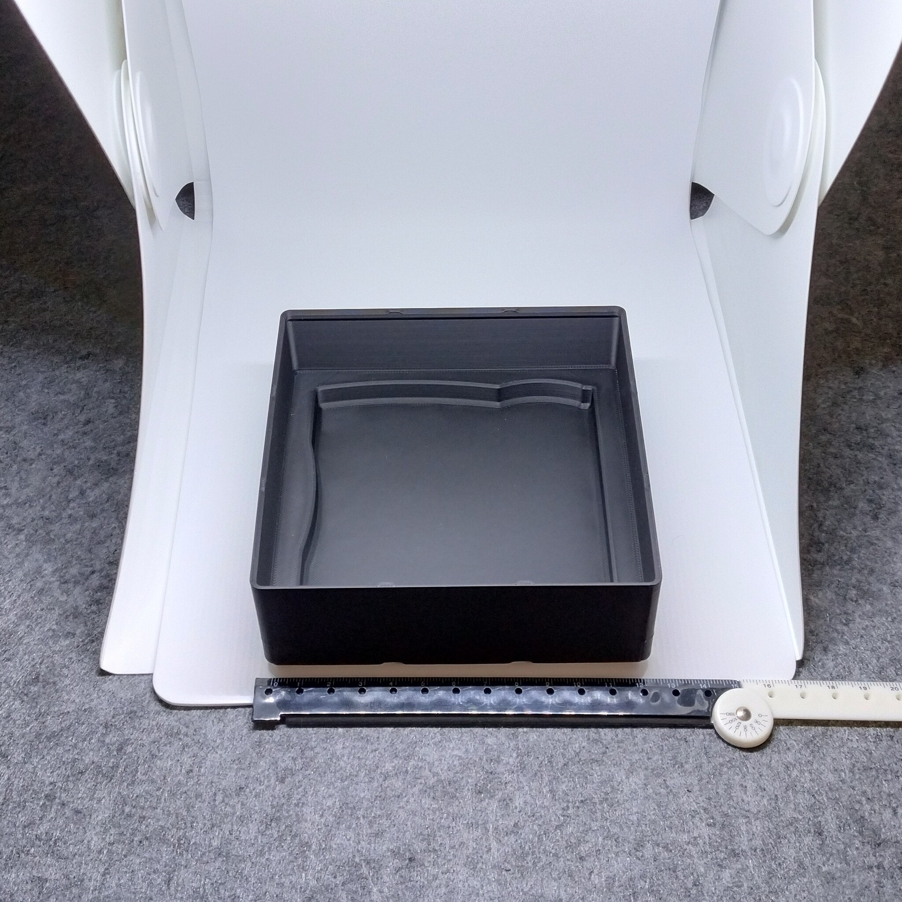

# Gridfinity - Bin 3.3.6 - Ethernet cable plug tester (remix)

   

- **Brief**: Gridfinity holder for an Ethernet cable plug tester.
- **Tags**: `gridfinity`, `storage`, `tool holder`, `stackable`
- **Published**:
  [Thingiverse](https://www.thingiverse.com/thing:7417703),
  [Printables](https://www.printables.com/model/1864348-gridfinity-bin-336-ethernet-cable-plug-tester-remi),
  [MakerWorld](https://makerworld.com/en/models/3388868-gridfinity-bin-3-3-6-ethernet-tester-remix),
  [Cults3D](https://cults3d.com/en/3d-model/tool/gridfinity-bin-3-3-6-ethernet-cable-plug-tester-remix).

Gridfinity bin for storing an Ethernet cable plug tester. Has enough clearance to also store the tester in a pouch or with the user manual, without interfering with stackability.

<!------------------------------------------------------------------------------------------------->

## Attribution

<!------------------------------------------------------------------------------------------------->

This model is a remix of a 3D print model by **Morbier** obtained from <https://www.printables.com/model/1005212-gridfinity-bin-for-ethernet-cableplug-tester>.

Explore my [3D print model collection](https://zeroexgit.github.io/3d-print-models/) to discover more models and check for updates to this one.

### Differences of the remix compared to the original

- Resize to Gridfinity 3x3x6 bin size.
- Added notches on stacking lips.
- Added press-fit holes for 6x2 mm magnets.

### Original Description

> A Gridfinity bin (3x3x5U) for Ethernet cable/plug tester.

<!------------------------------------------------------------------------------------------------->

## License

<!------------------------------------------------------------------------------------------------->

This model is licensed under [**CC BY-NC-SA 4.0**](https://creativecommons.org/licenses/by-nc-sa/4.0/).
