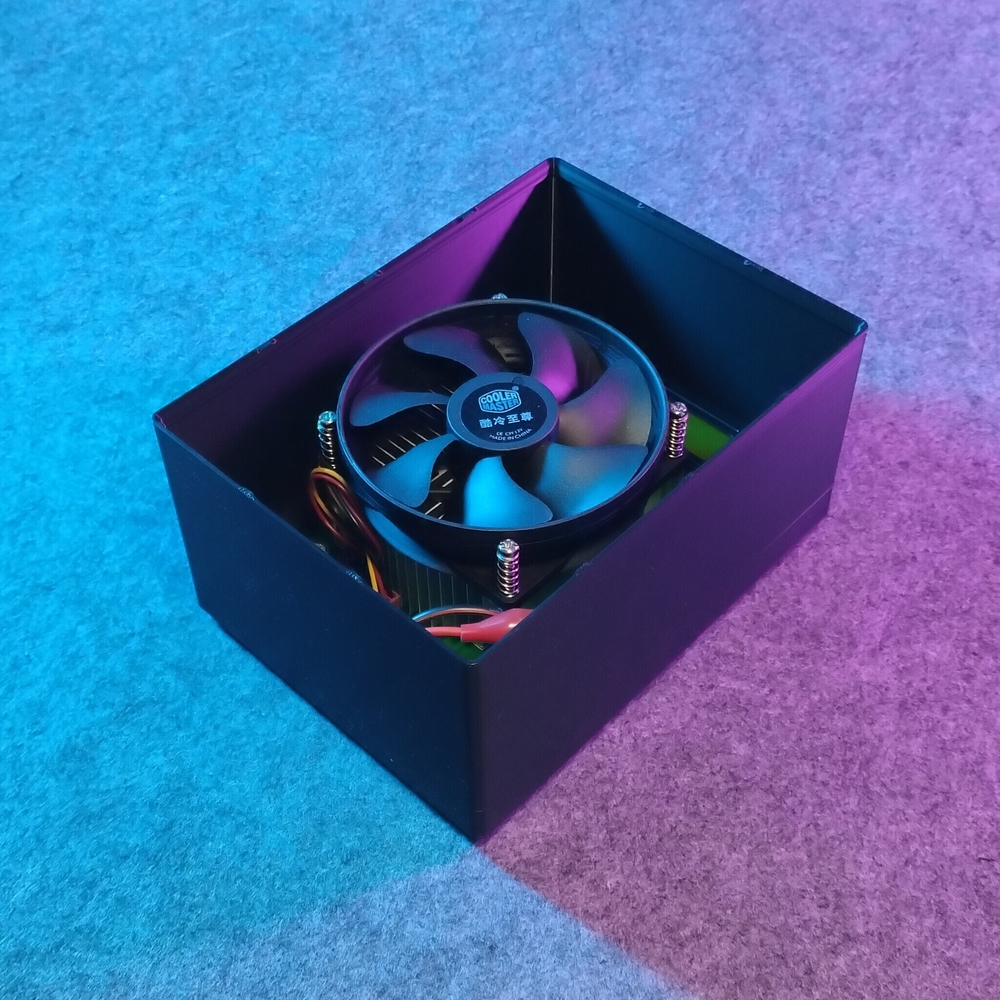
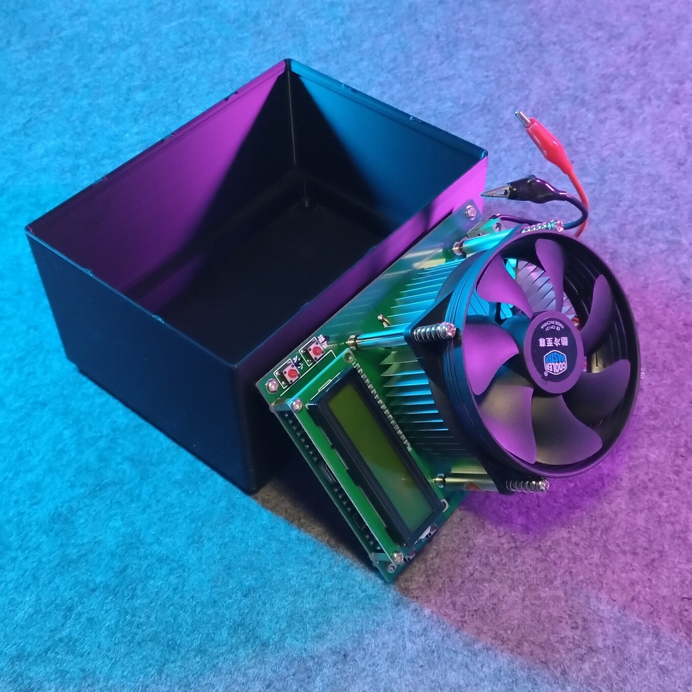
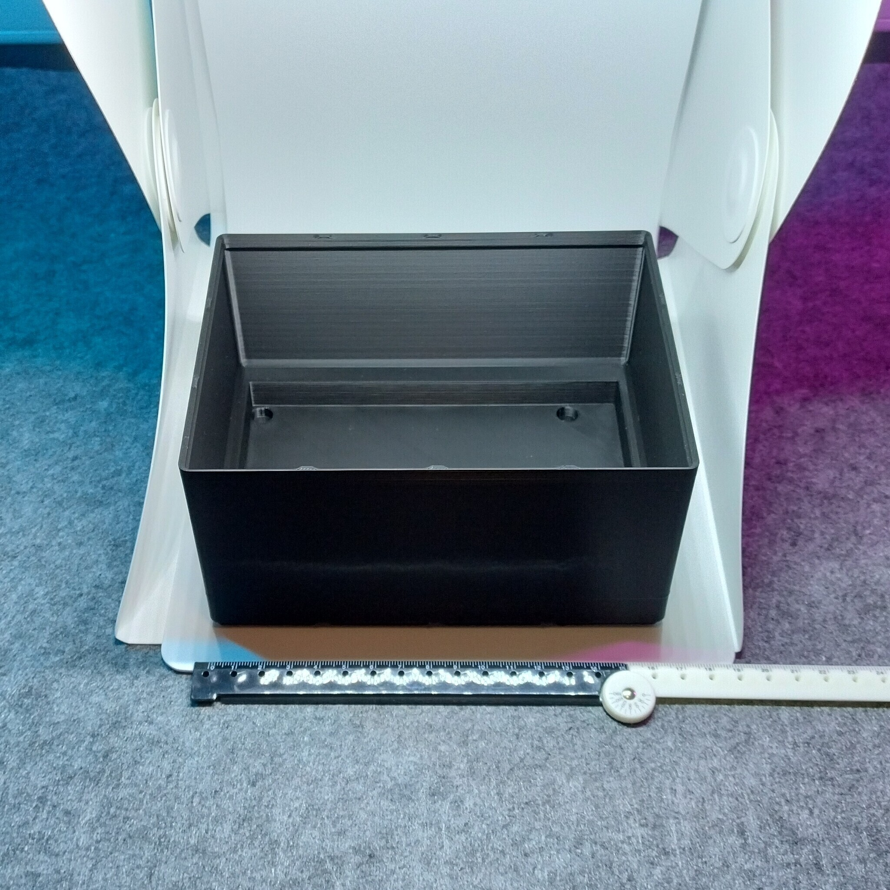
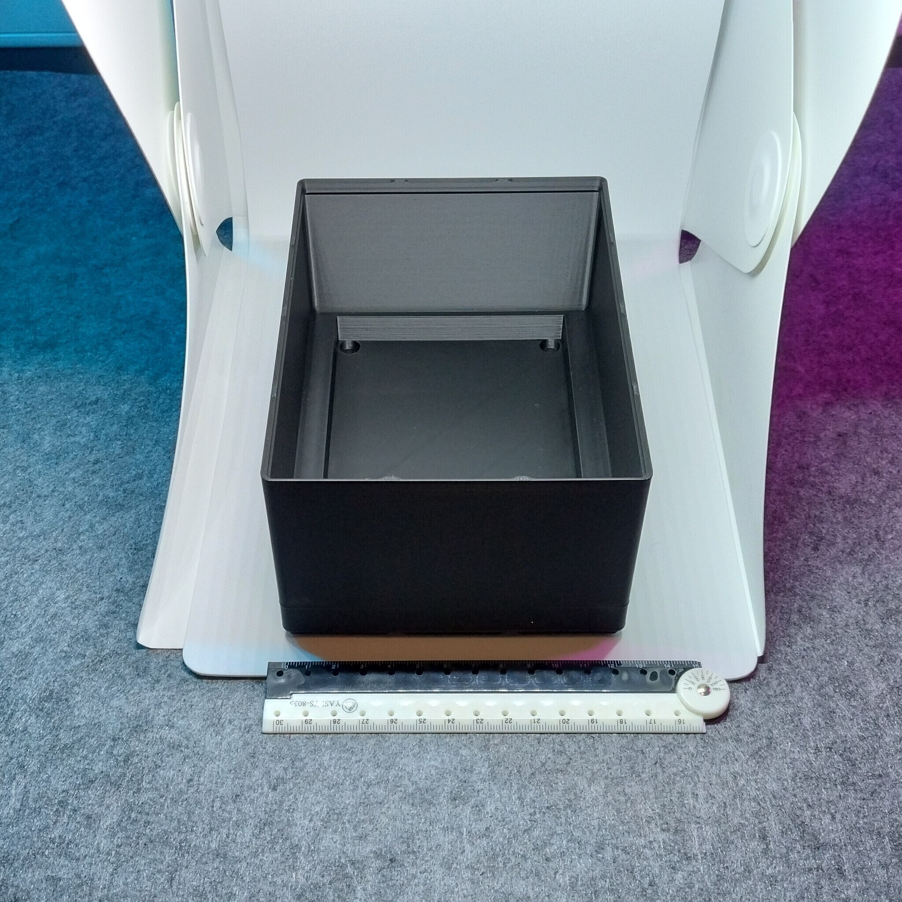

# Gridfinity - Bin 3.4.12 - Programable electronic load

   

- **Brief**: Gridfinity holder for a programmable electronic load.
- **Tags**: `gridfinity`, `storage`, `tool holder`, `stackable`
- **Published**:
  [Thingiverse](https://www.thingiverse.com/thing:7417713),
  [Printables](https://www.printables.com/model/1864365-gridfinity-bin-3412-programable-electronic-loadasd),
  [MakerWorld](https://makerworld.com/en/models/3388943-gridfinity-bin-3-4-12-electronic-load),
  [Cults3D](https://cults3d.com/en/3d-model/tool/gridfinity-bin-3-4-12-programable-electronic-load).

Gridfinity holder sized 3x4x12 units for a programmable electronic load. Exact model unknown, but commonly found on most hobby and online retailers.

Th bin features holes for the corner feet, a large cutout to keep the board from shaking around, and the bin is tall enough to be stackable with the electronic load held inside.

<!------------------------------------------------------------------------------------------------->

## Attribution

<!------------------------------------------------------------------------------------------------->

This is an original 3D print model.

Explore my [3D print model collection](https://zeroexgit.github.io/3d-print-models/) to discover more models and check for updates to this one.

<!------------------------------------------------------------------------------------------------->

## License

<!------------------------------------------------------------------------------------------------->

This model is licensed under [**CC BY-NC-SA 4.0**](https://creativecommons.org/licenses/by-nc-sa/4.0/).
