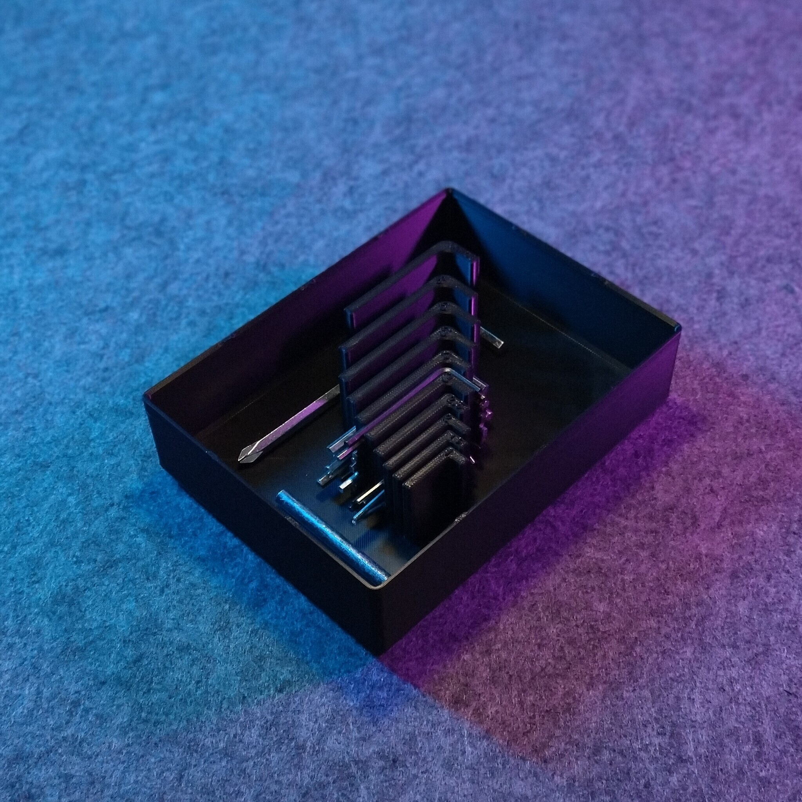
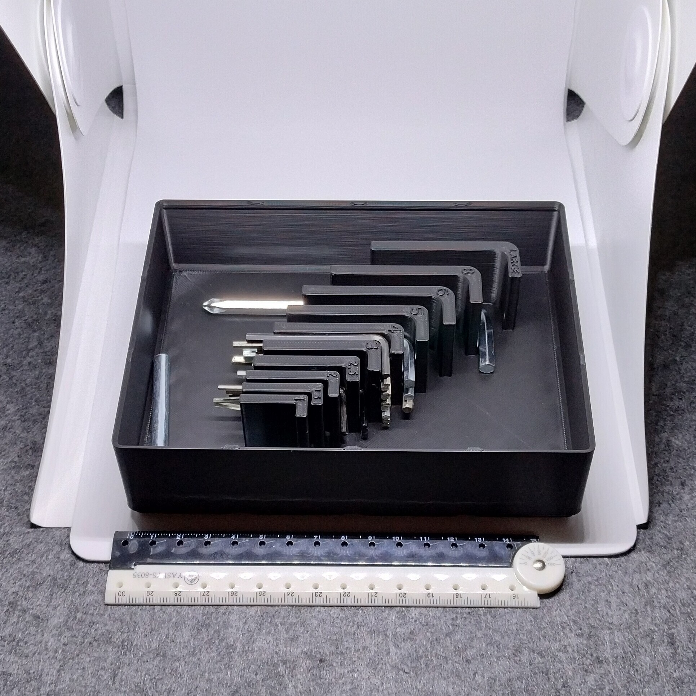
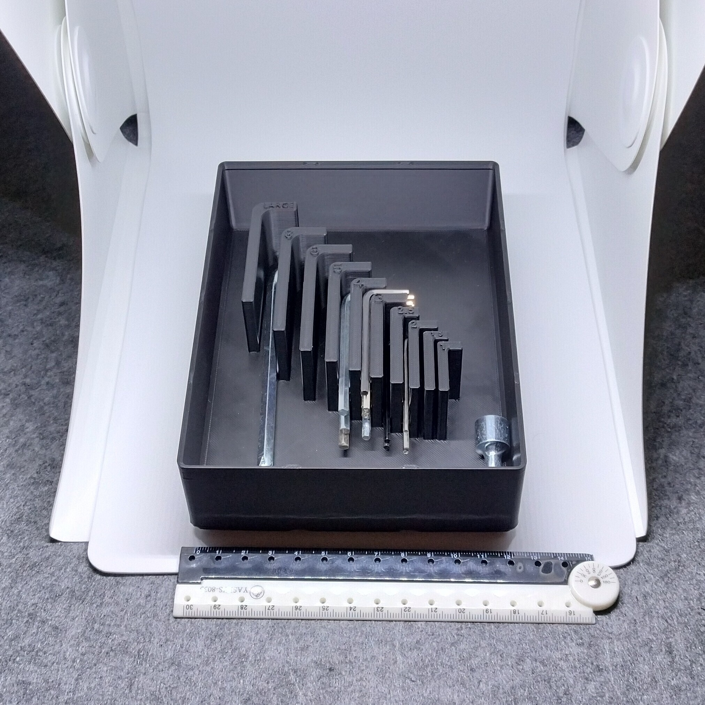

# Gridfinity - Bin 3.4.6 - Bulk Allen key organizer (remix)

  

- **Brief**: Gridfinity organizer for bulk Allen keys.
- **Tags**: `gridfinity`, `storage`, `tool holder`, `stackable`
- **Published**:
  [Thingiverse](https://www.thingiverse.com/thing:7417705),
  [Printables](https://www.printables.com/model/1864350-gridfinity-bin-346-bulk-allen-key-organizer-remix),
  [MakerWorld](https://makerworld.com/en/models/3388878-gridfinity-bin-3-4-6-bulk-allen-keys-remix),
  [Cults3D](https://cults3d.com/en/3d-model/tool/gridfinity-bin-3-4-6-bulk-allen-key-organizer-remix).

Gridfinity organizer for bulk Allen keys, ideal to store all those keys you never dare to throw away in a manner that is actually producive.

The bin has enough size to still make a mess in the corners if your heart desires so.

<!------------------------------------------------------------------------------------------------->

## Attribution

<!------------------------------------------------------------------------------------------------->

This model is a remix of a 3D print model by **MT** obtained from <https://www.printables.com/model/454838-gridfinity-allen-key-bulk-storage-medium-size>.

Explore my [3D print model collection](https://zeroexgit.github.io/3d-print-models/) to discover more models and check for updates to this one.

### Differences of the remix compared to the original

- Added notches to stacking lips.
- Added press-fit holes for 6x2 mm magnets.

### Original Description

> Rxunique has this excellent Gridfinity allen key bulk storage, but it only has 3x2 size or 6x4 size.. I need a 4x3 size one so here it is..
>
> stackable, holds a lot of allen wrench in the slots, and there are also overflow area to keep those odd sized ones in the box.

<!------------------------------------------------------------------------------------------------->

## License

<!------------------------------------------------------------------------------------------------->

This model is licensed under [**CC BY-NC-SA 4.0**](https://creativecommons.org/licenses/by-nc-sa/4.0/).
