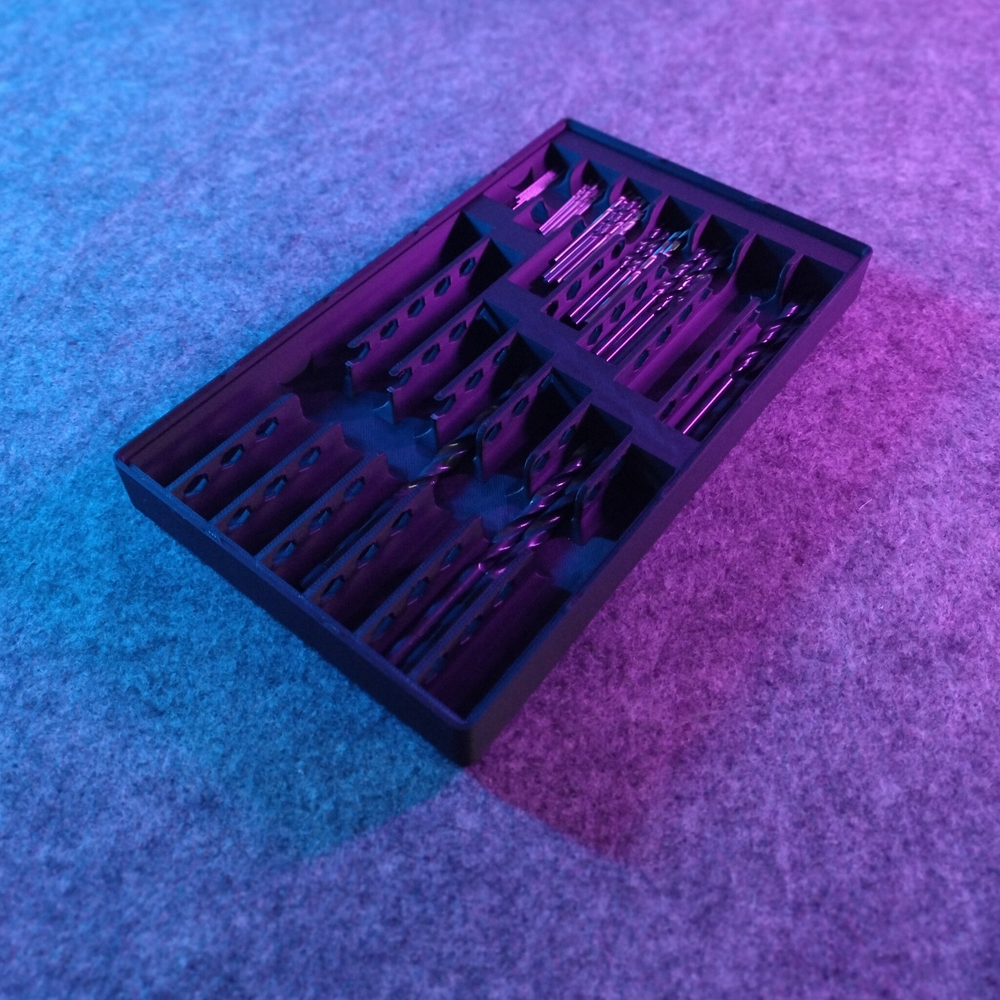
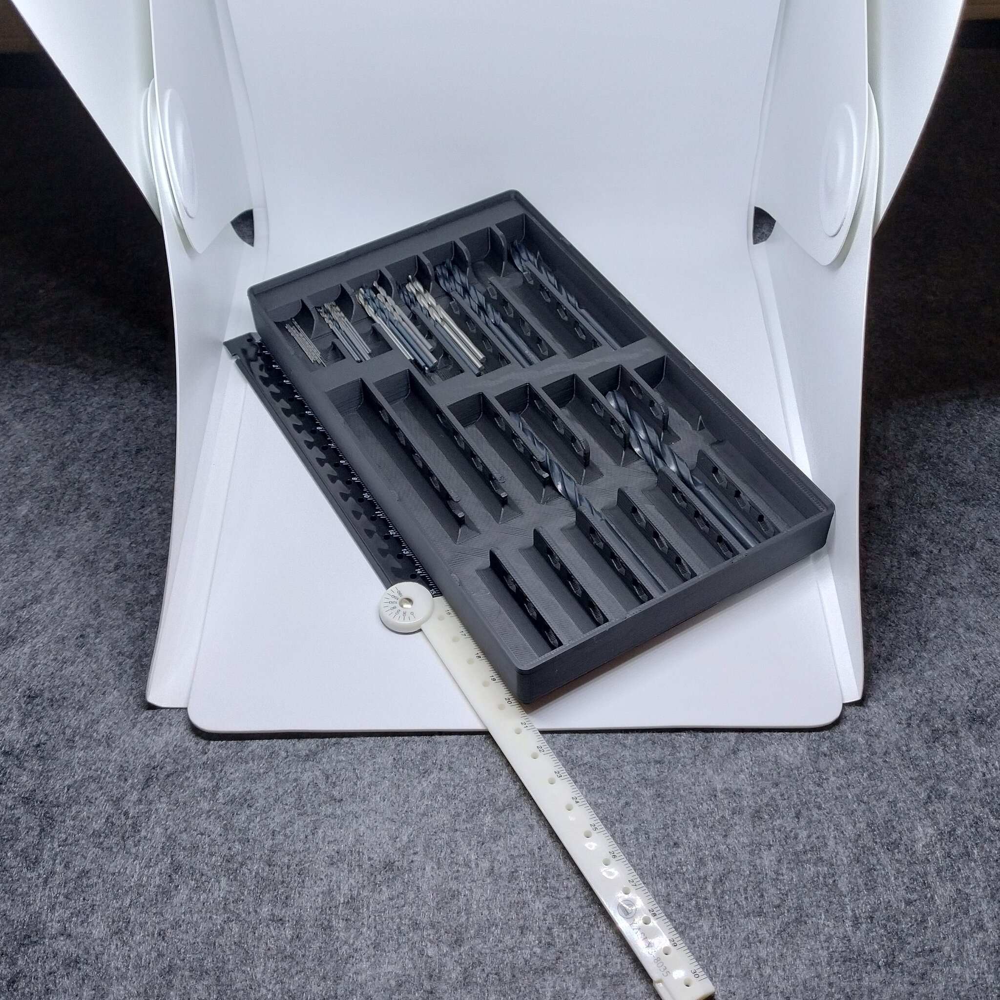
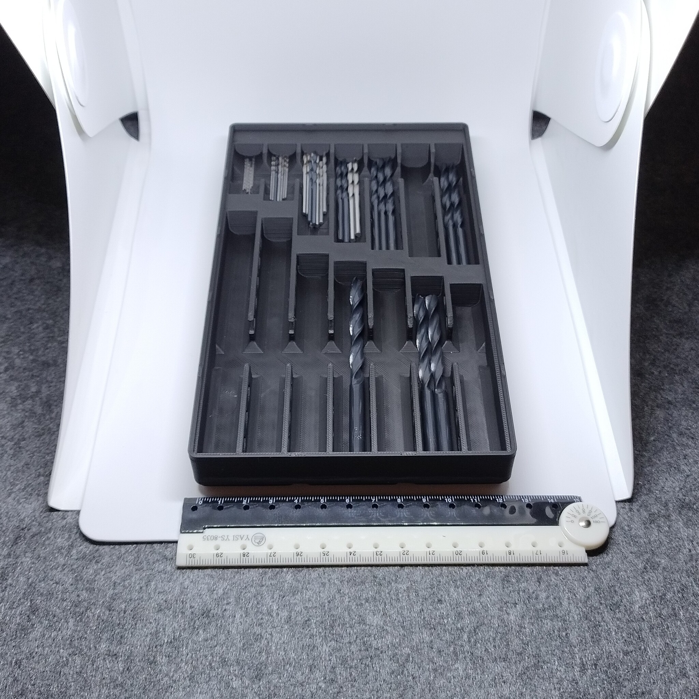

# Gridfinity - Bin 3.5.3 - Metric drill bits (remix)

- **Brief**: Gridfinity holder for metric drill bits, modified with press-fit holes for 6x2 mm
  magnets.
- **Tags**: `gridfinity`, `storage`, `drill bits`, `organizer`, `magnets`.
- **Published**:
  [Thingiverse](https://www.thingiverse.com/thing:7416621),
  [Printables](https://www.printables.com/model/1861094-gridfinity-bin-353-metric-drill-bits-remix),
  [MakerWorld](https://makerworld.com/en/models/3376734-gridfinity-bin-3-5-3-metric-drill-bits-remix),
  [Cults3D](https://cults3d.com/en/3d-model/tool/gridfinity-bin-3-5-3-metric-drill-bits-remix).

Organize a metric drill-bit set in a Gridfinity holder. This remix adds press-fit magnet holes to
the original design, helping the holder stay in place on a compatible base.

<!------------------------------------------------------------------------------------------------->
## Attribution
<!------------------------------------------------------------------------------------------------->

This model is a remix of a 3D print model by **alan ti** obtained from
<https://www.printables.com/model/1061778-gridfinity-metric-drill-bit-holder>.

Explore my [3D print model collection](https://zeroexgit.github.io/3d-print-models/) to discover more models and check for updates to this one.

### Differences of the remix compared to the original

- Added press-fit holes for 6x2 mm magnets.

### Original Description

> A Gridfinity holder designed for the author's Aldi FERREX drill-bit set, though it may fit other
> sets. It saves space and leaves room for labels.

<!------------------------------------------------------------------------------------------------->
## License
<!------------------------------------------------------------------------------------------------->

This model is licensed under [**CC BY-NC-SA 4.0**](https://creativecommons.org/licenses/by-nc-sa/4.0/).
