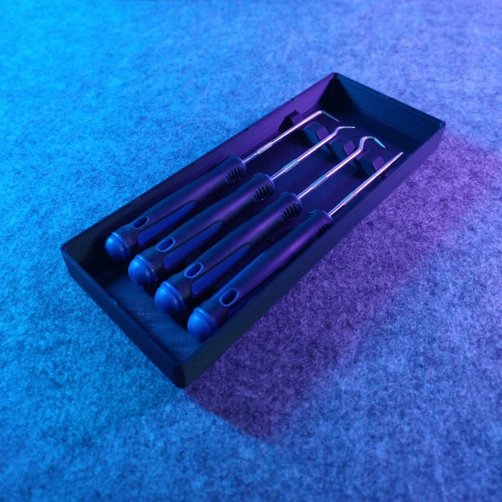
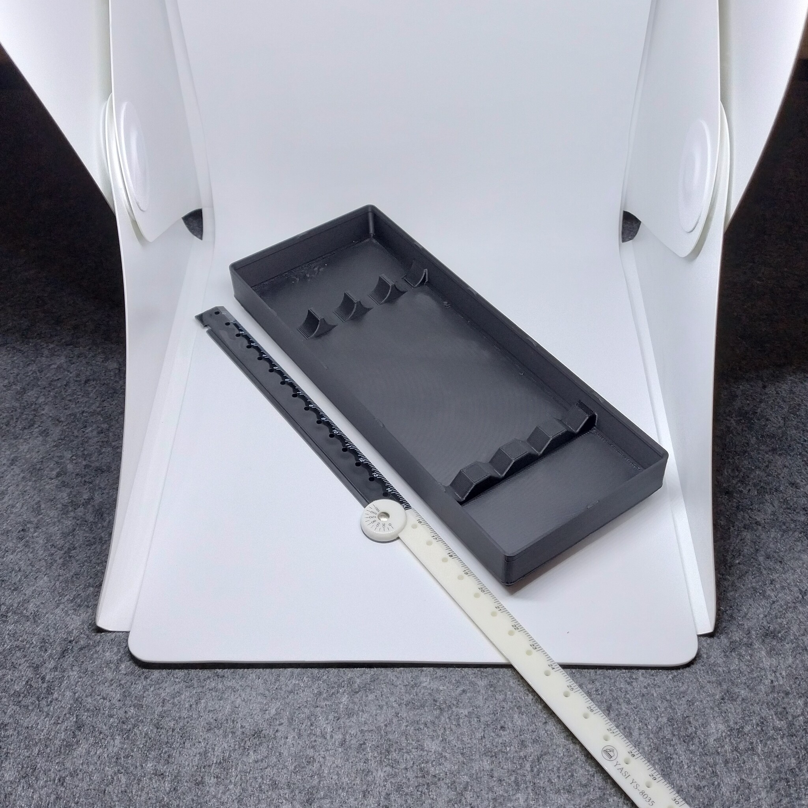
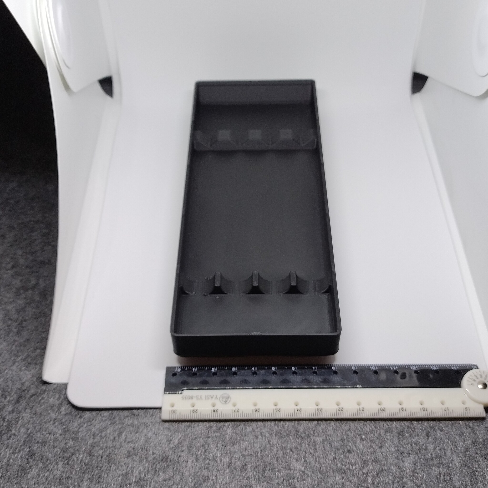

# Gridfinity - Bin 3.5.3 - Pick Set (remix)

- **Brief**: Gridfinity holder for the Milwaukee 48-22-9215 pick set, resized to 3x5x3 with stacking
  lips and press-fit magnet holes.
- **Tags**: `gridfinity`, `storage`, `pick set`, `organizer`, `stackable`.
- **Published**:
  [Thingiverse](https://www.thingiverse.com/thing:7416623),
  [Printables](https://www.printables.com/model/1861096-gridfinity-bin-353-pick-set-remix),
  [MakerWorld](https://makerworld.com/en/models/3376742-gridfinity-bin-3-5-3-pick-set-remix),
  [Cults3D](https://cults3d.com/en/3d-model/tool/gridfinity-bin-3-5-3-pick-set-remix).

Store a Milwaukee 48-22-9215 pick set in this 3x5x3 Gridfinity bin. The remix adds stacking lips
and replaces the original magnet holes with holes sized for 6x2 mm press-fit magnets.

<!------------------------------------------------------------------------------------------------->
## Attribution
<!------------------------------------------------------------------------------------------------->

This model is a remix of a 3D print model by **Fries** obtained from <https://www.printables.com/model/685683-gridfinity-pick-set-holder>.

Explore my [3D print model collection](https://zeroexgit.github.io/3d-print-models/) to discover more
models and check for updates to this one.

### Differences of the remix compared to the original

- Resized the bin to 3x5x3.
- Added stacking lips.
- Replaced the original magnet holes with press-fit holes for 6x2 mm magnets.

### Original Description

> A 3x5 bin for the Milwaukee 48-22-9215 pick set. It may also fit other pick sets.

<!------------------------------------------------------------------------------------------------->
## License
<!------------------------------------------------------------------------------------------------->

This model is licensed under [**CC BY 4.0**](https://creativecommons.org/licenses/by/4.0/).
