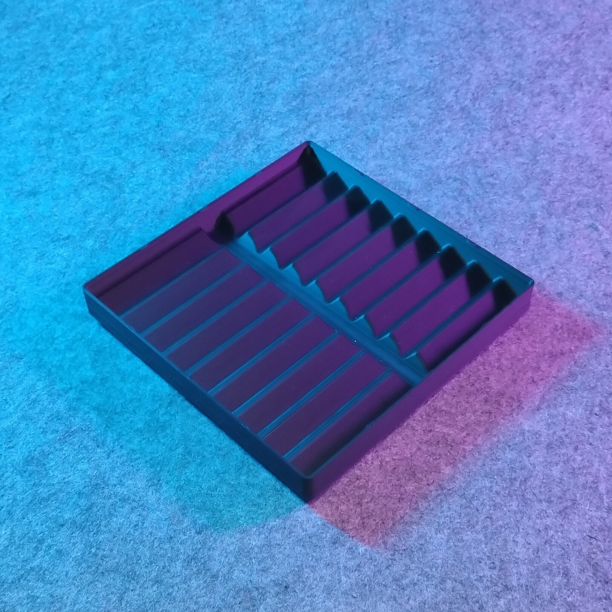
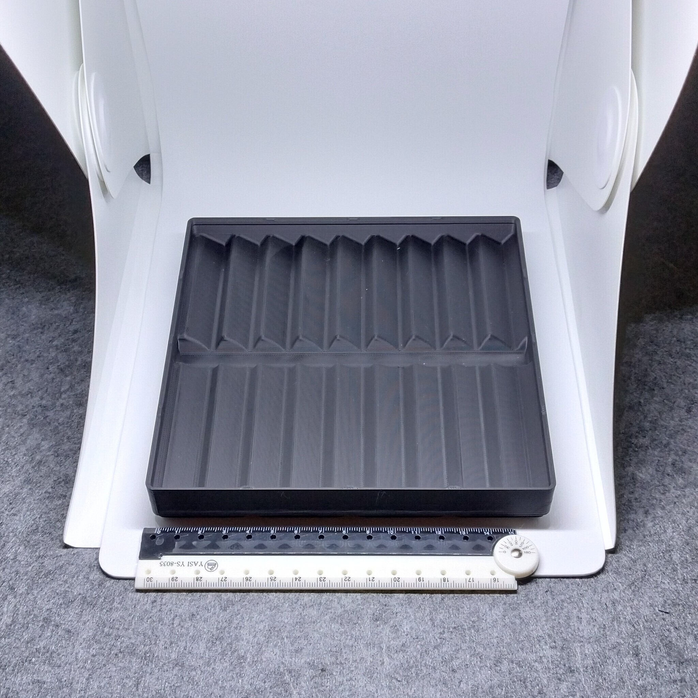
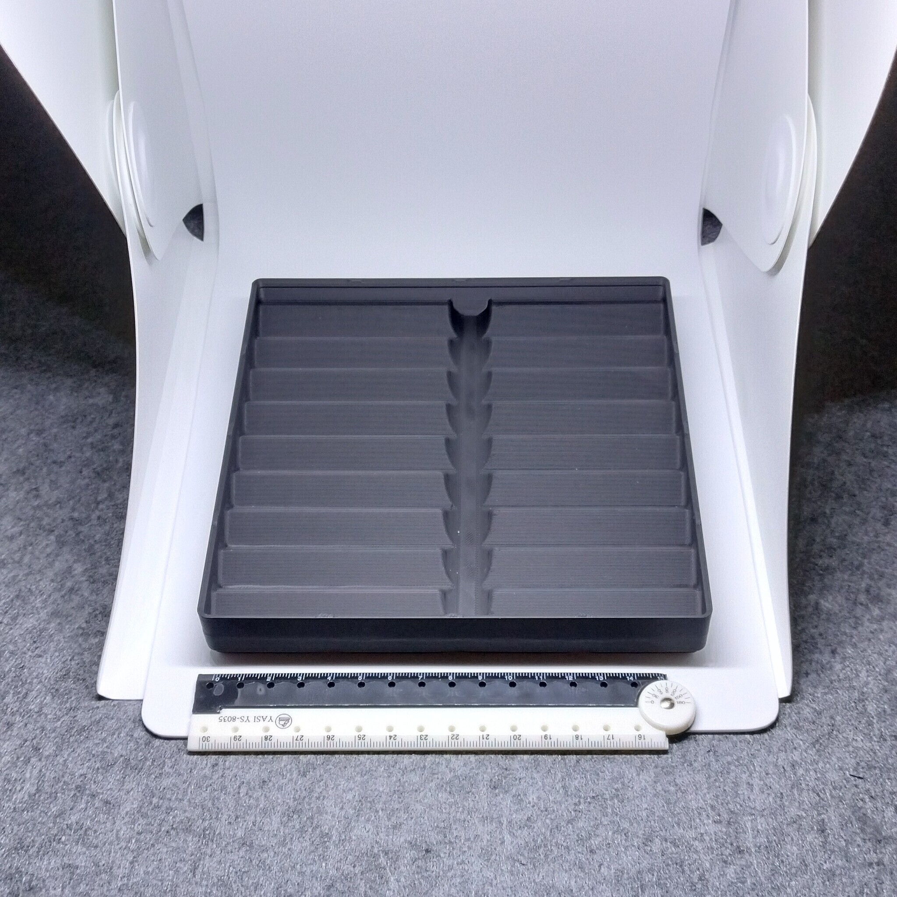

# Gridfinity - Bin 4.4.3 - Corrugated tray (remix)

  

- **Brief**: Half-height Gridfinity tray with ridges for separating short tools.
- **Tags**: `gridfinity`, `storage`, `tool holder`, `stackable`
- **Published**:
  [Thingiverse](https://www.thingiverse.com/thing:7417707),
  [Printables](https://www.printables.com/model/1864352-gridfinity-bin-443-corrugated-tray-remix),
  [MakerWorld](https://makerworld.com/en/models/3388887-gridfinity-bin-4-4-3-corrugated-tray-remix),
  [Cults3D](https://cults3d.com/en/3d-model/tool/gridfinity-bin-4-4-3-corrugated-tray-remix).

This half-height 4x4 Gridfinity tray uses ridges to keep tweezers and other short tools separated. Its low profile supports easy stacking.

<!------------------------------------------------------------------------------------------------->

## Attribution

<!------------------------------------------------------------------------------------------------->

This model is a remix of a 3D print model by **Doak** obtained from <https://www.printables.com/model/383854-gridfinity-4x4x05-corrugated-tray>.

Explore my [3D print model collection](https://zeroexgit.github.io/3d-print-models/) to discover more models and check for updates to this one.

### Differences of the remix compared to the original

- Added notches on stacking lips.
- Changed magnet hole type to press-fit holes for 6x2 mm magnets.

### Original Description

> A simple 4x4 half height Gridfinity tray with “corrugation” to keep tools separated. This was designed to hold tweezers and other short-ish tools. Tools are separated by a series of ridges.
>
> Half height to make for easy stacking.

<!------------------------------------------------------------------------------------------------->

## License

<!------------------------------------------------------------------------------------------------->

This model is licensed under [**CC BY-NC-SA 4.0**](https://creativecommons.org/licenses/by-nc-sa/4.0/).
