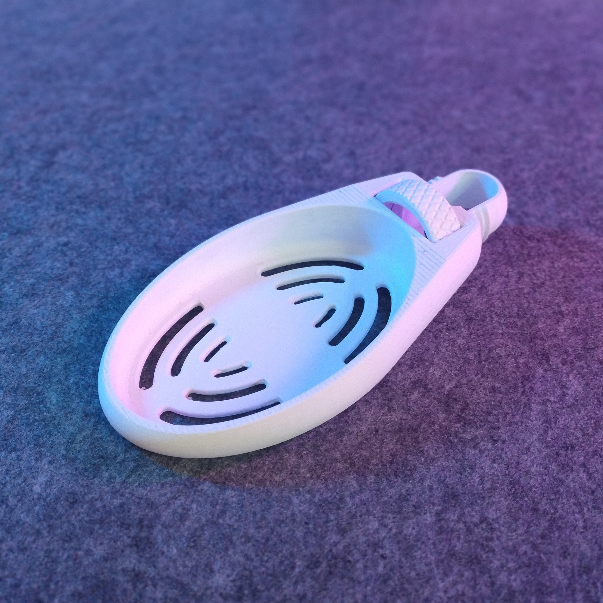

# 20mm Shower Bar Soap Tray (remix)

{ width="480" }

- **Brief**: Robust soap bar holder for 20mm diameter shower bars.
- **Tags**: `shower`, `soapholder`, `remix`.
- **Published**: [Thingiverse](https://www.thingiverse.com/thing:7321873),
  [Printables](https://www.printables.com/model/1648979-20mm-shower-bar-soap-tray-remix),
  [MakerWorld](https://makerworld.com/en/models/2568235-20mm-shower-bar-soap-tray-remix),
  [Cults3D](https://cults3d.com/en/3d-model/home/20mm-shower-bar-soap-tray-remix-zeroex).

You can find assembly instructions in the original model's description; insert the nut from below and tighten onto the bolt with the shower bar in between.

Explore my [3D print model collection](https://zeroexgit.github.io/3d-print-models/) to discover more models and check for updates to this one.

## Attribution

This model is a remix of a 3D print model by **Regis** obtained from
<https://www.printables.com/model/416652-shower-bar-o19-soap-holder>.

### Differences of the remix compared to the original

- Rescaled from 19mm to 20mm diameter to fit a different shower bar.
- Removed "SOAP" text from the original design.

### Original Description

> J'ai trouvé le système de fixation de Duane vraiment génial alors je l'ai utilisé et modélisé mon propre porte-savon.

## License

This model is licensed under [**CC BY-NC-SA 4.0**](https://creativecommons.org/licenses/by-nc-sa/4.0/).
