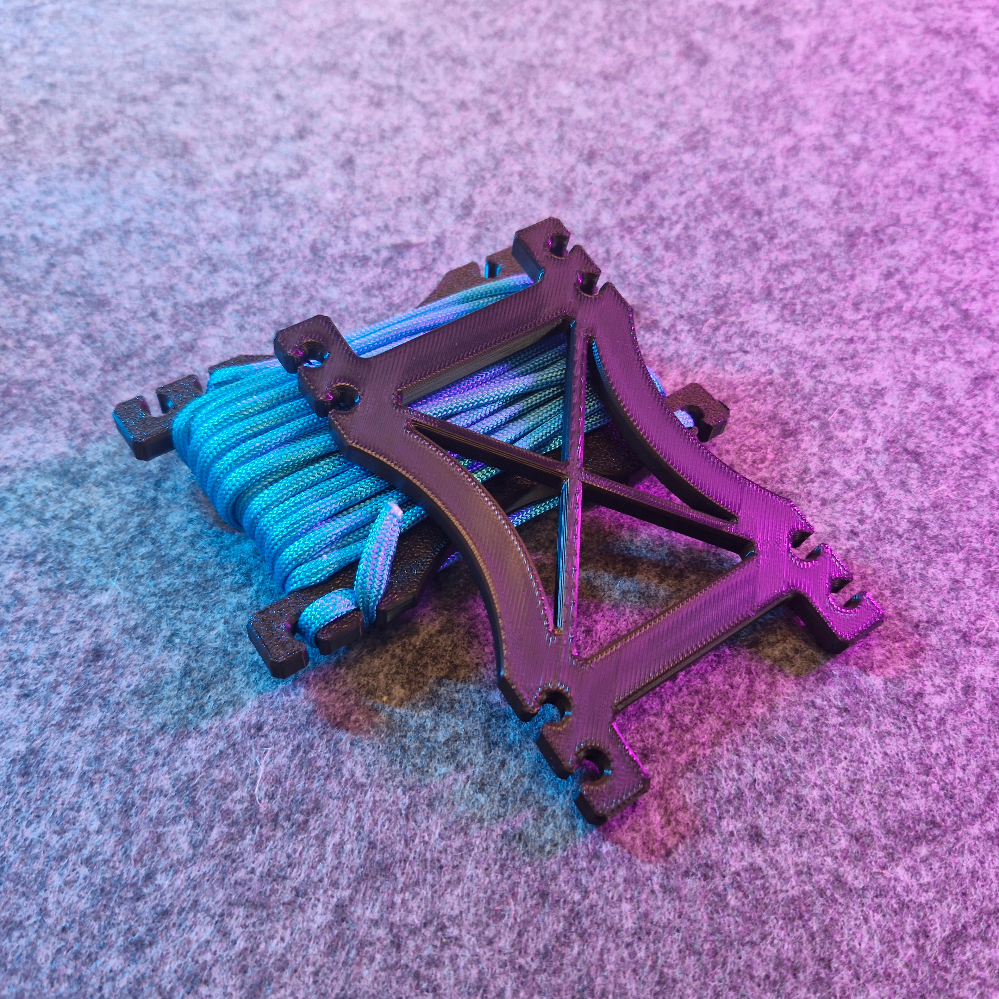
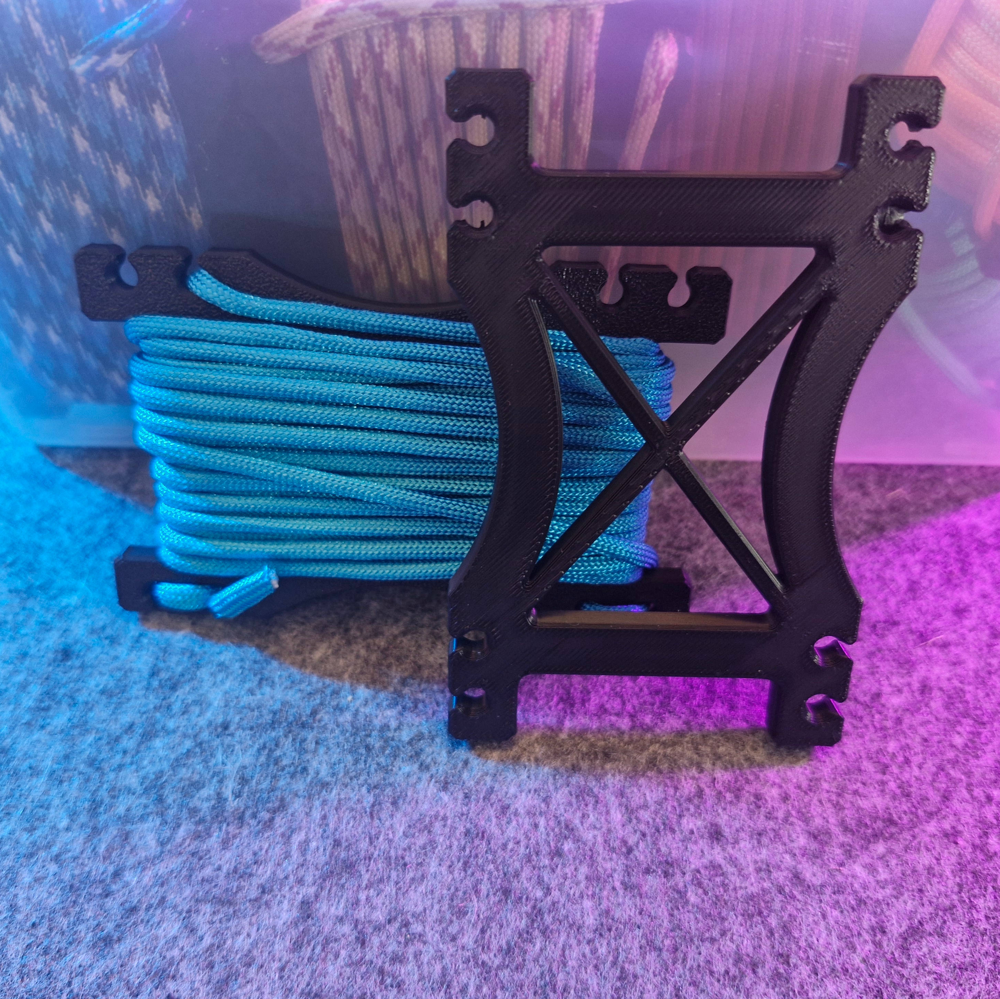

# Mini Paracord Winder (4mm)(reupload)

- **Brief**: Compact packable winder for 4mm paracord, available in 4 size variants.
- **Tags**: `paracord`, `winder`, `organizer`, `hiking`, `camping`, `edc`.

<!------------------------------------------------------------------------------------------------->
## Attribution
<!------------------------------------------------------------------------------------------------->

This model is a reupload of a 3D print model by **BuildX** obtained from <https://www.printables.com/model/882186-0164-mini-paracord-winders-for-the-pack-4-variants>.

I've reuploaded this model only to this repository and its website catalog to make the model easier to discover, provide a stable reference for what I print, and keep a backup in case the original listing disappears. I only reupload models whose licenses explicitly allow redistribution/resharing (including non-commercial constraints where applicable).

### Original Description

> Paracord can be your lifesaver in many situations when you need them. They should be part of your emergency kit!
>
> These mini winders for 4mm paracord are packable mini versions of my other paracord winder. Pack one with you for hiking, fishing, camping, or any other adventures!
>
> **Sizes:**
> - Mini 1 can store more than 60 ft (18.3m+) of 4mm paracord.
> - Mini 2 can store more than 40 ft (12.2m+) of 4mm paracord.
>
> **Key Features:**
> - Slots instead of holes to anchor the ends of the paracord (melted and/or knotted) — much easier to hook/unhook.
> - 2 loops to attach to a carabiner on your backpack.
> - 8 to 12 anchors to stow multiple segments on the same winder.
> - Prints as one part, designed to minimize filament usage.
> - Includes cross-bracing for rigidity and robustness.
>
> **Recommended for Printing:**
> - Print in PETG/ABS/ASA for durability.
> - 0.2mm layer, 0.4mm nozzle, 2–3 perimeters, 15% infill (or less).
>
> **Tip:** You can organize 3–4 segments of paracord on the same winder as long as their sum does not exceed the winder's capacity.

<!------------------------------------------------------------------------------------------------->
## License
<!------------------------------------------------------------------------------------------------->

This model is licensed under [**CC BY-NC-SA 4.0**](https://creativecommons.org/licenses/by-nc-sa/4.0/).