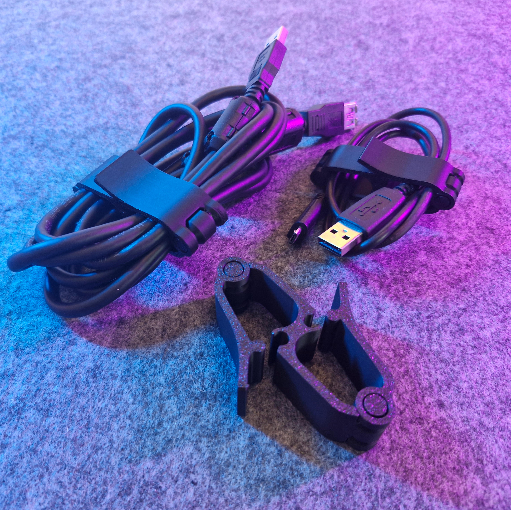

# Multi-cable organizer (proxy)

- **Brief**: Cable organizer with separate openings for each cable.
- **Tags**: `cable`, `organizer`, `cable management`.

<!------------------------------------------------------------------------------------------------->
## Attribution
<!------------------------------------------------------------------------------------------------->

This entry references a 3D print model by **SINGH DESIGN** available at <https://www.printables.com/model/1111792-multi-cable-organizer>.

This is a link-only catalog entry for a model I like. I share my own print photo and a link to the original listing so others can find it.

No model files are included here (no `.stl` / `.3mf` uploads) when the license does not allow redistribution/resharing.

### Original Description

> Multi cable organizer with separate opening.
>
> Caution, remove the piece from the print bed when the bed is cold.

<!------------------------------------------------------------------------------------------------->
## License
<!------------------------------------------------------------------------------------------------->

This model is licensed under the **Standard Digital File License** (no redistribution/resharing permitted).
