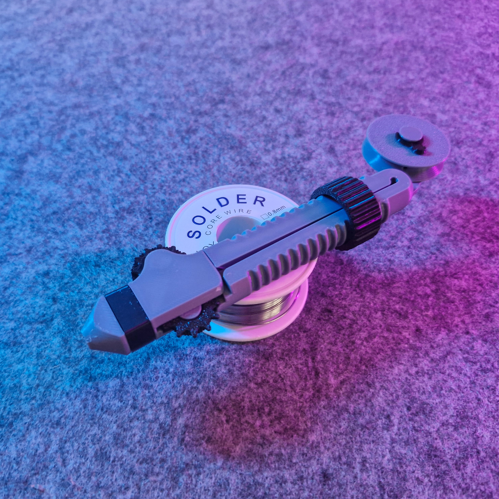

# Solder Scroll (reupload)

- **Brief**: Ergonomic pen-shaped solder dispenser with an adjustable scrolling feed for 0.3–1.5mm wire.
- **Tags**: `soldering`, `solder`, `tool`, `ergonomic`, `electronics`, `workshop`.

<!------------------------------------------------------------------------------------------------->
## Attribution
<!------------------------------------------------------------------------------------------------->

This model is a reupload of a 3D print model by **Victor** obtained from <https://www.printables.com/model/843353-solder-scroll-ergonomic-adjustable-solder-tool>.

I've reuploaded this model only to this repository and its website catalog to make the model easier to discover, provide a stable reference for what I print, and keep a backup in case the original listing disappears. I only reupload models whose licenses explicitly allow redistribution/resharing (including non-commercial constraints where applicable).

### Original Description

> The Solder Scroll makes soldering more ergonomic by allowing you to just scroll on the pen-shaped tool to add solder. By rotating the knob, the tool can be adjusted to accommodate different diameters of soldering wire (0.3–1.5mm). A length of soldering wire is stored on the back and can easily be refilled.

<!------------------------------------------------------------------------------------------------->
## License
<!------------------------------------------------------------------------------------------------->

This model is licensed under [**CC BY-NC-SA 4.0**](https://creativecommons.org/licenses/by-nc-sa/4.0/).
